# Enterprise Data Lakehouse: Engineering Guide
## A Phase-by-Phase Hybrid-Cloud Implementation on Microsoft Azure

---

> [!IMPORTANT]
> This document is a standalone engineering guide designed to transition a practitioner from initial resource provisioning to enterprise-grade DevOps automation. It is structured as a Comprehensive Technical Guide, providing the architectural blueprints and operational insights required to master Azure Data Factory.

---

## How to Use This Guide

Before you touch a single button in Azure, read this guide from top to bottom **at least once**. Every phase builds on the previous one. Skipping ahead is like reading the last chapter of a book first — you will be confused.

This guide is written for complete beginners. No prior cloud experience is assumed. If a word sounds unfamiliar, it will be explained the first time it appears. By the time you finish all 12 phases, you will understand not just *what* to click, but *why* every decision was made — and that is what separates a real data engineer from someone who just follows tutorials.

---

## Executive Table of Contents

1.  [**Before You Begin: The Big Picture**](#before-you-begin-the-big-picture)
2.  [**Core System Architecture**](#core-system-architecture)
3.  [**Medallion Data Refinery Model**](#medallion-data-refinery-model)
4.  [**The Phase-by-Phase Engineering Guide**](#the-12-phase-engineering-guide)
    - [Phase 1: Infrastructure & Resource Provisioning](#phase-1-infrastructure--resource-provisioning)
    - [Phase 2: Hybrid-Cloud Connectivity (SHIR)](#phase-2-hybrid-cloud-connectivity-shir)
    - [Phase 3: Metadata-Driven Ingestion](#phase-3-metadata-driven-ingestion)
    - [Phase 4: REST API Payload Harvesting](#phase-4-rest-api-payload-harvesting)
    - [Phase 5: High-Water Mark Incremental Loading](#phase-5-high-water-mark-incremental-loading)
    - [Phase 6: Relational Mart Hub](#phase-6-relational-mart-hub)
    - [Phase 7: Silver Tier Transformation (Spark)](#phase-7-silver-tier-transformation-spark)
    - [Phase 8: Gold Tier Analytical Synthesis](#phase-8-gold-tier-analytical-synthesis)
    - [Phase 9: Master Pipeline Orchestration](#phase-9-master-pipeline-orchestration)
    - [Phase 10: Serverless Telemetry & Alerting](#phase-10-serverless-telemetry--alerting)
    - [Phase 11: Production Schedule Automation](#phase-11-production-schedule-automation)
    - [Phase 12: Enterprise DevOps & Git Integration](#phase-12-enterprise-devops--git-integration)
5.  [**Global Troubleshooting & Risk Mitigation**](#global-troubleshooting--risk-mitigation)
6.  [**Project Lessons & Engineering Best Practices**](#project-lessons--engineering-best-practices)
7.  [**Conclusion & Portfolio Finality**](#conclusion--portfolio-finality)

---

## Before You Begin: The Big Picture

### What Problem Are We Actually Solving?

Imagine a large airline company. Every day, thousands of passengers book flights. Each booking is a row of data — a passenger ID, a flight ID, a price, a date. Every day, hundreds of new files arrive from the finance team. The company also has old data sitting on computers in their own office (called "on-premises" or "on-prem"). They want all of this data in one place in the cloud so they can answer business questions like: "Which airline made us the most money this month?"

That is exactly what this project builds. A system that:

1. **Collects** data from three different places (local files, the internet, a database)
2. **Organises** it in layers from raw to clean to analysis-ready
3. **Transforms** it using powerful computation
4. **Alerts** the team if anything goes wrong
5. **Runs automatically** every day without anyone pressing a button
6. **Tracks every change** made by every developer using version control

This kind of system is called a **Data Lakehouse** — a combination of a Data Lake (a giant storage container for any type of data) and a Data Warehouse (a highly organised, query-ready database).

---

### Key Vocabulary: Learn These First

Read this glossary carefully. These terms will appear throughout every phase.

| Term | Plain English Explanation |
|:---|:---|
| **Azure** | Microsoft's cloud platform. Think of it as renting computers, storage, and software over the internet instead of buying your own servers. |
| **Azure Data Factory (ADF)** | The main tool we use. It is a "data movement orchestrator" — it tells data where to go, when to move, and what shape to be in. It does not store data itself; it just moves it. |
| **Pipeline** | A set of instructions that ADF follows. Like a recipe — Step 1, then Step 2, then Step 3. |
| **Activity** | A single step inside a pipeline. "Copy this file" is one activity. "Run this calculation" is another. |
| **Dataset** | A pointer to a specific piece of data. It tells ADF "the data you need is in *this* file, in *this* folder, in *this* format." |
| **Linked Service** | A connection string. It tells ADF *how to reach* a data source (like the username and password to a database, or the address of a storage account). |
| **Integration Runtime (IR)** | The actual computing engine that ADF uses to move data. Think of it as the truck that carries data from A to B. |
| **Data Lake (ADLS Gen2)** | A giant, cheap storage system in the cloud that can hold any type of file (CSV, JSON, Parquet, Delta, etc.) in organised folders. |
| **Azure SQL Database** | A traditional relational database in the cloud. Great for structured data that needs fast lookups. |
| **Medallion Architecture** | A three-layer design pattern: Bronze (raw), Silver (clean), Gold (analysed). Data gets progressively better as it moves through the layers. |
| **Delta Lake** | A special way of storing files that adds database-like features (update, delete, ACID transactions) on top of a regular data lake. |
| **Spark** | A powerful distributed computing engine. When ADF runs a Data Flow, it is secretly running Apache Spark behind the scenes. |
| **Parquet** | A file format that stores data in columns instead of rows. It compresses data very efficiently — a 100MB CSV can become a 20MB Parquet file. |
| **ARM Template** | A JSON file that describes your entire Azure infrastructure as code. You can use it to recreate your whole environment in one click. |
| **Git** | A version control system. Every change you make to a pipeline is saved as a "commit" — you can always go back in time to an earlier version. |

---

## Core System Architecture

The following high-fidelity blueprint illustrates the end-to-end data trajectory. Orchestrated by **Azure Data Factory**, data is extracted from on-premises and RESTful sources, refined through a **Medallion Data Lake**, and served via an **Azure SQL Mart**, all while monitored by serverless **Logic App** telemetry.

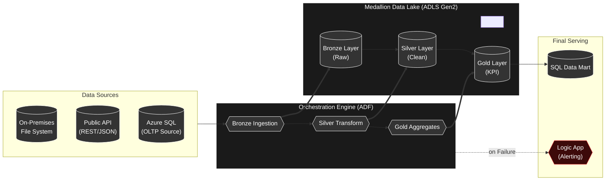

### Reading the Architecture Diagram

Look at the diagram from left to right. That is the direction data travels:

**Left side (Sources):** Data starts in three different places. On-premises files (CSV files sitting on a local computer), a Public API (data available on the internet via a URL), and an Azure SQL database (structured transactional data).

**Middle (ADF):** Azure Data Factory is the brain. It orchestrates three stages — Bronze Ingestion (collect raw data), Silver Transform (clean it), Gold Aggregates (summarise it for business use).

**Right side (Storage + Serving):** The Medallion Data Lake stores data in three layers as it gets progressively refined. Once the Gold layer is ready, data goes to a SQL Mart for business teams to query. If anything fails at any point, the Logic App sends an email alert instantly.

**The dotted red line** from ADF to Logic App is the alerting channel. It only fires on failure — silence means everything is running perfectly.

---

## Medallion Data Refinery Model

The Medallion Architecture ensures data quality through progressive refinement tiers.

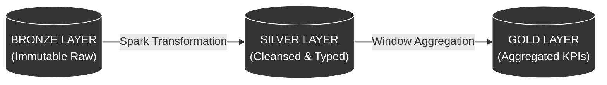

### Why Three Layers? Why Not Just One?

This is one of the most important questions a beginner can ask. The answer lies in what can go wrong.

**Imagine this scenario:** You receive raw data from a source system. You immediately transform it and load it into your final database. Two days later, you discover the source sent you incorrect data. Now your final database is corrupted. Where do you go back to? You have nothing — the raw data is gone because you transformed it in place.

The Medallion Architecture prevents this by keeping each layer completely separate and immutable (cannot be changed after writing):

**Bronze — The Archive.** Every piece of raw data lands here exactly as it arrived, no matter how messy. Think of it as a filing cabinet that keeps every original document. You never edit files in the Bronze layer. If anything ever goes wrong downstream, you can always come back here and reprocess from scratch.

**Silver — The Workshop.** This is where the cleaning happens. Column names get standardised. Data types get corrected (a phone number stored as text becomes a proper integer). Duplicates get removed. Inconsistent values (like "Male", "male", "M" all meaning the same thing) get unified. The Silver layer is production-ready data — clean, typed, reliable.

**Gold — The Boardroom.** This is the final analytical layer, built specifically for business users. Nobody in the Gold layer wants to see 1 million raw rows. They want to see: "Top 5 Airlines by Revenue This Month." The Gold layer contains pre-computed aggregations, rankings, and KPIs. It is what powers dashboards and business reports.

This separation means if something breaks in Silver, Bronze is safe. If a business requirement changes for Gold, you reprocess from Silver without touching Bronze. Each layer has a clear, single responsibility.

---

## The 12-Phase Engineering Guide

---

### Phase 1: Infrastructure & Resource Provisioning

#### What Is This Phase About?

Before you can build anything in Azure, you need to set up the digital "workspace". In the physical world, before building a house, you buy the land, lay the foundation, and connect water and electricity. Phase 1 is exactly that — preparing the cloud foundation.

#### Core Concepts You Will Master

**Resource Group — Your Project Folder**

Everything you create in Azure (databases, storage, pipelines, etc.) is called a "Resource". A Resource Group is simply a logical folder that holds all the resources related to one project. The benefit is enormous: when your project is done, you delete the Resource Group and every single resource inside it disappears in one click. No hunting around Azure for forgotten services that are still charging you money.

Think of it like this: if each resource is a document, the Resource Group is the folder on your desk. All documents in the folder belong to the same project.

**Azure Data Factory — The Orchestrator, Not the Worker**

A very common beginner mistake is thinking ADF stores or processes data. It does not. ADF is a pure orchestrator — it tells other services what to do and when to do it. The actual computation (for Data Flows) happens on Apache Spark clusters. The actual storage happens in ADLS Gen2. ADF just coordinates the whole show.

Think of ADF as the conductor of an orchestra. The conductor does not play any instrument. They just wave their baton and tell the violin section to start, tell the drums to come in, and tell the horns to stop. ADF is the baton.

**Azure Data Lake Storage Gen2 (ADLS Gen2) — The Storage Layer**

This is where all data will live. Gen2 refers to the second generation of Azure Data Lake, which added a critical feature: Hierarchical Namespace (HNS). 

Without HNS, your storage is "flat" — like dumping all your files into one big room with no folders. With HNS enabled, you can create proper folder structures (bronze/onprem/files, silver/bookings, gold/kpis), apply security at the folder level, and dramatically improve performance on large operations.

**The critical rule:** HNS must be enabled at the time of creation. You cannot add it later. This is the most common setup mistake beginners make.

**Azure SQL Database — The Relational Serving Layer**

While the Data Lake is flexible and holds any file format, sometimes business teams need to run SQL queries and need structured, typed tables. The Azure SQL Database serves this purpose. It is the same SQL you already know (SELECT, FROM, WHERE, JOIN) but running on managed cloud infrastructure that Microsoft patches and backs up automatically.

**The Watermark File — The System's Memory**

Before you can do incremental loading (Phase 5), the system needs a way to "remember" the last time it ran. We use a tiny JSON file called `last-load.json` stored in the Data Lake. Initially it contains `"1900-01-01"` as the date — a date so old in the past that on the very first run, it will capture *all* historical data. After each run, it updates to the latest date processed. This is the heartbeat of the incremental loading pattern.

```json
{
    "last_load": "1900-01-01"
}
```

**Firewall Configuration — Why the Default Is Wrong**

By default, Azure SQL refuses connections from everything, including other Azure services. This is a security feature — deny everything unless explicitly allowed. But it means if you do not open the firewall, ADF will get an "Access Denied" error when it tries to connect to your database. The fix is simple: in the SQL Networking settings, set "Allow Azure Services" to **Yes**. This creates a pre-approved pathway for services within Azure to communicate with each other.

#### Architecture at a Glance

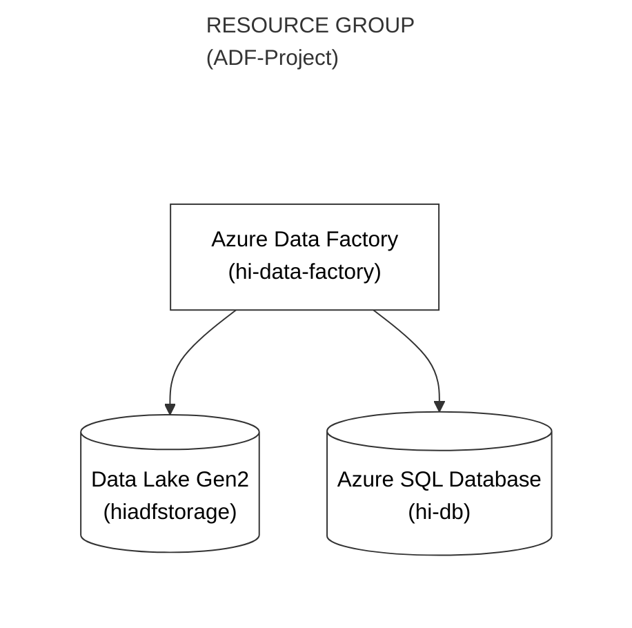

#### What Could Go Wrong (And Why)

| Risk | What Happens | How to Prevent It |
|:---|:---|:---|
| Forgot to enable HNS | Storage becomes a flat blob container with no folder hierarchy | Always go to the Advanced tab during storage creation and check "Enable hierarchical namespace" |
| Forgot to allow Azure services in SQL firewall | ADF gets "Access Denied" when connecting to SQL | In SQL Networking settings, set "Allow Azure services" to Yes |
| Wrong region for resources | Data crosses regions causing latency and extra cost | Always pick the same region for every resource in your Resource Group |

#### Implementation Guide
For the complete step-by-step implementation guide, follow the **[Manual](documentation/phase1_resources.md)**

---

### Phase 2: Hybrid-Cloud Connectivity (SHIR)

#### What Is This Phase About?

Your organisation has data sitting on a computer inside their own office — not in the cloud. This is called "on-premises" (on-prem) data. The challenge: how does Azure Data Factory, which lives in the cloud, access data on a machine that sits behind a company firewall?

The answer is the Self-Hosted Integration Runtime (SHIR). This phase is about building a secure bridge between your local machine and the Azure cloud.

#### Core Concepts You Will Master

**Why Can't ADF Just Connect Directly?**

Think about your home Wi-Fi. Your laptop is on your home network. If someone in another country tried to directly access a file on your laptop, they would fail — your router blocks all incoming connections from the internet. Corporate networks are exactly the same, just with much stricter security.

ADF cannot reach through your firewall and grab your files. The solution is to reverse the direction of the connection — instead of Azure reaching IN to your machine, your machine reaches OUT to Azure. Outgoing connections are almost always allowed through firewalls.

**The Self-Hosted Integration Runtime — The Bridge**

The SHIR is a small application you install on your local Windows machine. Once installed and registered with a secret key from ADF, it does two things:
1. It maintains a constant outgoing connection to Azure (like keeping a phone line open)
2. When ADF needs local data, it sends the request through that open connection, your machine processes it, and sends the data back the same way

Your firewall never needs to allow any *incoming* connections. This is why SHIR is such an elegant solution — it works with your existing security, not against it.

**How the Registration Works**

When you create a SHIR in ADF, Azure generates two secret keys. You copy Key 1 and paste it into the SHIR application on your local machine. This is like giving the bridge a password to prove it belongs to your ADF instance. Once registered, Azure knows "this particular local machine is authorised to send data to this ADF instance."

**Linked Services — The Connection Book**

Once the SHIR is running, you need to tell ADF exactly how to reach each specific data source. This is what Linked Services do. A Linked Service is essentially a saved connection configuration — like a contact in your phone. Instead of typing someone's number every time you call them, you save it once as a contact.

For each data source you want to connect to, you create one Linked Service. In this project, you will create four:

1. `ls_onprem_file` — Connection to your local file system (uses SHIR)
2. `ls_data_lake` — Connection to your Azure Data Lake (uses the built-in Azure IR)
3. `ls_github` — Connection to GitHub's public API (uses the built-in Azure IR)
4. `ls_sql` — Connection to your Azure SQL Database (uses the built-in Azure IR)

Notice that only the on-prem connection needs the SHIR. All Azure-to-Azure connections use the default AutoResolve Integration Runtime that ADF provides automatically.

**Two Types of Integration Runtime**

There are two runtimes you will use in this project:

*AutoResolve Integration Runtime:* This is the default, cloud-managed runtime that ADF provides. Use it whenever both your source and destination are cloud services. Azure manages it, you never have to install anything.

*Self-Hosted Integration Runtime:* This is the one you install on your own machine. Use it whenever you need to reach data on a private network (your local drive, a corporate SQL server, a shared network drive). You are responsible for keeping this machine running and the application updated.

#### Architecture at a Glance

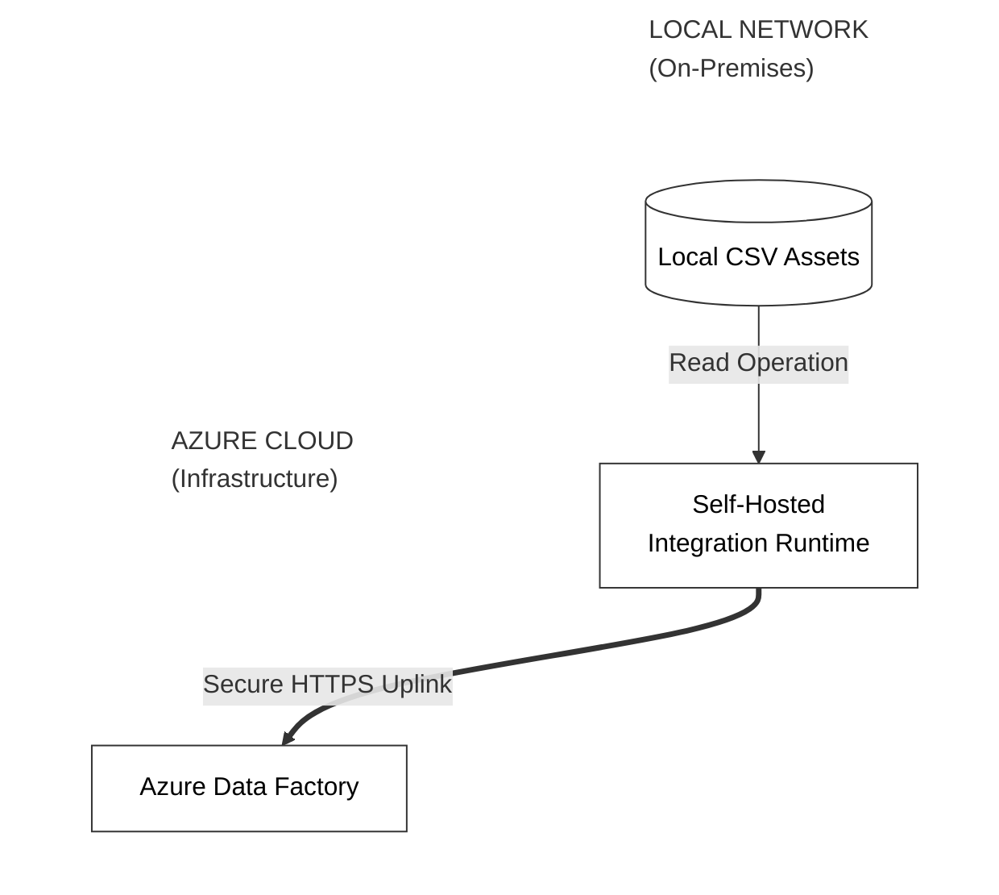

#### What Could Go Wrong (And Why)

| Risk | What Happens | How to Prevent It |
|:---|:---|:---|
| SHIR shows "Disconnected" | ADF cannot reach your local machine | Check that the SHIR application is running on your machine. Sometimes it stops after a Windows restart. Set it to start automatically with Windows. |
| Wrong Windows credentials in `ls_onprem_file` | Connection test fails with "Access Denied" | Use your full Microsoft account email and password, not a PIN. If you use a local Windows account, run `echo %username%` in Command Prompt to get the exact username. |
| File path format is wrong | ADF cannot find the folder | On Windows, the path should look like `C:\Users\YourName\Data` with backslashes. On some ADF configurations, forward slashes also work. |

#### Implementation Guide
For the complete step-by-step implementation guide, follow the **[Manual](documentation/phase2_ir_linkedservices.md)**

---

### Phase 3: Metadata-Driven Ingestion

#### What Is This Phase About?

You have 4 files to copy from your local machine to the Bronze layer. The naive approach: create 4 separate Copy Activity steps, one for each file. But what if you had 400 files? 4,000? Creating 4,000 separate activities is obviously impossible.

Phase 3 teaches the correct, scalable approach: write one dynamic pipeline that loops through a list of filenames and copies each one. This is called Metadata-Driven Ingestion — the pipeline's behaviour is driven by data (the list of filenames) rather than hardcoded instructions.

#### Core Concepts You Will Master

**Parameters vs. Hardcoding — The Fundamental Difference**

Hardcoding means embedding a specific value directly in your pipeline. For example, writing `"DimAirline.csv"` directly in a Copy Activity. This works for one file but cannot scale.

Parameters turn your pipeline into a template. Instead of `"DimAirline.csv"`, you write `@dataset().p_filename`. The `@dataset().p_filename` is a placeholder that says "whatever filename is passed into me at runtime, use that." The pipeline itself becomes reusable — the same pipeline can copy any file, as long as you tell it which one.

**Datasets as Templates**

A Dataset is normally a pointer to a specific file: "this CSV file, at this path, in this storage account." But a parameterised Dataset is a template — it says "a CSV file at this path, but the filename will be provided at runtime."

You create one Source Dataset template with a parameter `p_filename`. Every time the pipeline runs for a different file, it passes a different value for `p_filename`, and the Dataset points to a different file. Same Dataset, different data. This is the power of parameterisation.

**The ForEach Activity — The Loop**

The ForEach activity in ADF is exactly like a `for` loop in programming. You give it an array (a list of items), and it runs a set of inner activities once for each item in the list.

```
ForEach file in [DimAirline.csv, DimAirport.json, DimFlight.csv, DimPassenger.csv]:
    Run Copy Activity using that file's name
```

The `@item()` expression inside the loop always refers to the current element being processed. It is the loop variable.

**Sequential vs. Parallel Execution**

The ForEach activity can run iterations either:
- **Sequentially** (one file at a time, one after the other) — slower but safer for local machines with limited resources
- **In parallel** (multiple files at the same time) — faster but requires more compute

For the Self-Hosted Integration Runtime (running on your local computer), always use Sequential. Your laptop does not have the resources to handle dozens of simultaneous file transfers. In production cloud environments with powerful Integration Runtimes, parallel execution with a batch count of up to 50 is common.

**The Array Parameter — Feeding the Loop**

At the pipeline level (not inside the loop), you define a parameter of type `Array`. This array contains the list of all filenames to process. Its default value is written in JSON format:

```json
["DimAirline.csv", "DimAirport.json", "DimFlight.csv", "DimPassenger.csv"]
```

The ForEach activity reads this array and processes each item. To add a new file to the ingestion, you just add it to this array. The pipeline code itself does not change at all.

**Why This Matters in Real Projects**

In real data engineering jobs, new data files appear all the time. A well-designed metadata-driven pipeline means a new file can be added to the system by just updating a configuration list — no new pipeline code, no deployment, no disruption. This is what makes a pipeline "production-grade."

#### Architecture at a Glance

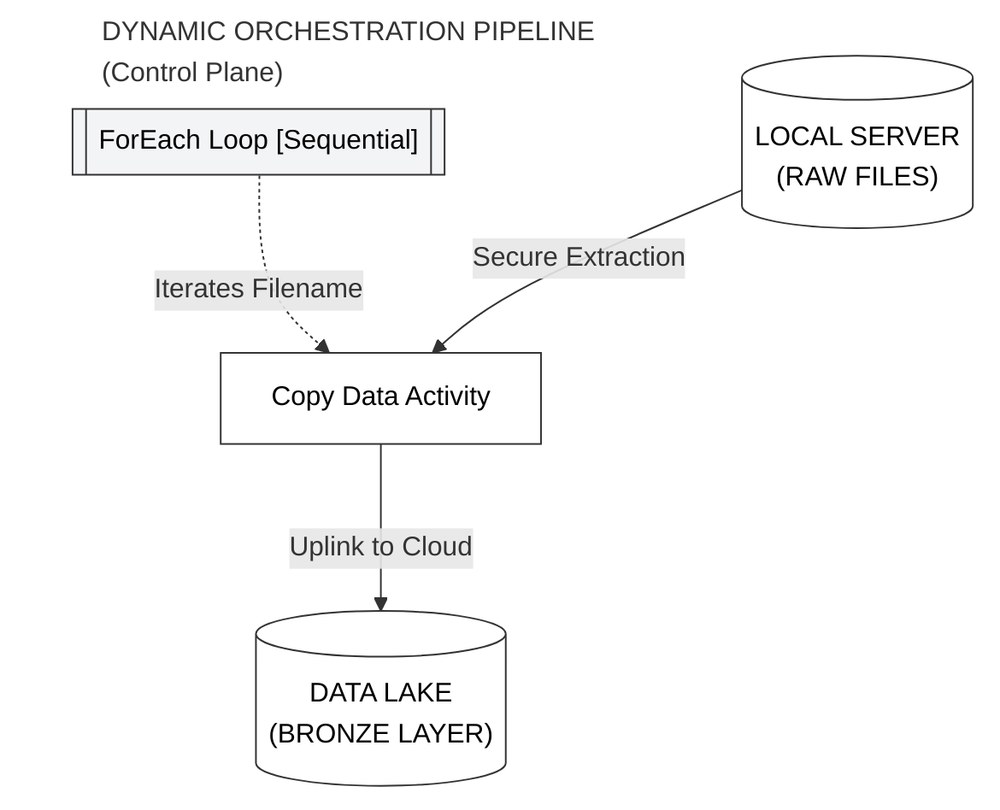

#### What Could Go Wrong (And Why)

| Risk | What Happens | How to Prevent It |
|:---|:---|:---|
| Parallel execution on SHIR | Machine runs out of memory, SHIR crashes | Always check "Sequential" in the ForEach settings when using a Self-Hosted IR |
| Wrong `@item()` syntax | ADF cannot resolve the filename variable | The expression inside ForEach for the current item is always exactly `@item()` — no extra quotes, no spaces |
| Array typed as String instead of Array | ForEach treats the whole array as one single string item | Make sure the pipeline parameter type is set to `Array`, not `String` |

#### Implementation Guide
For the complete step-by-step implementation guide, follow the **[Manual](documentation/phase3_onprem_pipeline.md)**

---

### Phase 4: REST API Payload Harvesting

#### What Is This Phase About?

Not all data lives in files or databases. Huge amounts of modern data is accessible through APIs (Application Programming Interfaces) — standardised web endpoints that return data in JSON format when you make a request to a specific URL. Phase 4 teaches you how ADF can call any public API and land the response data directly into your Data Lake.

#### Core Concepts You Will Master

**What Is an API?**

Think of an API as a waiter in a restaurant. You (the client) tell the waiter (the API) what you want. The waiter goes to the kitchen (the server/database), gets the food (the data), and brings it back to you in a standardised way (usually JSON format).

You do not need to know how the kitchen works. You just need to know the menu (the API documentation) — what URL to call, what parameters to pass, and what format the response will be in.

**HTTP GET vs. POST**

HTTP (HyperText Transfer Protocol) is the language of the web. The two most common request types are:

*GET:* "Give me data." You are only reading. No data is being sent. When you open a webpage or call a public data API, you are doing a GET request. This is what we use in this project — we are reading data from GitHub.

*POST:* "Here is data, do something with it." You are sending data to the server. When you submit a login form, you are doing a POST request. We use POST in Phase 10 when we send failure details to the Logic App.

**The Raw URL vs. The Web Page URL**

This is a very important distinction. When you open a file on GitHub in your browser, you see the GitHub website — navigation bars, buttons, comments, formatted code. If you tried to copy that URL into ADF, ADF would download all of that website HTML, not just the data file.

The "Raw" URL gives you just the data — no HTML, no formatting, nothing extra. On GitHub, there is a "Raw" button on every file. Click it, and the URL changes to `raw.githubusercontent.com/...`. That is the URL you give to ADF.

**Anonymous vs. Authenticated APIs**

APIs can be either public (no authentication required — anyone can call them) or private (require a key, token, or username/password). GitHub's public repositories expose raw files as public APIs. No authentication is needed. In ADF, this is configured in the Linked Service as "Authentication: Anonymous."

In real-world projects, most corporate APIs are authenticated. You would be given an API key (a long secret string) and would configure it in ADF's Linked Service as a header or a parameter.

**The Copy Activity Works for APIs Too**

Beginners assume the Copy Activity only copies files from one storage location to another. In fact, it is much more powerful — it can copy data from any supported source, including HTTP endpoints. You configure an HTTP Dataset (pointing to the API URL) as the Source, and a Data Lake JSON Dataset as the Sink. ADF handles the HTTP call, reads the JSON response, and writes it to the lake.

#### Architecture at a Glance

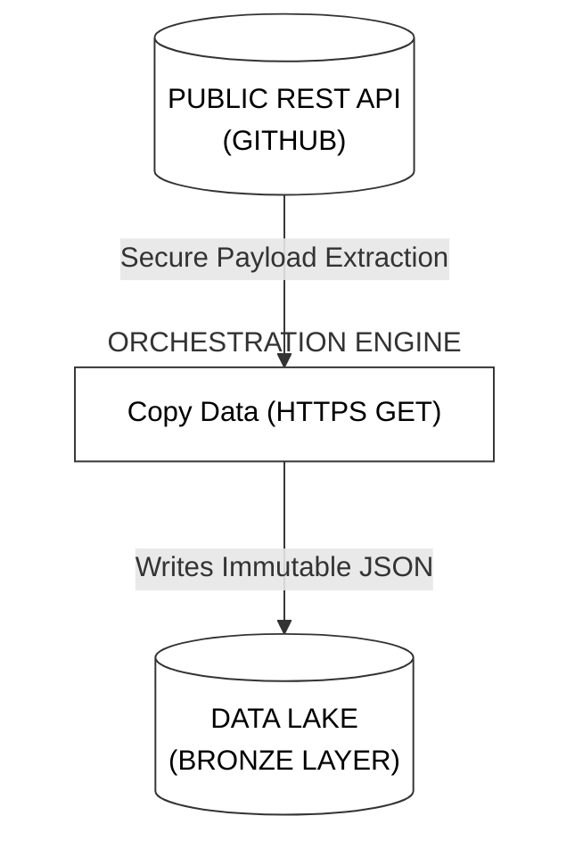

#### What Could Go Wrong (And Why)

| Risk | What Happens | How to Prevent It |
|:---|:---|:---|
| Using the GitHub web URL instead of Raw URL | ADF downloads HTML website code, not the JSON data | Always click "Raw" on GitHub and use the `raw.githubusercontent.com` URL |
| Copying the wrong part of the URL into Relative URL | Linked Service + Relative URL do not combine correctly | The Base URL in the Linked Service is `https://raw.githubusercontent.com/`. The Relative URL is everything after that — the repository path and filename |

#### Implementation Guide
For the complete step-by-step implementation guide, follow the **[Manual](documentation/phase4_api_pipeline.md)**

---

### Phase 5: High-Water Mark Incremental Loading

#### What Is This Phase About?

This is the most intellectually important phase of the project. Until now, every pipeline has been doing "full loads" — copying everything, every time. But what if your database has 10 million rows and gets 1,000 new rows each day? Running a full load every day would copy 10 million rows, process all of them, and write all of them — when you only needed the 1,000 new ones.

Incremental loading solves this. Phase 5 builds a system that is smart enough to know what it has already processed and only loads what is new.

#### Core Concepts You Will Master

**The High-Water Mark (HWM) Pattern**

A watermark in the physical world is the highest point water has reached — visible as a stain on a wall after a flood. In data engineering, a High-Water Mark is the "highest" (most recent) point your data pipeline has processed up to.

The concept works like this:
1. First time running: process all data (since 1900-01-01 up to today)
2. Record today's maximum date as the new watermark
3. Next time running: only process data newer than the watermark
4. Update the watermark to the new maximum date
5. Repeat forever

With each run, the watermark advances forward in time. Old data is never reprocessed. Only genuinely new records are ingested.

**Why Not Use Watermark Tables (The Old Way)?**

You may see old tutorials that store the watermark in a database table (a "watermark table"). This worked fine in traditional data warehouse architectures where you had a database to write to.

But in modern cloud architectures, your destination is a Data Lake — you cannot create tables in a data lake file system. Even if you could, creating a dependency on a database just to store a single date seems wasteful.

The modern approach: store the watermark in a JSON file in the Data Lake itself. The `last-load.json` file you created in Phase 1 is that file. The pipeline reads it at the start of each run and overwrites it at the end.

**The Dual Lookup Pattern**

To implement HWM, you need two pieces of information at the start of every run:
1. **What is the last date I processed?** → Read from `last-load.json`
2. **What is the latest date currently in the source database?** → Query the source with `SELECT MAX(booking_date)`

Both are retrieved using the Lookup Activity. A Lookup Activity executes a query and returns the result as a variable that subsequent activities can use.

Once you have both dates, the Copy Activity uses them to build a dynamic SQL query:
```sql
SELECT * FROM FactBookings
WHERE booking_date > '@{last_load_date}'
AND booking_date <= '@{latest_load_date}'
```

This query precisely captures only the records in the date bracket between the last run and now.

**The `>` vs `>=` Distinction — Very Important**

Notice the query uses `>` (strictly greater than) for the lower bound, not `>=` (greater than or equal to). This is critical. If you used `>=`, the system would re-load the very last record from the previous run on every subsequent run. Over time, this causes duplicate data. The strict `>` operator steps cleanly past the watermark — the record at exactly the watermark date has already been loaded, so exclude it.

**The State Update — Closing the Loop**

After copying the new data, the pipeline does one final step: it overwrites `last-load.json` with the new maximum date from the current run. This advances the watermark forward in time. On the next run, the new watermark will be used as the lower bound, and the cycle continues indefinitely.

**The Initial Load Challenge**

On the very first run, `last-load.json` contains `"1900-01-01"`. This causes the SQL query to read:
```sql
WHERE booking_date > '1900-01-01'
```
Since all real data has dates after 1900, this effectively captures everything — a complete initial load. From the second run onwards, the watermark will be a real recent date, and only incremental data will be loaded. This elegant design means you do not need a separate pipeline for initial load and incremental load — the same pipeline handles both.

#### Architecture at a Glance

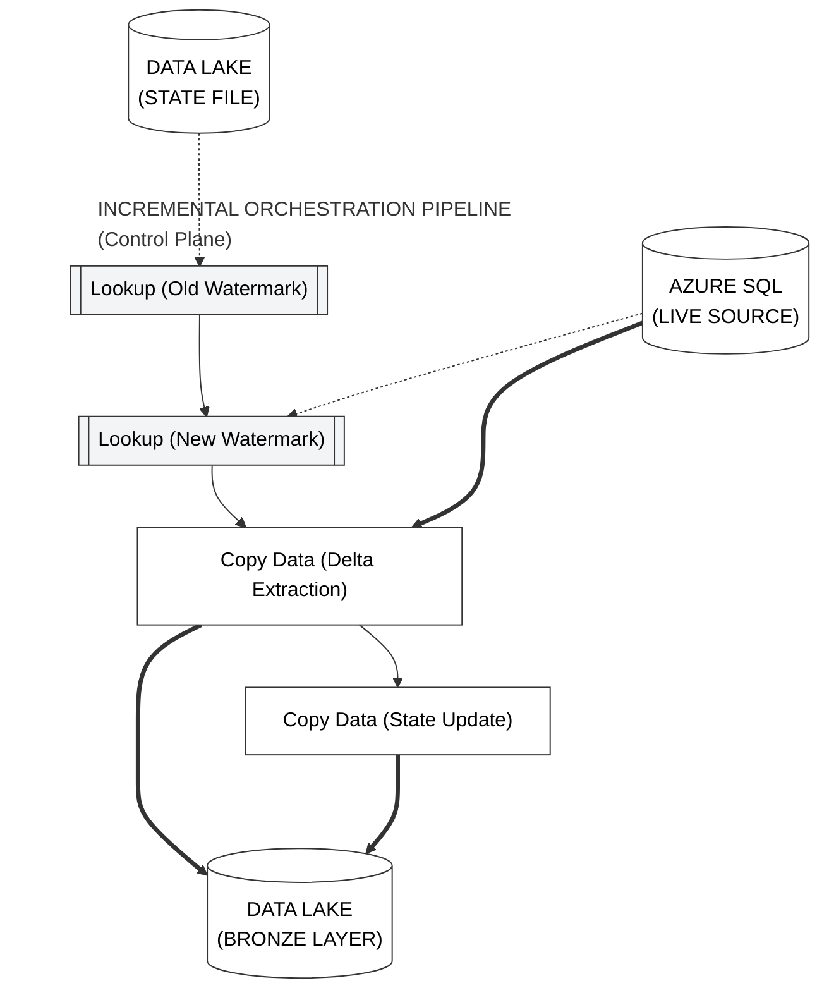

#### What Could Go Wrong (And Why)

| Risk | What Happens | How to Prevent It |
|:---|:---|:---|
| Using `>=` instead of `>` | The last record of every run gets duplicated | Always use strict `>` for the lower bound in your WHERE clause |
| Lookup returns an array, not a single value | Downstream expressions fail because they receive a list | Always enable "First row only" in the Lookup Activity settings |
| State file not updated after copy | Next run reloads the same data again | The `Update_Watermark` Copy Activity must be the final step, connected on success from the main Copy Activity |

#### Implementation Guide
For the complete step-by-step implementation guide, follow the **[Manual](documentation/phase5_incremental_sql.md)**

---

### Phase 6: Relational Mart Hub

#### What Is This Phase About?

Your Bronze layer now contains raw CSV and JSON files. These are great for data engineers, but business analysts are used to writing SQL queries. They cannot write SQL against a CSV file in a data lake. Phase 6 moves selected data from the Bronze lake into proper SQL tables in the Azure SQL Database — creating a "Data Mart" (a small, focused database optimised for a specific business domain).

#### Core Concepts You Will Master

**Data Lake vs. Data Mart — When to Use Which**

The Data Lake is designed for storage at scale and flexibility. Any file format, any size, cheap cost per GB. It is the right place for raw data, for data that data engineers process, and for intermediate results.

The Data Mart (a relational database) is designed for speed and structure. Strict schemas, typed columns, indexing, SQL query optimisation. It is the right place for data that business analysts, Power BI reports, and dashboards will query directly.

A mature data architecture often has both — the Data Lake for processing and the Data Mart for serving.

**The Type Casting Problem — Why Mapping Matters**

CSV files are pure text. Every value in a CSV, even the number `42`, is stored as the string `"42"`. When you load a CSV into SQL, you need to tell the database which columns should be treated as integers, which as text, which as dates. This is called type casting.

Without explicit mapping in ADF's Copy Activity, ADF will attempt to guess the types — and it will often guess wrong. A column that looks like `"123456"` might get imported as a string VARCHAR when you need it to be an INT. Your SQL query `WHERE passenger_id = 123456` would then fail because it's comparing an integer to a string.

The Mapping tab in the Copy Activity lets you explicitly define: "Column X from the source should be type INT in the destination." This is not optional — it is essential for data quality.

**Parallel Execution — The Right Time for It**

In Phase 3, we ran the ForEach loop sequentially because we were using a local SHIR. In Phase 6, both the source (ADLS Gen2) and destination (Azure SQL) are cloud services using the AutoResolve Integration Runtime. Cloud resources have plenty of compute. Running two Copy Activities simultaneously (copying DimAirline and DimPassenger at the same time) is perfectly fine and cuts the execution time in half.

When two activities have no connecting arrow between them on the ADF canvas, they run in parallel automatically. This is a deliberate design choice in ADF — the absence of a dependency line means "run simultaneously."

#### Architecture at a Glance

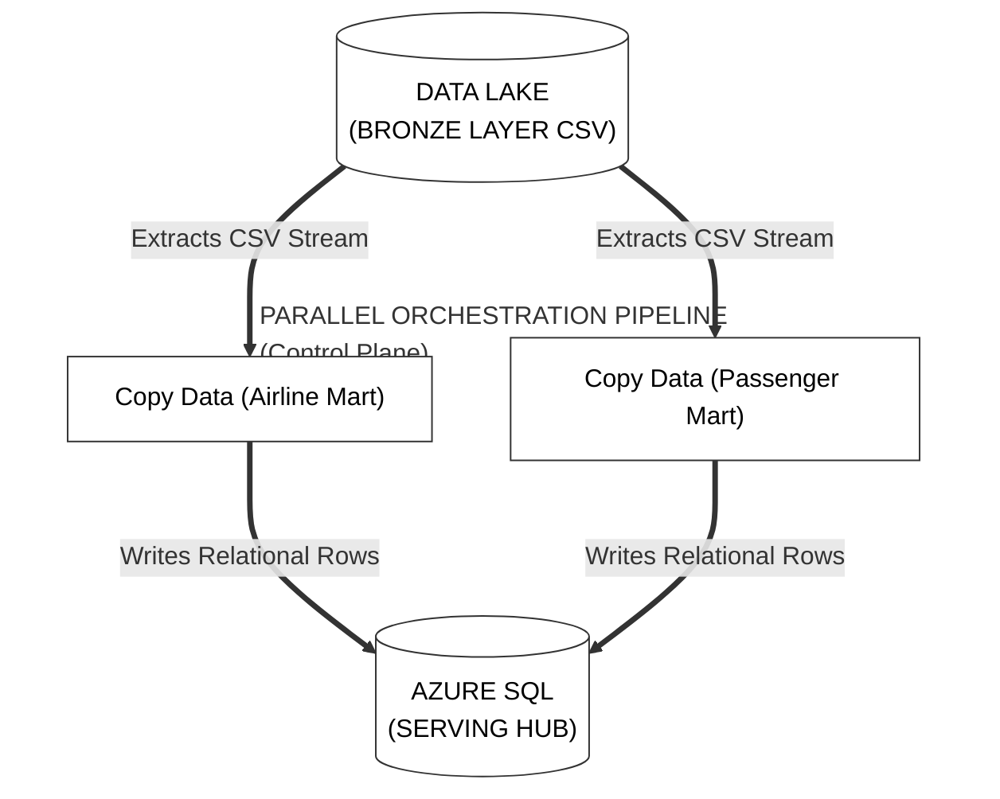

#### What Could Go Wrong (And Why)

| Risk | What Happens | How to Prevent It |
|:---|:---|:---|
| No explicit column mapping | Wrong data types in SQL, query failures downstream | Always use the Mapping tab and click "Import schemas" to see and configure the type mapping |
| CSV files not yet in Bronze when mapping | Schema import fails with "no data found" | Run Phase 3 pipeline first before building Phase 6 datasets |
| SQL table does not exist | Copy Activity fails with "object not found" | Always run the DDL script (CREATE TABLE) in the SQL Query Editor before running the pipeline |

#### Implementation Guide
For the complete step-by-step implementation guide, follow the **[Manual](documentation/phase6_load_to_sql.md)**

---

### Phase 7: Silver Tier Transformation (Spark)

#### What Is This Phase About?

The Bronze layer holds raw data exactly as it arrived — messy, inconsistently formatted, with data type issues. The Silver layer is where data gets cleaned, standardised, and made reliable. Phase 7 builds the transformation logic using ADF's Mapping Data Flows, which run on Apache Spark under the hood. No Spark code is required — everything is done through a visual drag-and-drop interface.

#### Core Concepts You Will Master

**What Is Apache Spark?**

Apache Spark is a distributed computing engine — it splits a large dataset across many machines and processes each chunk simultaneously, then combines the results. Instead of one computer processing 1 million rows sequentially, Spark might use 10 machines to process 100,000 rows each, simultaneously — finishing in a fraction of the time.

ADF's Data Flows are built on Spark. When you click "Debug" in a Data Flow, ADF quietly spins up a Spark cluster (a group of virtual machines) in the background, runs your transformation logic as Spark code, and then shuts the cluster down. You never write a single line of Spark code — the visual canvas generates it for you.

**The Debug Cluster — Why the 5-Minute Wait**

When you turn on "Data flow debug", ADF is actually provisioning a real Spark cluster. Spinning up virtual machines, installing dependencies, and connecting nodes takes time — typically 5 to 7 minutes. This is not a bug or a slow internet connection. It is the time needed to start real distributed compute infrastructure.

Once it is running, leave it on for the duration of your Data Flow development session. It has a Time-To-Live (TTL) — if you leave it idle for too long, it shuts down automatically to save cost.

**Import Projection — Telling Spark What Your Data Looks Like**

Before Spark can process your data, it needs to know its schema — the column names and data types. "Import Projection" reads a sample of your file and automatically discovers the schema. This is essential. Without it, Spark treats all columns as generic strings and cannot perform typed operations like `sum(ticket_cost)` or `upper(country)`.

**The Join Activity — Combining Data**

A Join in a Data Flow works exactly like a SQL JOIN. You take two sources and combine them on a matching column. In Phase 7, we join the Bronze bookings data (fact table) with the Bronze passengers data (dimension table) on the `passenger_id` column. Records from both tables that share the same `passenger_id` get merged into one wide row.

**Types of Joins and When to Use Each:**
- **Inner Join:** Only keep records where a match exists in BOTH tables. If a booking has no matching passenger, that booking is dropped.
- **Left Outer Join:** Keep ALL records from the left table. If no match exists in the right table, fill with NULLs. Used in Phase 8 to ensure all revenue records are preserved even if a passenger record is missing.
- **Right Outer Join:** Same as Left but for the right table.
- **Full Outer Join:** Keep ALL records from BOTH tables regardless of matches.

**Derived Column — Transforming Values**

The Derived Column activity lets you modify existing columns or create new ones using expressions. It is equivalent to the `withColumn()` function in PySpark or a CASE statement in SQL. Examples:

- `upper(country)` — Convert country name to uppercase
- `split(full_name, ' ')[1]` — Extract the first word (first name) by splitting on space
- `regexReplace(gender, 'M', 'Male')` — Replace abbreviations with full words

These expressions are written in ADF's expression language, which is very similar to SQL functions and PySpark syntax.

**Alter Row — Defining the Write Policy**

Before writing to a Delta Lake destination, you must define an "Alter Row" policy. This tells Spark what to do if a record with the same key already exists in the destination:

- **Insert If:** Only write the row if it is new
- **Update If:** Update the row if the key already exists
- **Upsert If:** Update if exists, Insert if new (most common production use)
- **Delete If:** Delete the row if a condition is met

Using `upsertIf(true())` means "always upsert" — always insert new rows and always update existing ones if the key matches.

**Delta Lake — Why This Format?**

Regular Parquet files are immutable — once written, you cannot update a specific row. If you need to update a booking record, you have to rewrite the entire file.

Delta Lake adds a transaction log on top of Parquet files. This log tracks every change (insert, update, delete) as a separate entry. The Delta format enables:
- **Upserts** — update specific rows without rewriting the whole file
- **ACID Transactions** — changes are atomic (either fully applied or not at all)
- **Time Travel** — you can query the state of the data at any point in its history
- **Schema Evolution** — adding new columns without breaking existing queries

This is why Delta is the preferred format for Silver and Gold layers in modern architectures.

#### Architecture at a Glance

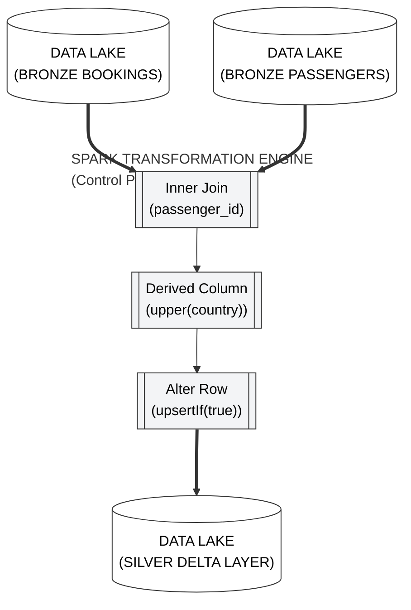

#### What Could Go Wrong (And Why)

| Risk | What Happens | How to Prevent It |
|:---|:---|:---|
| Forgot to Import Projection | Column names are not visible, join conditions cannot be set | Always click "Import projection" on every source node before building downstream transformations |
| Alter Row missing before Delta Sink | Data Flow fails with "no row policy defined" | Every Delta Sink must be preceded by an Alter Row activity |
| Key column not set on Delta Sink | Upsert becomes a duplicate insert every run | In the Sink settings under "Key columns", always select the primary key column |

#### Implementation Guide
For the complete step-by-step implementation guide, follow the **[Manual](documentation/phase7_silver_transformation.md)**

---

### Phase 8: Gold Tier Analytical Synthesis

#### What Is This Phase About?

The Silver layer has clean, reliable data. Now it needs to be turned into answers. Business users do not want to see a table of 1 million rows — they want to see "Top 5 Airlines by Revenue This Quarter." Phase 8 builds the Gold layer by aggregating Silver data into pre-computed KPIs using advanced Spark window functions.

#### Core Concepts You Will Master

**Aggregation — Summarising Data**

Aggregation means collapsing many rows into fewer rows by applying a mathematical operation. The most common aggregation functions are:

- `SUM()` — Add up all values in a group
- `COUNT()` — Count how many rows are in a group
- `AVG()` — Calculate the average
- `MAX()` / `MIN()` — Find the highest or lowest value

In Phase 8, we group all booking records by `airline_name` and compute `SUM(ticket_cost)` for each group. This collapses 1 million individual booking rows into perhaps 20 rows — one per airline — each showing that airline's total revenue.

**Window Functions — Ranking Without Collapsing**

Regular aggregation collapses rows. Window functions perform calculations across groups while keeping all rows intact.

The most important window function in this project is `denseRank()`. It assigns a ranking number to each row based on an ordering. If three airlines have the same revenue, they all get the same rank. The next airline gets the next consecutive rank (not skipping numbers — that is what makes it "dense").

Example output:
```
Airline A: $2,000,000 → Rank 1
Airline B: $1,800,000 → Rank 2
Airline C: $1,800,000 → Rank 2 (tied)
Airline D: $1,500,000 → Rank 3 (dense — no gap)
```

Regular `rank()` would make Airline D Rank 4, skipping 3 because two airlines tied at rank 2. `denseRank()` is usually preferred in business reports because the ranking numbers remain continuous and meaningful.

**The Filter After Ranking — "Top N" Pattern**

To get the "Top 5 Airlines," you:
1. Aggregate to get total revenue per airline
2. Rank by revenue descending
3. Filter to keep only rows where `Rank <= 5`

This three-step pattern (Aggregate → Window Rank → Filter) is one of the most common Gold layer patterns in the entire data engineering industry. You will use it in almost every analytical project you work on.

**Overwrite vs. Upsert for Gold Layer**

In the Silver layer, we used Upsert — update existing records, insert new ones. In the Gold layer, we use Overwrite (also called "truncate and reload"). Why the difference?

The Gold layer contains pre-computed business views. Every time the pipeline runs, the entire view is recalculated from scratch. Yesterday's "Top 5 Airlines" is completely replaced by today's "Top 5 Airlines." There is no point trying to upsert because the entire result set changes. It is cleaner and simpler to just overwrite the entire Gold table on every run.

#### Architecture at a Glance

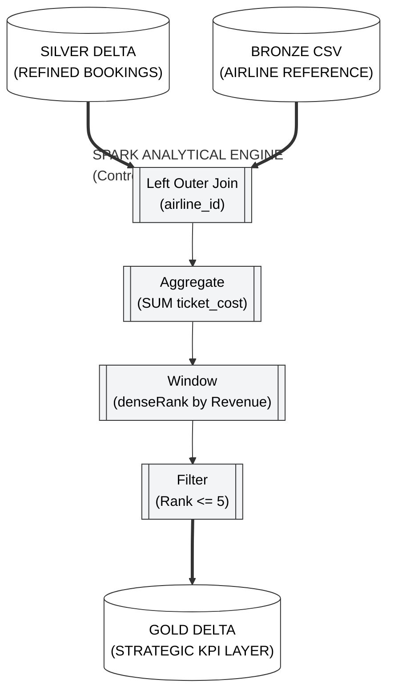

#### What Could Go Wrong (And Why)

| Risk | What Happens | How to Prevent It |
|:---|:---|:---|
| Using Inner Join instead of Left Outer | Bookings with no matching airline get dropped, revenue is undercounted | Always use Left Outer Join when joining a fact table to a dimension table |
| Gold Sink set to "Insert" instead of "Overwrite" | Rankings accumulate over multiple runs, creating duplicates | Always set Gold Sink table action to "Overwrite" |
| `toShort()` function on a null ticket_cost | Data Flow errors on null conversion | Add a filter before aggregation to remove rows where ticket_cost is null |

#### Implementation Guide
For the complete step-by-step implementation guide, follow the **[Manual](documentation/phase8_gold_layer.md)**

---

### Phase 9: Master Pipeline Orchestration

#### What Is This Phase About?

You now have multiple independent pipelines: one for Bronze ingestion, one for Silver transformation, one for Gold analytics. Each works on its own. But in production, you need them to run in sequence, automatically, with the Bronze pipeline completing before Silver starts, and Silver completing before Gold starts.

Phase 9 creates a "Parent Pipeline" — a master controller that invokes all child pipelines in the correct order with proper dependency gating.

#### Core Concepts You Will Master

**Parent-Child Pipeline Architecture**

Think of it like a project manager and their team. The parent pipeline is the project manager — it does not do the actual work, it delegates. Each child pipeline (Bronze, Silver, Gold) is a specialist team member who handles their specific task. The project manager makes sure Team A finishes before Team B starts.

This architecture has several advantages:
- You can still run each child pipeline independently for testing or re-runs
- The parent pipeline provides a single entry point for the entire data lifecycle
- Adding a new stage (e.g., a Platinum layer someday) just means adding one more Execute Pipeline activity to the parent

**The Execute Pipeline Activity**

The Execute Pipeline activity is the tool used in parent pipelines to invoke child pipelines. It is like calling a function in programming. You point it at a specific pipeline and tell it to run.

**The "Wait on Completion" Flag — Critical**

By default, the Execute Pipeline activity fires and immediately moves on — it does not wait for the child pipeline to finish. This means without the "Wait on completion" checkbox ticked, your parent pipeline would trigger all three child pipelines simultaneously, which completely defeats the purpose of sequential ordering.

With "Wait on completion" enabled, the parent pipeline pauses after triggering the child pipeline and only moves to the next step when the child pipeline reports success or failure. This is the correct production setting. Always enable it.

**Success Dependency Lines — The Green Arrows**

On the ADF canvas, when you connect two activities with an arrow, you are creating a dependency. By default, the arrow is green, meaning "run the next activity only if this activity succeeded." 

These green arrows enforce the sequential order. The Silver Execute Pipeline activity only starts after the Bronze Execute Pipeline activity has reported "Succeeded." This prevents race conditions (where Silver tries to transform data before Bronze has finished loading it).

**Race Conditions — Why Order Matters**

A race condition is what happens when two processes that depend on each other run simultaneously without coordination. If Silver starts transforming data while Bronze is still loading it, Silver might read an incomplete dataset and produce incorrect results. The data it transforms would be missing the last batch of records that Bronze had not yet written.

The green success dependency arrows completely prevent this. Silver simply waits for Bronze to finish. This is not just good practice — it is mandatory for correct results.

#### Architecture at a Glance

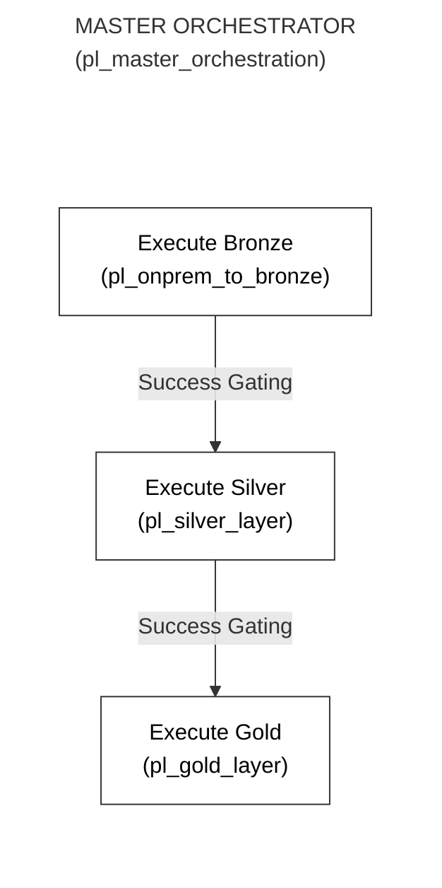

#### What Could Go Wrong (And Why)

| Risk | What Happens | How to Prevent It |
|:---|:---|:---|
| "Wait on completion" not checked | All three pipelines run simultaneously, Silver reads incomplete Bronze data | Always enable "Wait on completion" on every Execute Pipeline activity |
| No dependency arrow between activities | Activities run in parallel instead of sequentially | Draw success dependency arrows between Bronze→Silver and Silver→Gold |
| Parent pipeline parameters not matching child | Parameter passing fails with type mismatch error | If child pipelines have parameters, always bypass them through the parent rather than hardcoding values in the Execute Pipeline activity |

#### Implementation Guide
For the complete step-by-step implementation guide, follow the **[Manual](documentation/phase9_parent_pipeline.md)**

---

### Phase 10: Serverless Telemetry & Alerting

#### What Is This Phase About?

Your pipeline runs automatically at midnight. If it fails at 2am, no one knows until a business user complains at 9am that their dashboard has stale data. By then, seven hours of business time have been lost. Phase 10 builds an automated alerting system that sends an email the moment a pipeline fails — even at 2am.

#### Core Concepts You Will Master

**Azure Logic Apps — Serverless Applications**

A Logic App is a serverless application that responds to triggers and performs actions. "Serverless" means you do not manage any server — you just define the workflow, and Azure runs it whenever needed, scaling automatically, and you pay only for the time it actually runs.

A Logic App workflow has two parts:
1. **Trigger:** What event starts the workflow? In our case: receiving an HTTP POST request.
2. **Action:** What happens next? In our case: send an email.

Logic Apps have hundreds of pre-built connectors — email, Slack, Teams, SMS, databases, and more. This means you can build sophisticated alerting workflows without writing any code.

**HTTP POST — Sending Data to the Logic App**

When ADF detects a pipeline failure, it needs to notify the Logic App. It does this using the Web Activity with a POST request. Think of it as ADF sending a text message to the Logic App with details about what went wrong.

The POST request includes a body — a JSON object with details:
- `DataFactoryName` — which ADF instance failed
- `PipelineName` — which pipeline failed
- `ErrorMessage` — what the error was
- `RunId` — the unique identifier for this specific run (useful for looking up logs)

**JSON Schema — The Contract Between ADF and Logic App**

When the Logic App is configured to receive HTTP requests, you must define a JSON schema. This schema is a contract — it tells the Logic App exactly what fields to expect in the incoming request body. Once the schema is defined, the Logic App "understands" the fields and makes them available as dynamic variables in the email body.

**The Failure Dependency Line — The Red Arrow**

In Phase 9, we used green success dependency arrows. For the alerting activity, we need a red failure dependency arrow. The alerting Web Activity should ONLY run when the pipeline fails. Connecting it with a success arrow would cause the alert to fire every time the pipeline runs successfully — which is wrong and would be very annoying.

Right-click the connecting arrow and change it from "Success" to "Failure." The arrow turns red. Now the alert only fires when something goes wrong.

**The `@pipeline()` System Variables**

ADF has built-in variables accessible via the `@pipeline()` function. These are automatically populated at runtime with information about the current run:
- `@pipeline().DataFactory` — the name of the ADF instance
- `@pipeline().Pipeline` — the name of the current pipeline
- `@pipeline().RunId` — the unique run ID
- `@activity('ActivityName').Error.Message` — the error message from a specific failed activity

These are used in the Web Activity body to pass real, accurate information to the Logic App email.

#### Architecture at a Glance

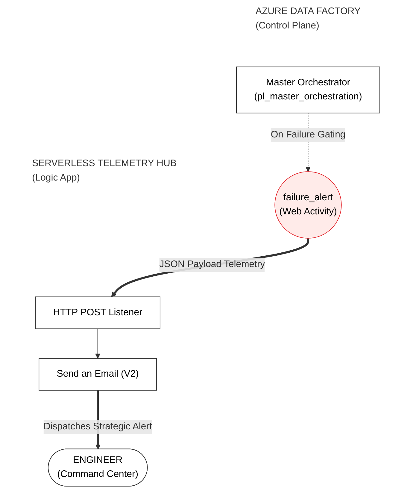

#### What Could Go Wrong (And Why)

| Risk | What Happens | How to Prevent It |
|:---|:---|:---|
| Dependency line left as green (Success) | Alert fires on every successful run, not just failures | Right-click the arrow → change to "Failure" → it turns red |
| Logic App URL copied before saving the workflow | URL is blank — it only generates after the first save | Always click Save in the Logic App Designer before copying the HTTP trigger URL |
| Alert email goes to spam | You never see the failure notification | After first test, check your spam folder and mark the alert email as "Not Spam" |

#### Implementation Guide
For the complete step-by-step implementation guide, follow the **[Manual](documentation/phase10_logic_app.md)**

---

### Phase 11: Production Schedule Automation

#### What Is This Phase About?

You have a complete, working pipeline. Right now, it only runs when you manually click "Debug" or "Trigger Now." That is fine for development, but in production, data needs to arrive on a schedule — every day at a specific time, without anyone having to do anything. Phase 11 automates this using ADF Triggers.

#### Core Concepts You Will Master

**What Is a Trigger?**

A Trigger is a rule that tells ADF when to automatically run a pipeline. ADF supports several types of triggers:

**Schedule Trigger (most common):** Runs a pipeline at a specific time on a recurring schedule. "Run every day at midnight." This is what 99% of production pipelines use. You define a start time, an end time (optional), a timezone, and a recurrence interval.

**Tumbling Window Trigger:** Similar to a schedule trigger but with an important difference — it can run for past time windows that were missed. If your pipeline was down for two days, a tumbling window trigger will automatically run the pipeline twice to "catch up." Useful for time-partitioned data pipelines.

**Storage Event Trigger:** Runs a pipeline when a specific event happens in storage — like when a new file lands in a Data Lake folder. Useful for real-time ingestion patterns where you do not know exactly when data will arrive.

**The Timezone Trap — UTC vs. Local Time**

All Azure infrastructure runs on UTC (Coordinated Universal Time — essentially Greenwich Mean Time). When you set a trigger time, the default is UTC. If you are in Pakistan (UTC+5), and you want your pipeline to run at 9am Pakistan time, you need to either set the trigger to 4am UTC or — better — set the trigger timezone to `(UTC+05:00) Islamabad, Karachi` and set the time to 9am. Always set the timezone explicitly to avoid confusion.

**Publishing Is Required for Triggers to Activate**

This is a very common mistake. You create a trigger, click OK, and think you are done. But if you have not clicked "Publish All", the trigger only exists in your development workspace — it has not been registered with the Azure backend. ADF will not actually run the trigger until it is published.

Always click "Publish All" after creating or modifying a trigger. After publishing, go to Manage → Triggers and confirm the status shows "Started."

**Start Date vs. Today's Date**

If you set the trigger's start date to today and the start time to 6am, but it is already 7am when you publish — the trigger will not run today. It will wait until tomorrow at 6am. If you want the trigger to run immediately, set the start time to a few minutes in the future.

#### Architecture at a Glance

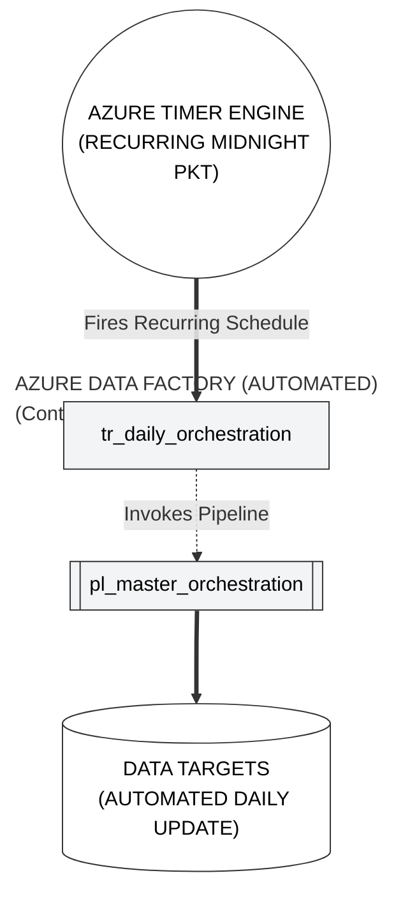

#### What Could Go Wrong (And Why)

| Risk | What Happens | How to Prevent It |
|:---|:---|:---|
| Forgot to Publish All | Trigger exists in ADF Studio but never actually fires | Always Publish All after creating or modifying a trigger. Verify in Manage → Triggers |
| Timezone left as UTC | Pipeline runs at the wrong local time | Always explicitly set the timezone to your local region |
| Start date/time is in the past | Trigger may fire immediately or behave unpredictably | Set the start time to at least 5 minutes in the future from when you publish |

#### Implementation Guide
For the complete step-by-step implementation guide, follow the **[Manual](documentation/phase11_triggers.md)**

---

### Phase 12: Enterprise DevOps & Git Integration

#### What Is This Phase About?

Imagine you have a colleague who accidentally breaks a pipeline. Without version control, you have no way to see what changed, no way to go back, and no clear record of who made what change. Phase 12 connects ADF to GitHub so that every change to every pipeline is tracked, versioned, and reversible — just like how software developers manage their code.

#### Core Concepts You Will Master

**What Is Git and Why Does It Matter?**

Git is a version control system. Every time you save a change in ADF (after git integration), that change is recorded as a "commit" — a snapshot of the pipeline at that moment in time. You can see the entire history of every change, who made it, and when.

This is not just for safety — it enables collaboration. If five data engineers are working on the same ADF project, Git allows them to work on separate "branches" (independent copies of the code) and then merge their work together without overwriting each other's changes.

**Branches — Parallel Development Environments**

Think of a branch as a personal copy of the project. The `main` branch is the official, approved version. When a developer starts working on a new feature, they create a new branch (e.g., `feature/new-airline-dimension`). All their changes happen in this isolated branch. The `main` branch is completely unaffected.

When the work is done and reviewed, the developer merges their branch back into `main`. This workflow means:
- `main` always contains stable, approved code
- Developers can experiment freely without risk
- Changes can be reviewed before they reach production

**Pull Requests — The Review Gate**

A Pull Request (PR) is a formal request to merge a feature branch into `main`. Before the merge happens, other team members can review the changes — look at what was added, what was modified, whether the logic makes sense. They can approve it, request changes, or reject it.

This peer review process is standard practice in all professional software development. It catches bugs, maintains code quality, and ensures knowledge is shared across the team.

**The Two Branches in ADF Git Integration**

ADF uses a dual-branch strategy:

`main` (Collaboration Branch): Where all development work is saved. When you click "Save" in ADF Studio with Git integration enabled, your changes are committed to this branch.

`adf_publish` (Publish Branch): An automatically generated branch that ADF creates when you click "Publish All." It contains the ARM templates (JSON files describing your entire ADF infrastructure) that can be used to deploy your pipelines to a QA or production environment. You never commit to this branch manually.

**ARM Templates — Infrastructure as Code**

When you click "Publish All," ADF generates ARM (Azure Resource Manager) templates — JSON files that describe every pipeline, dataset, linked service, and trigger in your ADF instance. These templates can be used to recreate your entire ADF environment in a brand new Azure subscription with one command. This is called Infrastructure as Code (IaC).

In a professional DevOps setup, a DevOps engineer would take these ARM templates from the `adf_publish` branch and deploy them to QA and Production environments through automated release pipelines. As a data engineer, your job ends at generating the ARM templates (clicking Publish). The deployment is handled by the DevOps team.

#### Architecture at a Glance

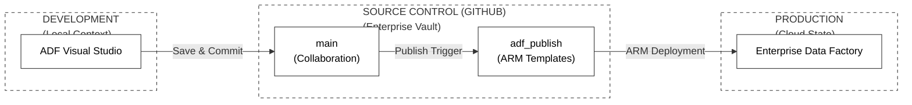

#### What Could Go Wrong (And Why)

| Risk | What Happens | How to Prevent It |
|:---|:---|:---|
| Credentials (passwords) committed to Git | Security risk — secrets exposed in version history | Never store passwords or API keys in pipeline JSON. Use ADF's Key Vault integration for secrets |
| Working directly on `main` branch | Untested changes go directly to the collaboration branch | Always create a feature branch for new work. Merge to `main` only after testing and review |
| `adf_publish` branch modified manually | ARM templates become inconsistent | Never commit to `adf_publish` manually. It is managed entirely by ADF's Publish function |

#### Implementation Guide
For the complete step-by-step implementation guide, follow the **[Manual](documentation/phase12_git_devops.md)**

---

## Global Troubleshooting & Risk Mitigation

When things go wrong (and they will — that is normal), this table is your first stop. Data engineering is 50% building and 50% debugging. The engineers who succeed are the ones who debug patiently and systematically.

| Component | Error Signature | Root Cause | Engineering Solution |
|:---|:---|:---|:---|
| **Connectivity** | `Access Denied (403)` | SQL firewall blocking ADF | In Azure SQL Networking → set "Allow Azure services" to Yes. Also check your client IP is whitelisted. |
| **SHIR** | `Node is offline / disconnected` | SHIR application not running on local machine | Open the Microsoft Integration Runtime application on your PC and verify it shows "Running" |
| **On-Prem Files** | `Path not found` | Incorrect host path in File System Linked Service | Verify the exact local path by opening File Explorer and copying the address bar content |
| **Incremental Load** | `0 rows copied every run` | Watermark not updating correctly | Check `last-load.json` — if the date is not advancing after each run, the Update_Watermark copy activity has an error |
| **Data Flow Debug** | `Cluster not starting` | Azure resource quota exceeded | Check your Azure subscription's quota for Spark clusters. Try a different region. |
| **Ingestion** | `NULL Values in SQL` | Column mapping not set | Go to the Mapping tab of the Copy Activity → Import schemas → explicitly map each column |
| **Logic Apps** | `Alert email in spam` | Email provider spam filter | Check spam folder, mark as "Not Spam," and add the Logic App's sending address to your contacts |
| **Spark** | `Cluster Start Timeout` | Cold start on first debug | Enable "Quick Re-use" in Integration Runtime settings, or simply wait the full 7 minutes for cold start |
| **Triggers** | `Trigger not firing` | Not published | Always click "Publish All" after creating or modifying triggers. Verify status in Manage → Triggers |
| **Git** | `Changes not visible in GitHub` | Saved but not committed | In ADF Studio with Git mode, "Save" creates a commit. Make sure you are on the correct branch. |

---

## Project Lessons & Engineering Best Practices

These are the principles that separate junior data engineers from senior ones. Memorise them. They will be asked about in interviews and they will save you from disasters in real projects.

**1. The Bronze Layer Is Sacred — Never Edit It**

The Bronze layer is your source of truth and your safety net. If your Silver transformation logic has a bug, you fix the transformation and reprocess from Bronze. If Bronze is corrupted or modified, you have nothing to fall back on. Treat every file in Bronze as read-only, forever.

**2. Every Pipeline Must Be Idempotent**

An idempotent pipeline produces the same result no matter how many times you run it. If you run your pipeline once, you get X result. If you run it 10 times, you still get X result — no duplicates, no gaps. The HWM pattern achieves idempotency for incremental loads. The Overwrite setting achieves it for Gold layer analytics.

Idempotency is critical because pipelines fail and get re-run all the time. If re-running a pipeline creates duplicate data, you have a serious data quality problem that compounds over time.

**3. Name Everything Consistently**

Use prefixes to immediately identify what type of object you are looking at:
- `ls_` for Linked Services (e.g., `ls_data_lake`, `ls_sql`)
- `ds_` for Datasets (e.g., `ds_bronze_bookings`, `ds_sql_source`)
- `pl_` for Pipelines (e.g., `pl_onprem_to_bronze`, `pl_master_orchestration`)
- `df_` for Data Flows (e.g., `df_transform_silver`, `df_analytics_gold`)
- `tr_` for Triggers (e.g., `tr_daily_orchestration`)

When you return to a project six months later — or when a new colleague joins the team — consistent naming makes everything immediately understandable.

**4. Never Store State in a Pipeline**

Pipelines are stateless by design. They run, finish, and leave no memory of what happened. If you need to store state between runs (like the watermark date), store it externally — in a file (like `last-load.json`), in a database table, or in a Key Vault secret. Never rely on pipeline variables to carry information across separate runs.

**5. Test Every Layer Before Building the Next**

Before building Silver, confirm Bronze has correct data. Before building Gold, confirm Silver has correct data. Before scheduling, confirm the master pipeline runs successfully manually. This bottom-up validation prevents a situation where Gold layer bugs are actually caused by Bronze layer errors that were never caught.

**6. Monitor Everything, Alert on Failure**

Production systems break. Networks have outages. Source systems send malformed data. A pipeline that fails silently is far more dangerous than one that fails loudly. Always add failure alerting (Phase 10) to every production pipeline. Your on-call team needs to know within minutes, not hours.

**7. Understand Before You Click**

The biggest mistake beginners make is following tutorials by clicking buttons without understanding why. Every click in this guide has a reason. If you understand *why* you are enabling HNS, *why* you need the SHIR, *why* you use `>` instead of `>=`, you can adapt to any real-world scenario. If you just memorised the clicks, you will be helpless when something goes slightly differently.

---

## Conclusion & Portfolio Finality

You have now built and understood a complete, enterprise-grade data engineering system on Microsoft Azure. Let us summarise what you have accomplished:

| Phase | What You Built | Core Concept Mastered |
|:---|:---|:---|
| **Phase 1** | Cloud infrastructure foundation | Resource Groups, ADLS Gen2 with HNS, Azure SQL, watermark file |
| **Phase 2** | Hybrid-cloud connectivity | SHIR, Linked Services, Integration Runtimes |
| **Phase 3** | Dynamic metadata-driven ingestion | Parameters, ForEach loops, scalable pipeline design |
| **Phase 4** | REST API data harvesting | HTTP connections, JSON ingestion, Raw URL pattern |
| **Phase 5** | Modern incremental loading | High-Water Mark pattern, dual lookups, state management |
| **Phase 6** | Relational data mart | Type casting, parallel execution, SQL serving layer |
| **Phase 7** | Silver layer transformation | Mapping Data Flows, Apache Spark, Delta Lake, Upsert |
| **Phase 8** | Gold layer analytics | Aggregation, window functions, denseRank, KPI computation |
| **Phase 9** | Master pipeline orchestration | Parent-child pipelines, success gating, race condition prevention |
| **Phase 10** | Serverless telemetry & alerting | Logic Apps, HTTP POST, failure dependency gating |
| **Phase 11** | Production schedule automation | Schedule Triggers, timezone configuration, publishing |
| **Phase 12** | Enterprise DevOps & version control | Git branches, Pull Requests, ARM templates, IaC |

This implementation represents the complete, real-world lifecycle of a production data pipeline. Every pattern used here — Medallion Architecture, HWM incremental loading, parent-child orchestration, serverless alerting — is the same pattern used in data engineering teams at major companies worldwide.

If you built every phase, understood every concept, and can explain the *why* behind every decision — you are ready to call yourself a data engineer.

**System Status**: Production Complete. Integration Finalized. Documentation Validated.
