# Enterprise Data Lakehouse: Engineering Guide
## A 12-Phase Hybrid-Cloud Implementation on Microsoft Azure

---

> [!IMPORTANT]
> This document is a standalone engineering guide designed to transition a practitioner from initial resource provisioning to enterprise-grade DevOps automation. It is structured as a Comprehensive Technical Guide, providing the architectural blueprints and operational insights required to master Azure Data Factory.

---

## Executive Table of Contents

1.  [**Core System Architecture**](#core-system-architecture)
2.  [**Medallion Data Refinery Model**](#medallion-data-refinery-model)
3.  [**The 12-Phase Engineering Guide**](#the-12-phase-engineering-guide)
    - [Phase 1: Infrastructure & Resource Provisioning](#phase-1-infrastructure--resource-provisioning)
    - [Phase 2: Hybrid-Cloud Connectivity (SHIR)](#phase-2-hybrid-cloud-connectivity-shir)
    - [Phase 3: Metadata-Driven Ingestion](#phase-3-metadata-driven-ingestion)
    - [Phase 4: REST API Payload Harvesting](#phase-4-rest-api-payload-harvesting)
    - [Phase 5: High-Water Mark Incremental Loading](#phase-5-high-water-mark-incremental-loading)
    - [Phase 6: Relational Mart Hub](#phase-6-relational-mart-hub)
    - [Phase 7: Silver Tier Transformation (Spark)](#phase-7-silver-tier-transformation-spark)
    - [Phase 8: Gold Tier Analytical Synthesis](#phase-8-gold-tier-analytical-synthesis)
    - [Phase 9: Master Pipeline Orchestration](#phase-9-master-pipeline-orchestration)
    - [Phase 10: Serverless Telemetry & Alerting](#phase-10-serverless-telemetry--alerting)
    - [Phase 11: Production Schedule Automation](#phase-11-production-schedule-automation)
    - [Phase 12: Enterprise DevOps & Git Integration](#phase-12-enterprise-devops--git-integration)
4.  [**Global Troubleshooting & Risk Mitigation**](#global-troubleshooting--risk-mitigation)
5.  [**Project Lessons & Engineering Best Practices**](#project-lessons--engineering-best-practices)
6.  [**Conclusion & Portfolio Finality**](#conclusion--portfolio-finality)

---

## Core System Architecture

The following high-fidelity blueprint illustrates the end-to-end data trajectory. Orchestrated by **Azure Data Factory**, data is extracted from on-premises and RESTful sources, refined through a **Medallion Data Lake**, and served via an **Azure SQL Mart**, all while monitored by serverless **Logic App** telemetry.

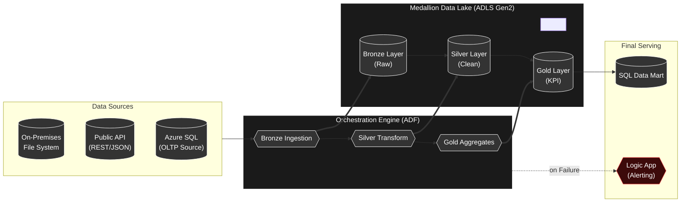

---

## Medallion Data Refinery Model

The Medallion Architecture ensures data quality through progressive refinement tiers.

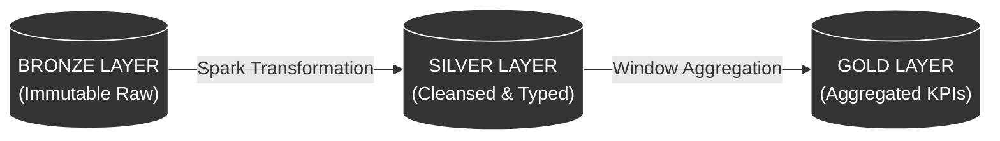

---

## The 12-Phase Engineering Guide

### Phase 1: Infrastructure & Resource Provisioning
**Concept:** Establishing a secure, isolated cloud environment.
- **Goal:** Provision the ADLS Gen2 storage with **Hierarchical Namespace (HNS)** enabled to support folder-level security and performance.
- **Key Implementation:** Establishing the Medallion directory structure (`bronze`, `silver`, `gold`).
- **Minimal Diagram:**
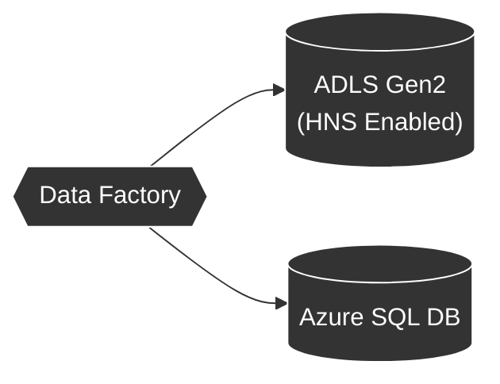
- **Engineering Insight:** Enabling HNS during storage creation is critical; failing to do so results in a flat legacy blob structure that cannot be upgraded later.

### Phase 2: Hybrid-Cloud Connectivity (SHIR)
**Concept:** Securely tunneling data from on-premises legacy environments without firewall reconfiguration.
- **Goal:** Deploy the **Self-Hosted Integration Runtime (SHIR)** as a bi-directional gateway.
- **Key Implementation:** Registering the local agent via a secure authorization key and validating throughput.
- **Minimal Diagram:**
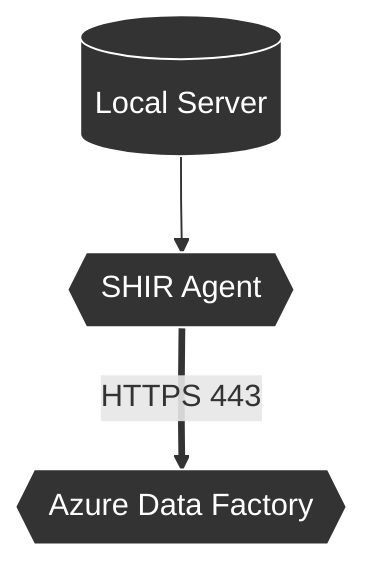
- **Engineering Insight:** Always name Linked Services using the `ls_` prefix to maintain enterprise naming standards.

### Phase 3: Metadata-Driven Ingestion
**Concept:** Developing **Parameterized Control Planes** to automate massive file ingestion.
- **Goal:** Implement a single `ForEach` pipeline capable of ingesting infinite files via an array.
- **Key Implementation:** utilizing the `@item().p_filename` expression to map runtime variables to dataset properties.
- **Minimal Diagram:**
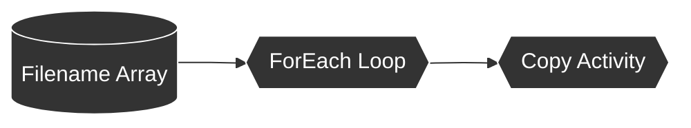
- **Engineering Insight:** Set the loop to **Sequential** execution to prioritize stability over speed on local SHIR hardware.

### Phase 4: REST API Payload Harvesting
**Concept:** Automated extraction of external reference data via standardized HTTP endpoints.
- **Goal:** Harvesting JSON reference sets (e.g., Airport data) directly from public repositories.
- **Key Implementation:** Identifying the **Raw** JSON endpoint to bypass HTML DOM noise.
- **Minimal Diagram:**
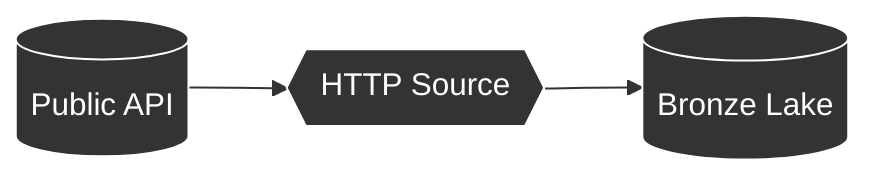
- **Engineering Insight:** Use **Anonymous** authentication within the Linked Service for public endpoints to simplify the security handshake.

### Phase 5: High-Water Mark Incremental Loading
**Concept:** Optimizing cloud compute and network bandwidth by only ingesting changed data.
- **Goal:** Implement a dual-lookup sensor chain to isolate and copy 'Delta' records.
- **Key Implementation:** Calculating the date bracket between the historic watermark and the live database state.
- **Minimal Diagram:**

- **Engineering Insight:** Rigidly use `>` (strict greater-than) in your query logic to prevent row duplication on the watermark boundary.

### Phase 6: Relational Mart Hub
**Concept:** Serving unstructured Lakehouse assets through high-performance SQL schemas.
- **Goal:** Moving refined records into an Azure SQL 'Mart' for relational business consumption.
- **Key Implementation:** Utilizing **Explicit Column Mapping** to cast CSV strings into typed data structures.
- **Minimal Diagram:**
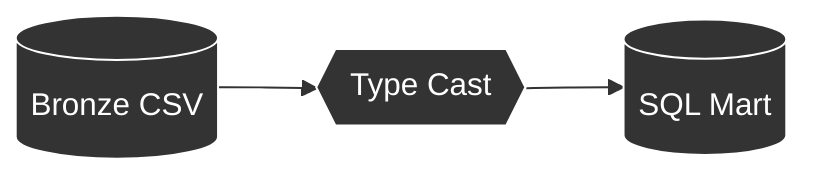
- **Engineering Insight:** Configure the mapping logic to allow SQL to default missing columns to **NULL** instead of failing the ingestion.

### Phase 7: Silver Tier Transformation (Spark)
**Concept:** Schema enforcement and semantic cleansing using distributed compute.
- **Goal:** Cleanse and consolidate disparate Bronze records into a production-ready Silver Layer.
- **Key Implementation:** Utilizing **Apache Spark (Data Flows)** to execute Inner Joins and case-standardization.
- **Minimal Diagram:**
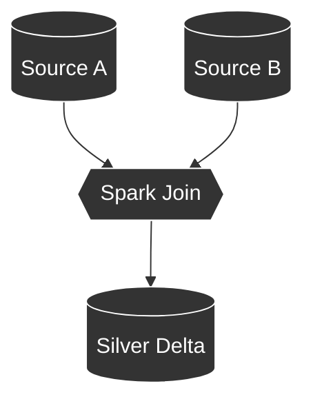
- **Engineering Insight:** **Delta format** adds ACID compliance to the Data Lake, enabling high-speed Upserts (Update/Insert) on cloud storage.

### Phase 8: Gold Tier Analytical Synthesis
**Concept:** Synthesizing millions of records into high-level strategic KPIs.
- **Goal:** Identifying the 'Top 5 Airlines by Revenue' using globally windowed ranking functions.
- **Key Implementation:** Implementing the `denseRank()` function over large distributed datasets.
- **Minimal Diagram:**
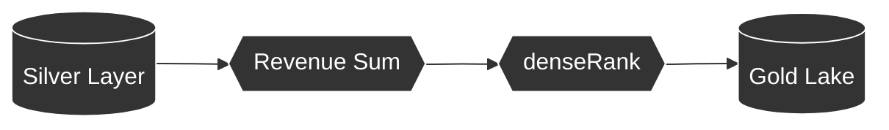
- **Engineering Insight:** Configure the Gold Sink to **Overwrite** during every run to ensure the strategic dashboard always reflects the most recent calculations.

### Phase 9: Master Pipeline Orchestration
**Concept:** Enforcing strict sequential integrity across the tiered data lifecycle.
- **Goal:** Chaining independent pipelines into a unified, synchronous master workflow.
- **Key Implementation:** Implementing **Success Gating** using 'Wait on completion' flags.
- **Minimal Diagram:**

- **Engineering Insight:** Sequential orchestration prevents race conditions where transformation initiates before ingestion is committed.

### Phase 10: Serverless Telemetry & Alerting
**Concept:** Automated incident monitoring and real-time failure notification.
- **Goal:** Deploying an **Azure Logic App** to listen for and report pipeline termination events.
- **Key Implementation:** Mapping JSON error metadata to an SMTP gateway for instant email alerts.
- **Minimal Diagram:**
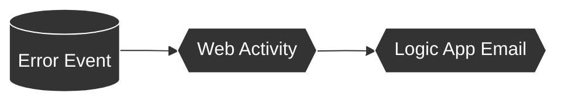
- **Engineering Insight:** Manually reconfigure the dependency line to **Red (Failure)**; leave it as 'Success' will trigger false alerts on healthy runs.

### Phase 11: Production Schedule Automation
**Concept:** Transitioning from manual validation to an autonomous production lifecycle.
- **Goal:** Binding the master orchestration logic to a time-locked daily recurrence.
- **Key Implementation:** Overriding the trigger timezone to **PKT (UTC+05:00)** for business synchronization.
- **Minimal Diagram:**
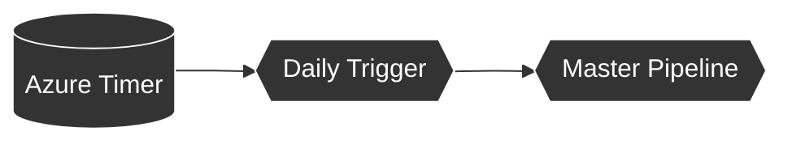
- **Engineering Insight:** Schedule Triggers do not register with the Azure backend until the code is formally **Published** to the service.

### Phase 12: Enterprise DevOps & Git Integration
**Concept:** Implementing industry-standard source control and deployment portability.
- **Goal:** Synchronizing the ADF control plane with **GitHub** for auditability and IaC export.
- **Key Implementation:** Utilizing the `adf_publish` branch for automated ARM template generation.
- **Minimal Diagram:**
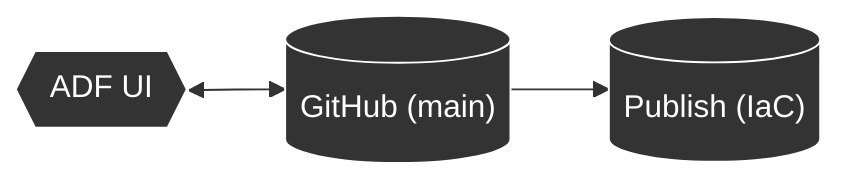
- **Engineering Insight:** Separate your collaboration branch (`main`) from your deployment branch (`adf_publish`) to mirror professional software development lifecycles.

---

## Global Troubleshooting & Risk Mitigation

| Component | Error Signature | Root Cause | Engineering Solution |
|:---|:---|:---|:---|
| **Connectivity** | `Access Denied (403)` | IP Firewall | Authorize 'Allow Azure Services' in SQL Networking. |
| **Ingestion** | `NULL Values in SQL` | Column Mapping | Hard-code 'Map' tab to ensure CSV headers match SQL. |
| **Logic Apps** | `Request Entity Too Large` | JSON Payload | Optimize the Body expression to send only critical RunID metadata. |
| **Spark** | `Cluster Start Timeout` | Cold Start | Enable 'Quick Re-use' in Integration Runtime settings for faster debug. |

---

## Project Lessons & Engineering Best Practices

1.  **Immutability**: Never edit files in the Bronze layer; it is your source of truth.
2.  **Idempotency**: Ensure pipelines can be run multiple times without creating duplicate data (the HWM pattern).
3.  **Naming Conventions**: Use `ls_` for Linked Services, `ds_` for Datasets, and `pl_` for Pipelines.
4.  **Statelessness**: Avoid storing state in the pipeline; use external files (e.g., `last-load.json`) for persistence.

---

## Conclusion & Portfolio Finality

This implementation demonstrates the complete lifecycle of an **Enterprise Data Lakehouse** on Microsoft Azure. By synthesizing metadata-driven ingestion, Spark transformations, serverless alerting, and DevOps synchronization, the system provides a robust framework for scalable, production-ready data engineering.

**System Status**: Production Complete. Integration Finalized. Documentation Validated.
