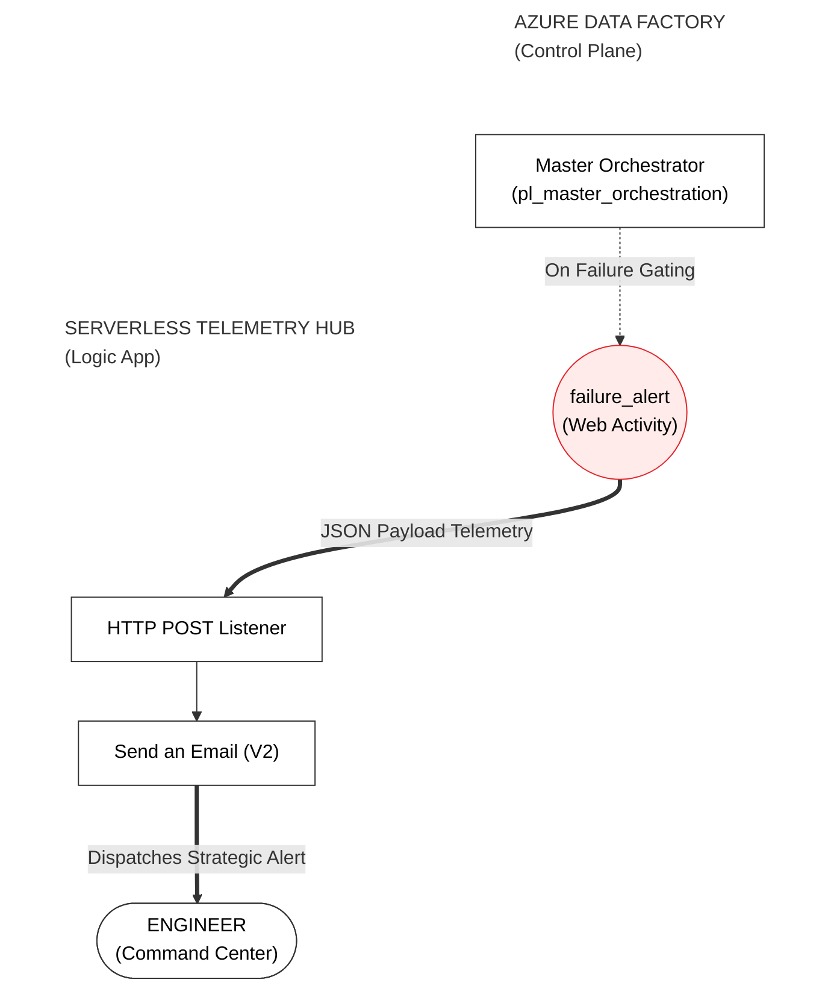
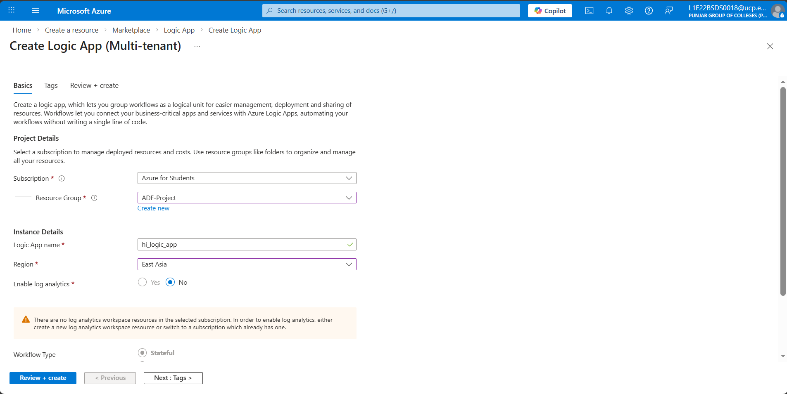
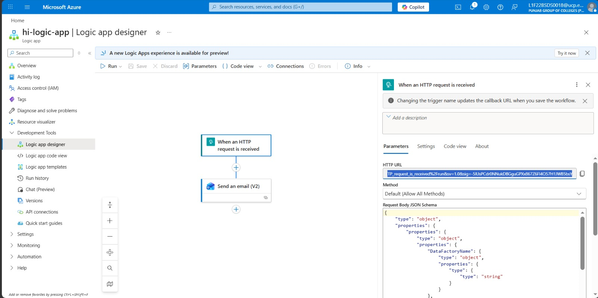
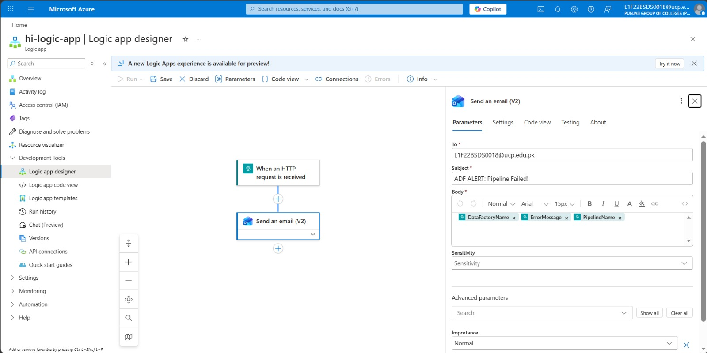
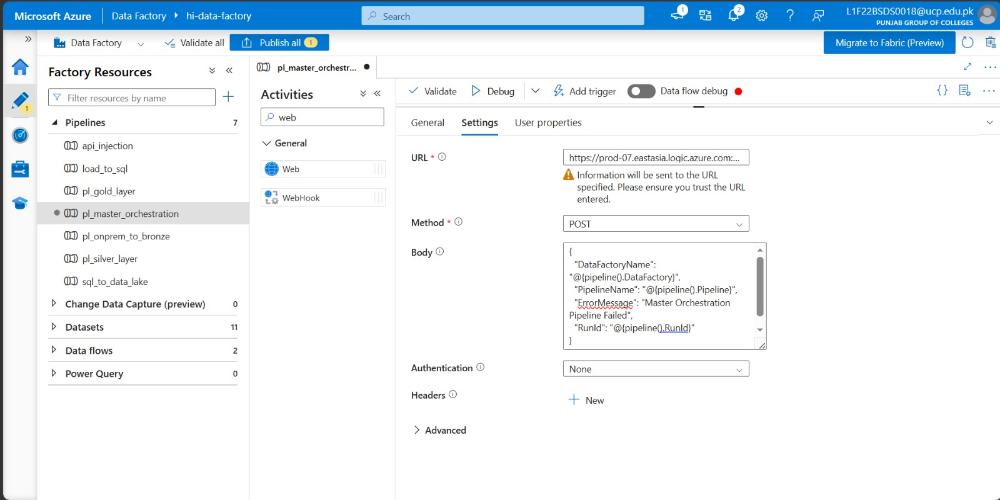
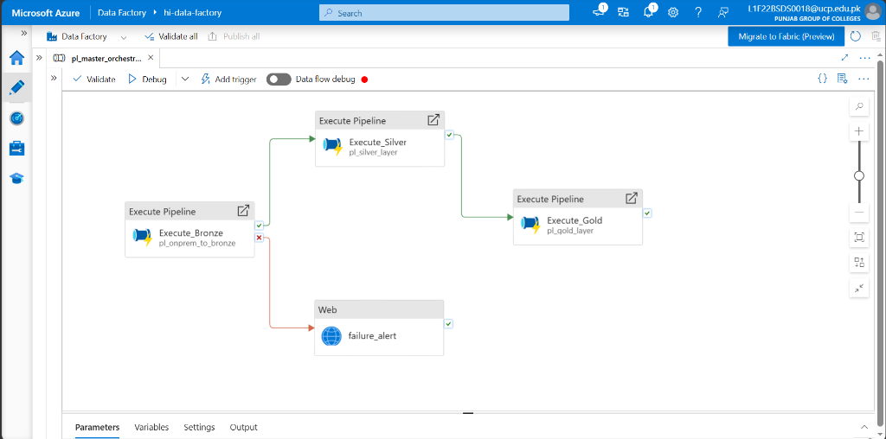
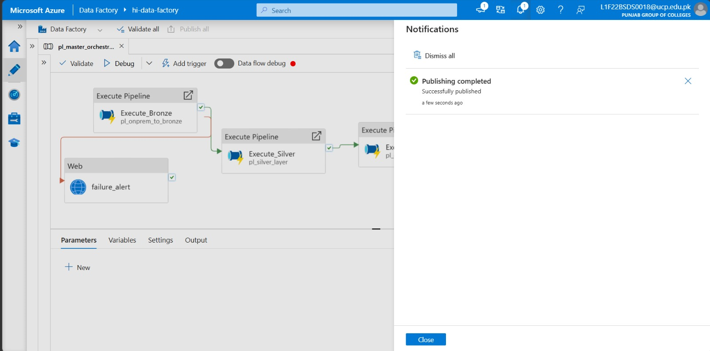
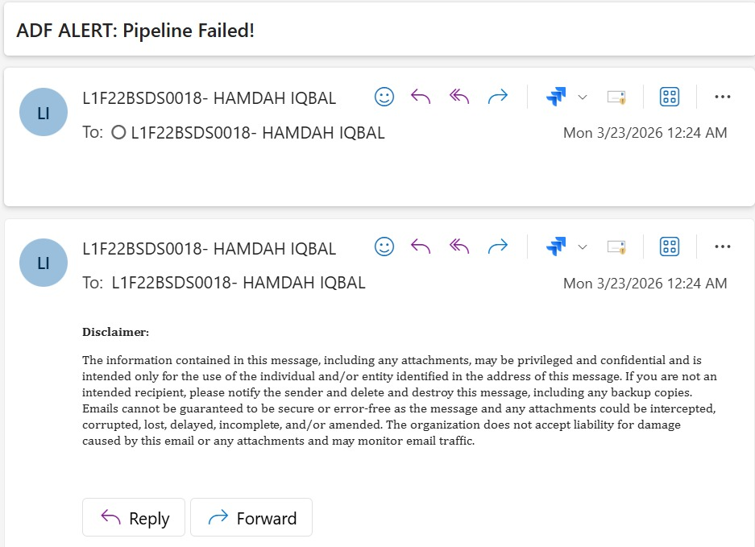

# Phase 10: Operational Telemetry & Alerting

**[ Back to Project Dashboard ](../README.md)**

*Architecting an enterprise-grade alerting system to monitor pipeline health and dispatch real-time failure telemetry to the engineering team.*

---

## Project Foundation

High-availability data engineering requires proactive monitoring. This phase implements the **Automated Operational Telemetry Pattern**, utilizing **Azure Logic Apps** to provide a serverless failure-detection layer. By integrating an HTTP-based listener with an SMTP gateway, the architecture ensures that any pipeline termination state is instantly reported with the relevant error metadata, enabling immediate incident resolution.

**By the end of this phase, the ecosystem will possess:**
- A **Serverless Failure-Listener** (Logic App) armed with a custom JSON schema.
- An **Automated Notification Gateway** (Outlook/Office 365).
- Validated **Pipeline-to-Alert Telemetry** via the master orchestrator.

---

## Architecture Blueprint

The diagram illustrates the telemetry flow. Data Factory monitors the execution state; upon a 'Failure' event, it pings the Logic App endpoint with a JSON payload containing the RunID and error message. The Logic App then parses this metadata and dispatches an automated alert email.



---

## Operational Risk Mitigation

Telemetry systems require strict JSON contract adherence to function correctly.

| Criticality | Implementation Risk | Strategic Mitigation |
|:---:|:---|:---|
| **CRITICAL** | **Telemetry Schema Drift** | The Logic App expects a specific JSON structure (FactoryName, PipelineName, ErrorMessage, RunId). A mismatch between the ADF Web Activity payload and the Logic App schema will cause alert rejection. |
| **FATAL** | **False Positive Alerting** | Azure defaults to 'Success' dependencies. We must explicitly reconfigure the dependency line to **Failure (Red)**. If left as 'Success', the system will dispatch "Failure" alerts every time the pipeline successfully completes. |

---

## Implementation Workflow

### Step 1: Serverless Logic App Deployment

1.  **Path:** `Azure Portal > Create a resource > Search: "Logic App" > Create`.
2.  **Configure:**
    -   **Plan type:** Select **Consumption** (Most cost-effective).
    -   **Logic App name:** `hi-logic-app`.
    -   **Region:** `East Asia` (Match your ADF region).
**Verification Checkpoint:** Under the 'Basics' tab, confirm the Logic App is set to 'Consumption' plan.


---

### Step 2: HTTP Trigger Pattern and Schema

1.  **Path:** Open your new Logic App -> **Logic App Designer**.
2.  Search for the trigger: **When an HTTP request is received**.
3.  **JSON Schema:** Copy and paste the following into the box:
    ```json
    {
        "type": "object",
        "properties": {
            "DataFactoryName": { "type": "string" },
            "PipelineName": { "type": "string" },
            "ErrorMessage": { "type": "string" },
            "RunId": { "type": "string" }
        }
    }
    ```
4.  Click **Save**.
**Verification Checkpoint:** The HTTP POST URL will be generated only AFTER you click 'Save'.


---

### Step 3: SMTP Gateway Integration (Email)

1.  Click **+ New step** below the HTTP trigger.
2.  Search for: **Send an email (V2)** (Use Office 365 Outlook or Gmail).
3.  **Sign In:** Click the button to authorize your email account.
4.  **Configure the Email:**
    -   **To:** Your own email address.
    -   **Subject:** `ADF Pipeline Failure Alert!`
    -   **Body:** Click inside and use the "Dynamic content" list to add the fields:
        `Factory: {DataFactoryName} | Pipeline: {PipelineName} | Error: {ErrorMessage}`

**Verification Checkpoint:** Your email body should contain the dynamic tokens `{DataFactoryName}`, `{PipelineName}`, etc.


---

### Step 4: Failure Gating via Web Activity

1.  Go back to your **Master Pipeline** in ADF.
2.  Drag a **Web** activity onto the canvas. Name it `failure_alert`.
3.  **Connect IT:** Drag the box from `Execute_Bronze` to `failure_alert`.
4.  **Change Dependency (CRITICAL):** Right-click the green connecting line and select **Failure** (it will turn Red).
5.  **Settings Tab:**
    -   **URL:** Paste the Logic App URL you copied in Step 2.
    -   **Method:** `POST`.
    -   **Body:** Click **Add dynamic content** and paste:
        ```json
        {
            "DataFactoryName": "@{pipeline().DataFactory}",
            "PipelineName": "@activity('Execute_Bronze').PipelineName",
            "ErrorMessage": "@activity('Execute_Bronze').Error.Message",
            "RunId": "@{pipeline().RunId}"
        }
        ```

**Verification Checkpoint:** Target the generated Logic App URL within the Web activity settings.


**Verification Checkpoint:** Ensure the connecting line from `Execute_Bronze` to `failure_alert` is **RED**.


---

### Step 5: Telemetry Verification

1.  Click **Publish all** and wait for success.
2.  **Test:** Intentionally break something (like the SQL password) and run Debug.
3.  Check your inbox for the automated alert.

**Verification Checkpoint:** Confirm successful global publication of the telemetry logic.


**Verification Checkpoint:** Confirm receipt of the automated alert email in your inbox.


---

## Technical Handoff
Telemetry is now integrated. In **Phase 11**, we move from manual execution into **Production Lifecycle Automation**, establishing the daily recurring schedule for the entire ecosystem.

**[ Back to Project Dashboard ](../README.md) | [ Previous Phase: Master Orchestration ](./phase9_parent_pipeline.md) | [ Next Phase: Schedule Automation ](./phase11_triggers.md)**
