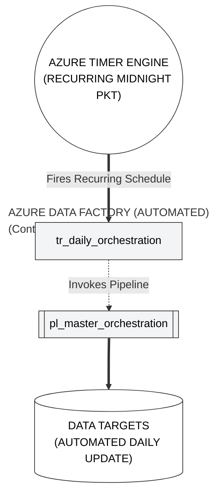
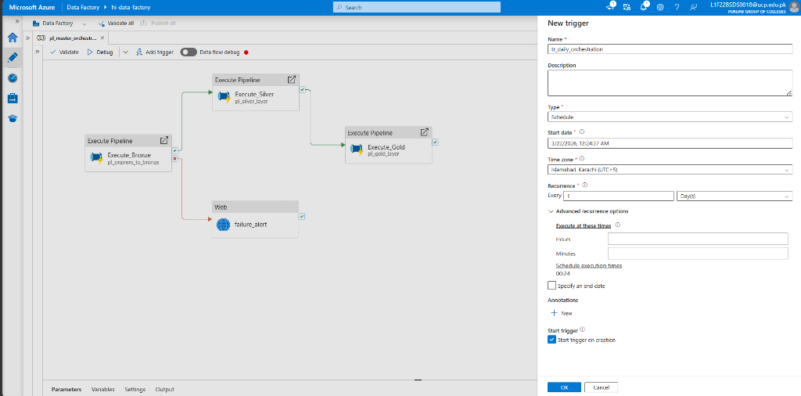
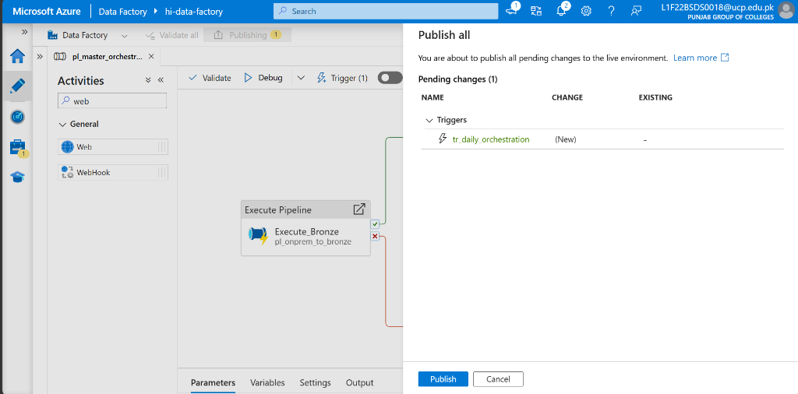

# Phase 11: Enterprise Schedule Automation

**[ Back to Project Dashboard ](../README.md)**

*Transitioning the data refinery from manual validation into a fully automated, time-locked production schedule.*

---

## Table of Contents
- [Project Foundation](#project-foundation)
- [Architecture Blueprint](#architecture-blueprint)
- [Operational Risk Mitigation](#operational-risk-mitigation)
- [Implementation Workflow](#implementation-workflow)
  - [Step 1: Recurrence Policy Specification](#step-1-recurrence-policy-specification)
  - [Step 2: Orchestration Binding](#step-2-orchestration-binding-and-parameters)
  - [Step 3: Management Plane Activation](#step-3-management-plane-activation-and-monitoring)

---

## Project Foundation

Manual execution is structurally incompatible with modern enterprise requirements. This phase implements the **Production Lifecycle Automation Pattern**, utilizing **Schedule Triggers** to automate the daily recurring cycle. By aligning the execution clock with business-specific timezones (PKT), the architecture ensures that data ingestion and transformation occur during optimal windows, providing consistent day-over-day analytical availability.

**By the end of this phase, the ecosystem will possess:**
- A **Recurring Schedule Trigger** (`tr_daily_orchestration`) synchronized to local time.
- Validated **Trigger-to-Pipeline Binding** within the Master Orchestrator.
- A **Self-Sustaining Ingestion Cycle** requiring zero manual intervention.

---

## Architecture Blueprint

The diagram illustrates the automation chain. The Azure Timer Engine fires at a pre-set interval, waking the trigger logic, which then invokes the Master Orchestration pipeline to begin the 12-stage data refinery cycle.

---

## Operational Risk Mitigation

Time-based automation in global cloud environments introduces the risk of timezone drift.

| Criticality | Implementation Risk | Strategic Mitigation |
|:---:|:---|:---|
| **CRITICAL** | **Cloud UTC Latency Drift** | By default, Azure triggers operate on UTC (Coordinated Universal Time). We must explicitly override the **Time Zone** to `(UTC+05:00) Islamabad, Karachi` to ensure alignment with business SLA requirements. |
| **FATAL** | **Registration Negligence** | A trigger created but not published remains dormant. We must click **Publish all** to physically register the trigger hardware with the Azure backend; failing to do so results in zero automated execution. |

---

## Implementation Workflow

### Step 1: Recurrence Policy Specification

> **Strategic Justification:** Defining a recurrence policy ensures that the project remains self-sustaining. Scheduling during off-peak hours (Midnight) minimizes network load and cloud resource contention.

1. Open `pl_master_orchestration`.
2. Select **Add trigger** -> **New/Edit** -> **+ New**.
3. **Configure as follows:**
   - **Type:** `Schedule`.
   - **Recurrence:** `Every 1 Day`.
   - **Time Zone:** `(UTC+05:00) Islamabad, Karachi` (CRITICAL).
   - **Start Trigger:** Checked.
   - **Start Date:** Set to "Today".
   - **Time:** `09:00`.
**Verification Checkpoint:** Ensure the Time Zone is set to your local region (e.g., Karachi/Islamabad).  
  

---

### Step 2: Pipeline Binding & Activation

1. **Path:** `Author > pl_master_orchestration > Add trigger > New/Edit`.
2. Select your new trigger: `tr_daily_master`.
3. Click **OK**.
4. **Activation:** You MUST click **Publish all** for the trigger to actually start working. 
**Verification Checkpoint:** Confirm the trigger status is 'Started' in the Management tab.  
  

---

### Step 3: Management Plane Activation and Monitoring

> **Strategic Justification:** The Manage tab provides the centralized oversight required to verify the life-cycle state of all automation assets.

1. Execute **Publish all**.
2. Navigate to the **Manage** tab -> **Triggers**.
3. Verify the status of `tr_daily_orchestration` is **Started**.

---

## Technical Handoff
Production automation is now active. In **Phase 12**, we implement the final stage of professional engineering: **Enterprise DevOps Integration**, utilizing Git version control and ARM templates to ensure environment portability and CI/CD compliance.

**[ Back to Project Dashboard ](../README.md) | [ Previous Phase: Logic App Monitoring ](./phase10_logic_app.md) | [ Next Phase: Git Integration & CI/CD ](./phase12_git_devops.md)**
