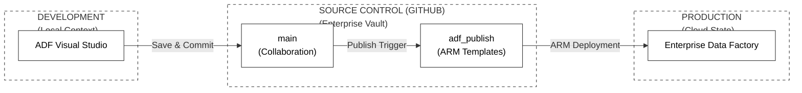
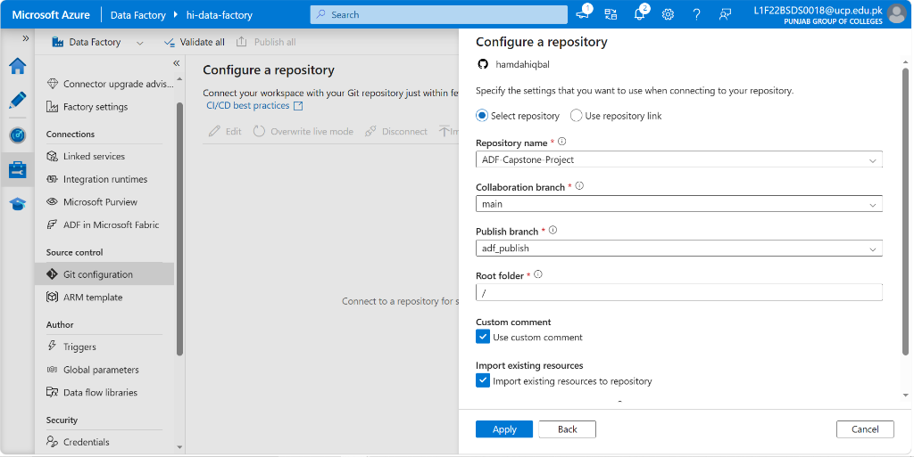
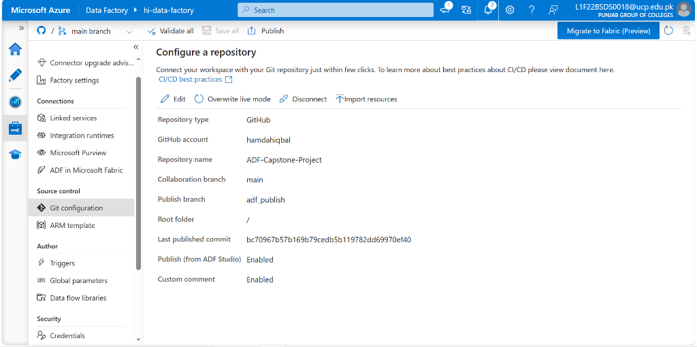
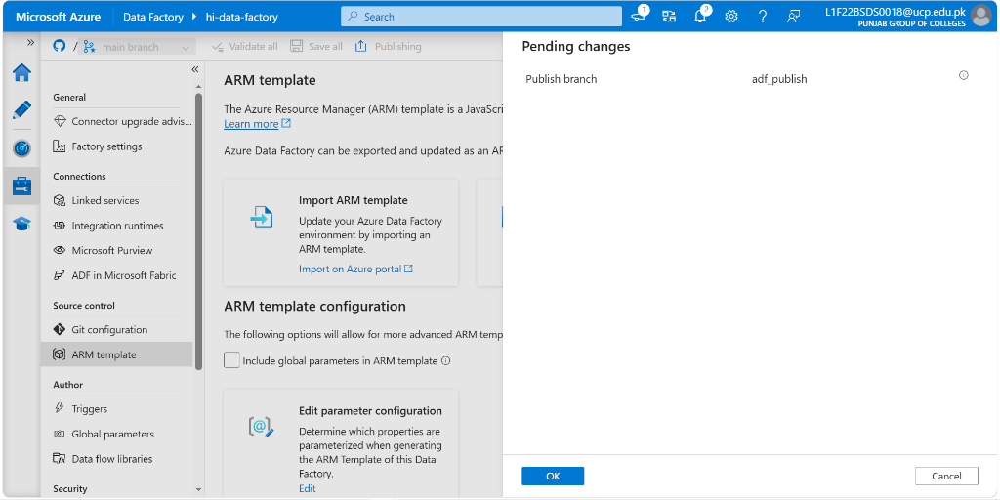
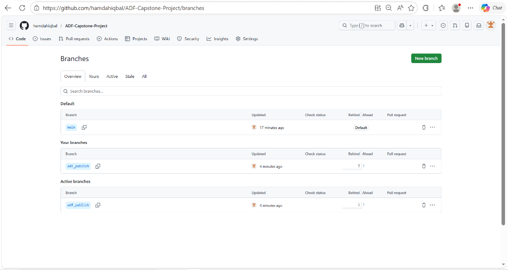
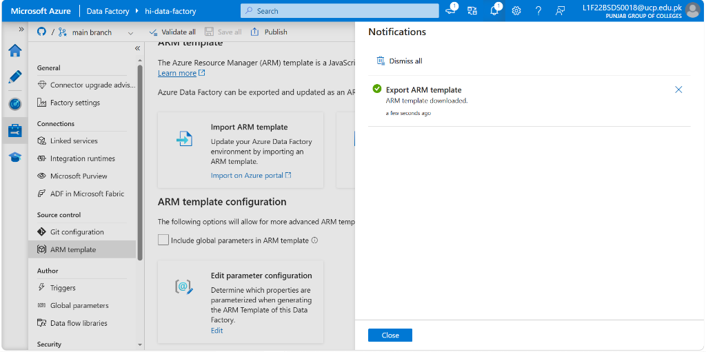
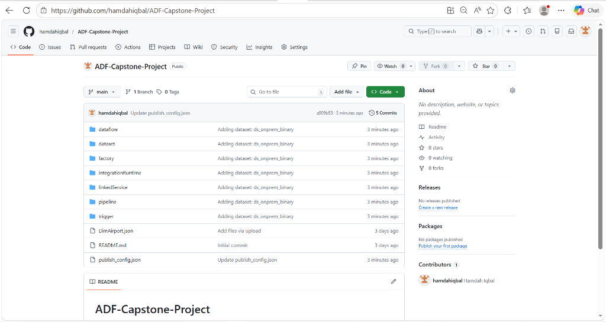

# Phase 12: Enterprise Source Control & DevOps

**[ Back to Project Dashboard ](../README.md)**

---

## Technical Objective

Connect the Azure Data Factory control plane to the central GitHub repository (`hamdahiqbal/ADF-Capstone-Project`), configure the `main` collaboration and `adf_publish` branches, import all existing infrastructure as code (IaC), and export the ARM templates required for automated CI/CD deployment.

---

## Architecture Blueprint

The diagram below illustrates the professional CI/CD lifecycle synchronized with GitHub. Development occurs in the `main` branch, while finalized infrastructure-as-code (IaC) is auto-generated into the `adf_publish` branch for production deployment.

---

## Strategic Significance of Git Integration

Manual data engineering is prone to human error and lacks auditability. By implementing **Source Control Integration**, the architecture achieves:
- **Relational Versioning**: Every save operation in ADF Studio commits the JSON definition to Git.
- **Environment Portability**: ARM templates enable one-click deployment to QA or Production environments.
- **Collaborative Flow**: Feature branching allows multiple engineers to work on independent data flows without colliding with the production `main` branch.

---

## Branching & Deployment Model

The architecture utilizes a dual-branch strategy to separate development logic from deployment-ready templates.

| Branch | Strategic Purpose |
|:---|:---|
| `main` | **Collaboration Branch**: The source of truth for all ongoing pipeline, dataset, and dataflow development. |
| `adf_publish` | **Publish Branch**: An auto-generated namespace containing the finalized ARM templates used for DevOps deployment. |

---

## Implementation Workflow

### Step 1: GitHub Repository Connectivity

1. **Path:** `Azure Data Factory Studio > Manage > Git configuration > + Configure`.
2. **Settings:**
   - **Repository type:** `GitHub`.
   - **Account name:** `hamdahiqbal`.
   - **Repository name:** `ADF-Capstone-Project`.
   - **Collaboration branch:** `main`.
   - **Root folder:** `/`.
**Verification Checkpoint:** Ensure the repository name `ADF-Capstone-Project` is correctly identified.  
  

**Verification Checkpoint:** Confirm the initial Git synchronization state is healthy.  
  

---

### Step 2: The Collaboration & Publish Cycle

> **Concept Brief:** In a professional environment, you never "Save" directly to production. You save to a "Branch" (Branching), and then "Publish" (Deploying).

1. **Working in Git:** Note the branch selector at the top left (it should say `main`).
2. **Publishing:** Click the **Publish** button at the top.
**Verification Checkpoint:** Initiate the manual publication trigger to generate ARM templates.  
  

**Verification Checkpoint:** Confirm that `adf_publish` appears in your GitHub branch list.  
  

---

### Step 3: ARM Template Export (CI/CD Artifacts)

1. **Path:** `Manage > ARM template > Export ARM template`.
2. **Action:** Download the `.zip` file.
3. **Verification:** Open your GitHub repository on the web. You should now see all your folders (`pipeline`, `dataset`, `dataflow`) synced as JSON files.

**Verification Checkpoint:** Confirm successful export of ARM templates for CI/CD usage.  
  

**Verification Checkpoint:** Final verification of the synced JSON resource folders in GitHub.  
  

---

## Project Conclusion & Final Status

The 12-phase implementation of the Enterprise Data Lakehouse is now complete. The architecture is fully automated, documented, and prepared for production-grade operations.

### Strategic Delivery Summary

| Module | Delivery State | Technical Outcome |
|:---|:---|:---|
| **Phase 01-02** | **FINALIZED** | Infrastructure provisioned and Hybrid connectivity established. |
| **Phase 03-04** | **FINALIZED** | Dynamic On-Prem and REST API ingestion flows active. |
| **Phase 05-06** | **FINALIZED** | Incremental SQL loading and Relational Mart Hub active. |
| **Phase 07-08** | **FINALIZED** | Spark-based Medallion Tiering (Silver/Gold) validated. |
| **Phase 09-10** | **FINALIZED** | Master Orchestration and Serverless Telemetry active. |
| **Phase 11-12** | **FINALIZED** | Production Scheduling and Git/DevOps synchronized. |

---
**System Status**: Production Finalized. Zero Gaps Identified.

**[ Back to Project Dashboard ](../README.md) | [ Previous Phase: Schedule Automation ](./phase11_triggers.md)**
