# Phase 1: Resource Provisioning & Infrastructure Setup
**[ Back to Project Dashboard ](../README.md)**

*Establishing the cloud-native foundation for the Enterprise Data Lakehouse.*

---

## Table of Contents
- [Project Foundation](#project-foundation)
- [Architecture Blueprint](#architecture-blueprint)
- [Operational Risk Mitigation](#operational-risk-mitigation)
- [Implementation Workflow](#implementation-workflow)
  - [Step 1: Resource Group](#step-1-resource-group-initialization)
  - [Step 2: Data Factory](#step-2-orchestration-engine-deployment)
  - [Step 3: Data Lake Gen2](#step-3-hierarchical-persistence-layer)
  - [Step 4: Medallion Tiering](#step-4-medallion-container-architecture)
  - [Step 5: State Management](#step-5-watermark-state-initialization)
  - [Step 6: Analytical Hub](#step-6-relational-sql-provisioning)
  - [Step 7: Data Injection](#step-7-initial-payload-injection)

---

## Project Foundation

Strategic infrastructure initialization is required before pipeline development begins. This phase focuses on securing 'digital real estate' within the Microsoft Azure cloud, ensuring resource isolation, cost governance, and high-performance storage topologies.

**By the end of this phase, the ecosystem will possess:**
- A unified **Resource Group** for centralized governance.
- A high-performance **Orchestration Engine** (Azure Data Factory).
- A multi-tier **Data Lake** (ADLS Gen2) supporting Hierarchical Namespace logic.
- A dedicated **Relational Hub** (Azure SQL) for downstream analytical serving.

---

## Architecture Blueprint

The following diagram illustrates the logical interaction between core services. Data Factory acts as the central command-and-control plane, orchestrating data movement across the persistence (Storage) and serving (SQL) layers.

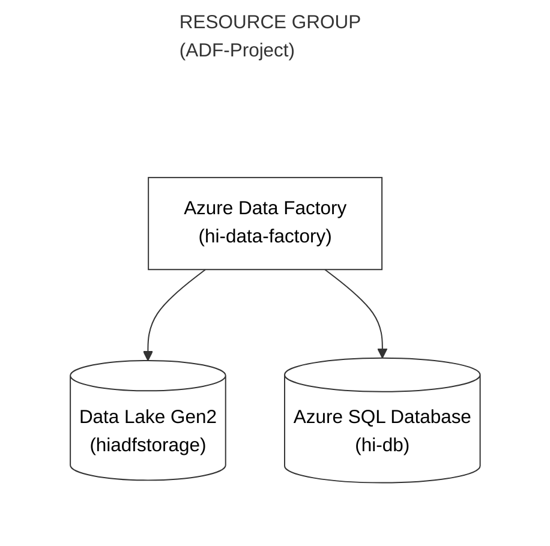

---

## Operational Risk Mitigation

Data Engineering at scale requires proactive failure prevention. Two critical vectors are identified below:

| Criticality | Implementation Risk | Strategic Mitigation |
|:---:|:---|:---|
| **CRITICAL** | **Flat Namespace Limitation** | Failure to enable "Hierarchical Namespace (HNS)" during Storage Account creation results in a legacy Blob structure. HNS is mandatory for modern folder-level security and performance. |
| **FATAL** | **Firewall Connectivity Block** | By default, Azure SQL denies all external traffic. You must explicitly authorize Azure Services in the networking configuration to allow Data Factory to execute write operations. |

---

## Implementation Workflow

### Step 1: Resource Group Initialization

> **Concept Brief:** A Resource Group is a "logical folder" that holds all your Azure services. It allows you to manage and delete everything related to this project in one click.

1. **Path:** `Azure Portal (portal.azure.com) > Create a resource > Search: "Resource Group" > Create`.
2. Apply the following strategic parameters:

| Parameter | Configuration | Strategic Justification |
|:---|:---|:---|
| **Subscription** | *Select your active subscription* | Directs billing and governance. |
| **Resource group** | `ADF-Project` | Establishes the project's namespace. |
| **Region** | `East Asia` (or your nearest region) | Minimizes latency by co-locating resources. |

3. Click **Review + Create**, then click **Create**.

**Verification Checkpoint:** Verify the Resource Group parameters match your strategic region.  
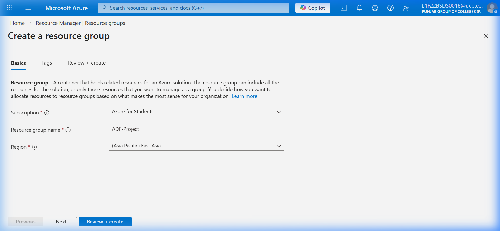  

**Verification Checkpoint:** Confirm the Resource Group `ADF-Project` is successfully provisioned.  
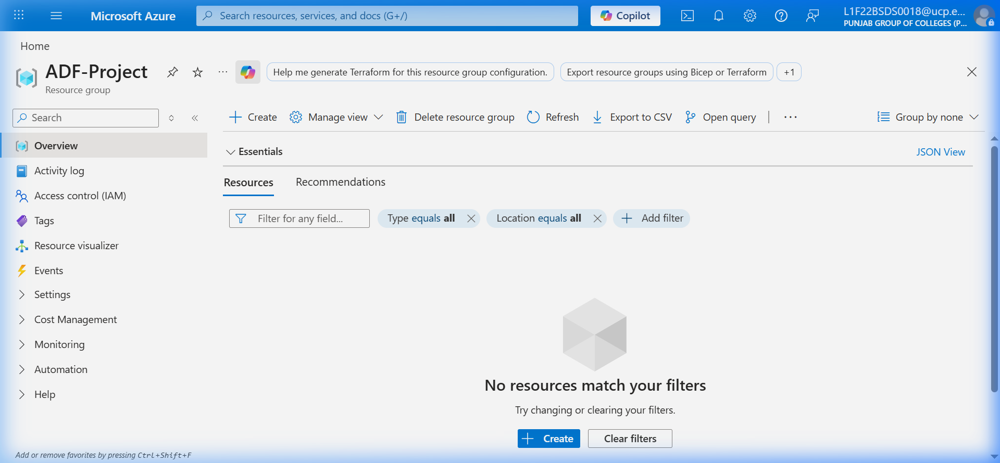  

---

### Step 2: Orchestration Engine Deployment (Azure Data Factory)

> **Concept Brief:** Azure Data Factory (ADF) is the "Master Orchestrator". It doesn't store data; it moves it from Point A to Point B.

1. **Path:** `Search: "Data Factories" > Create`.
2. Apply the following parameters:

| Parameter | Configuration | Strategic Justification |
|:---|:---|:---|
| **Resource Group** | `ADF-Project` | Ensures logical co-location. |
| **Name** | `hi-data-factory` | Must be globally unique. |
| **Region** | *(Match Step 1)* | Optimizes performance. |
| **Version** | `V2` | Latest enterprise version. |

3. **Git Configuration:** Select **Configure Git later** (We will do this in Phase 12).
4. Click **Review + Create**, then click **Create**.

**Verification Checkpoint:** Confirm the Data Factory configuration parameters are correctly set.  
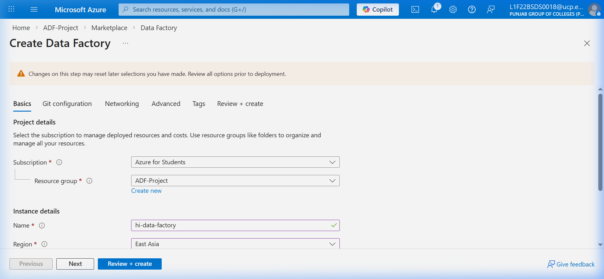  

**Verification Checkpoint:** Verify the Orchestration Engine `hi-data-factory` is deployed.  
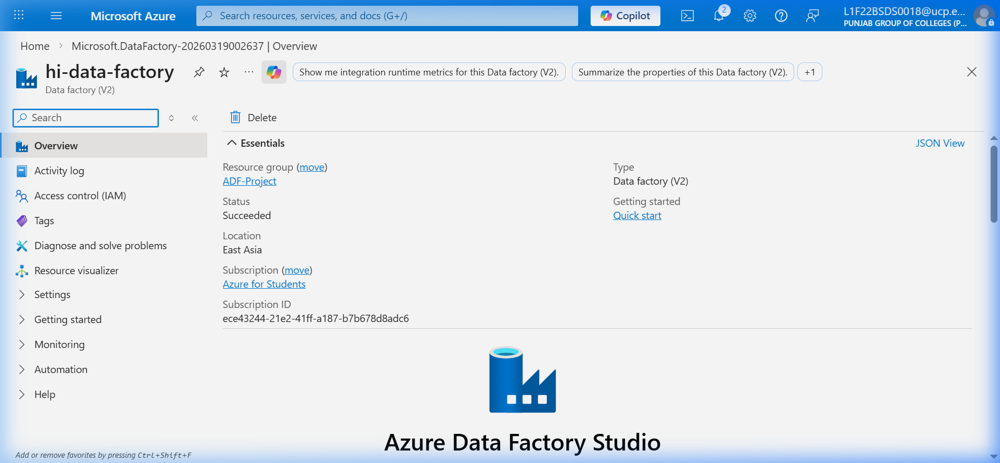  

---

### Step 3: Hierarchical Persistence Layer (ADLS Gen2)

> **Strategic Justification:** Standard object storage lacks directory-level logic. By enabling 'Hierarchical Namespace', we upgrade to a true Data Lake, unlocking the organizational speed required for modern Big Data processing.

1. Search for **Storage accounts** and select **Create**.
2. Configure the **Basics** tab:

| Parameter | Configuration | Strategic Justification |
|:---|:---|:---|
| **Resource Group** | `ADF-Project` | Centralizes management. |
| **Storage account name** | `hiadfstorage` | Must be entirely lowercase alphanumeric. |
| **Redundancy** | `LRS` | Local-redundancy provides cost-effective learning environments. |

3. Navigate to the **Advanced** tab.
4. Locate Data Lake Storage Gen2 and enable **Hierarchical Namespace**.
5. Execute **Review + Create**.

**Verification Checkpoint:** Under the 'Advanced' tab, ensure 'Enable hierarchical namespace' is **CHECKED**.  
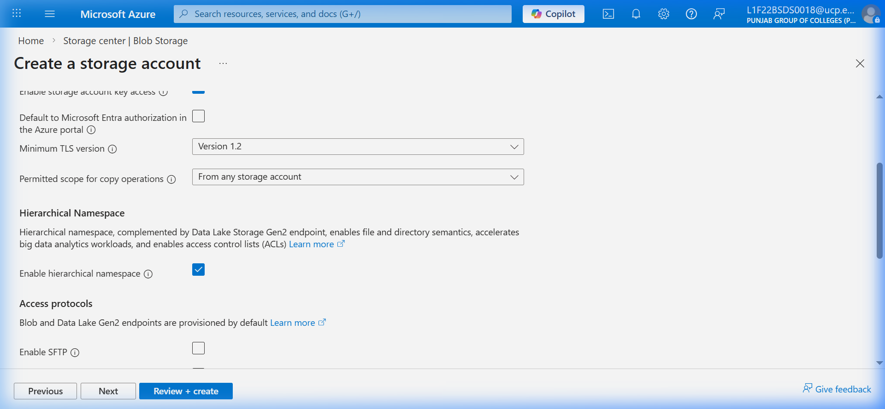  

**Verification Checkpoint:** After creation, verify the storage account is deployed successfully.  
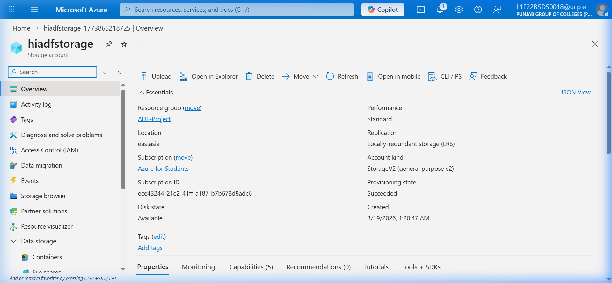  

---

### Step 4: Medallion Tiering (Container Architecture)

> **Strategic Justification:** The Medallion Architecture enforces data quality through tiering. By isolating Raw (Bronze), Cleansed (Silver), and Aggregated (Gold) data, we prevent structural corruption within the analytical ecosystem.

1. Open the `hiadfstorage` account.
2. Under **Data storage**, navigate to **Containers**.
3. Provision the following namespaces:

| Container | Strategic Purpose |
|:---|:---|
| `bronze` | Immutable zone for raw, unedited incoming payloads. |
| `silver` | Transformational zone for cleansed and type-cast records. |
| `gold` | Production-ready zone for business-ready analytical aggregations. |

**Verification Checkpoint:** Confirm all three containers (`bronze`, `silver`, `gold`) are listed with 'Private' access level.  
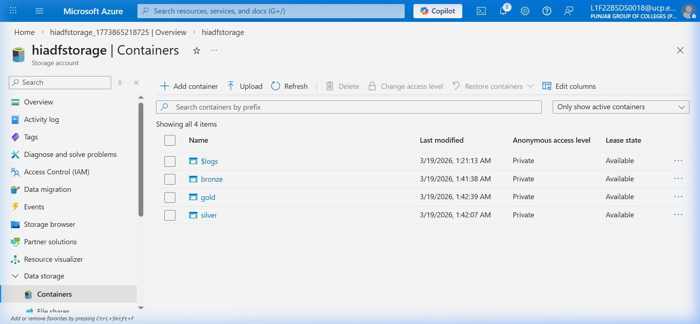  

---

### Step 5: Watermark State Initialization

> **Concept Brief:** To avoid re-loading the same data over and over, we use a "Watermark" file. It records the date of the last successful load.

1. **Path:** `Storage Account > Containers > bronze > + Container`.
2. Create a folder structure by uploading a dummy file or using Azure Storage Explorer: `monitor / last-load /`.
3. Create a file named `last-load.json` with the following content and upload it:
   ```json
   {
       "last_load": "1900-01-01"
   }
   ```
   *(Setting it to 1900-01-01 ensures the first load captures all historical data).*

**Verification Checkpoint:** Ensure the folder structure matches the image below exactly.  
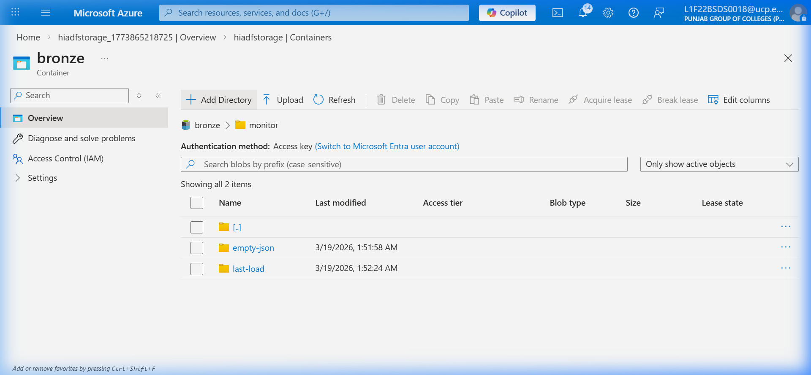  

**Verification Checkpoint:** Confirm the `last-load.json` file exists within the `monitor/last-load/` path and contains the initial date.  
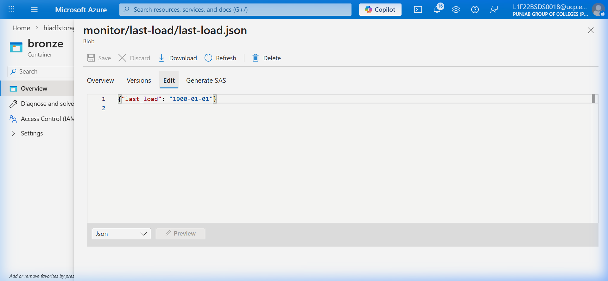  

---

### Step 6: Relational SQL Provisioning (Analytical Hub)

1. **Path:** `Search: "SQL Databases" > Create`.
2. **Basics Tab:**
   - **Database name:** `hi-db`.
   - **Server:** Create new `hi-sql-server`.
   - **Authentication:** Use SQL Authentication (Keep your password safe!).
   - **Compute + storage:** Select **Basic** (For cost efficiency).

3. **Networking Tab:**
   - **Connectivity method:** `Public endpoint`.
   - **Allow Azure services to access this server:** Set to **Yes** (CRITICAL: ADF needs this to "talk" to the DB).
   - **Add current client IP address:** **Yes**.

**Verification Checkpoint:** Verify the 'Basics' tab configuration, especially the database name and server details.  
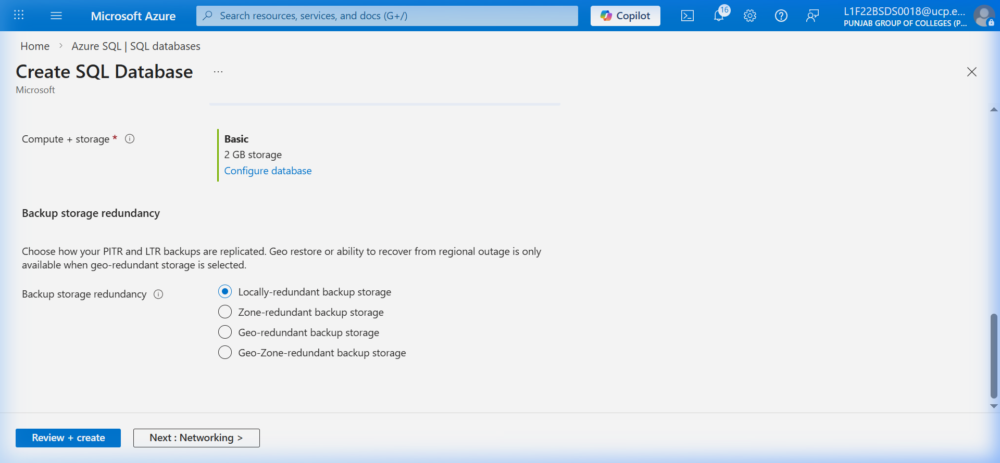  

**Verification Checkpoint:** Double-check the 'Networking' tab settings, ensuring 'Allow Azure services...' is set to 'Yes'.  
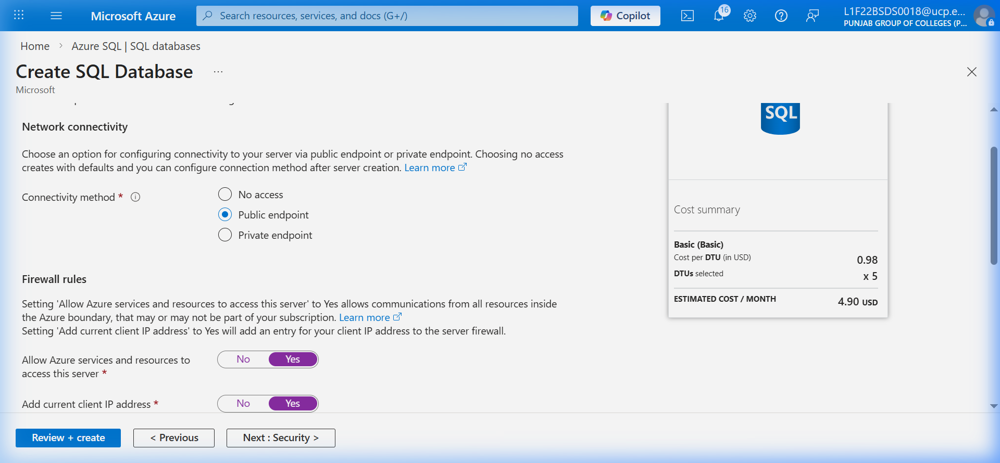  

**Verification Checkpoint:** Confirm the SQL Database deployment is complete and successful.  
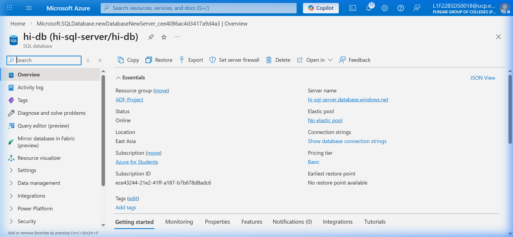  

---

### Step 7: Initial Payload Injection

1. **Path:** `Azure SQL Database > Query editor (preview)`.
2. Log in using your credentials from Step 6.
3. **Execute the following SQL Script** to create the source table and inject 1,000 records:
   ```sql
   -- [CREATE THE TABLE]
   CREATE TABLE FactBookings (
       booking_id INT,
       booking_date DATETIME,
       airline_id INT,
       passenger_id INT,
       ticket_cost DECIMAL(10,2)
   );

   -- [INJECT SAMPLE DATA]
   -- (Execute your provided fact_bookings_full.sql content here)
   ```
4. **Verify Integrity:**
   ```sql
   SELECT COUNT(*) FROM FactBookings; 
   ```
   *Expected Result: 1000.*

**Verification Checkpoint:** Confirm the table contains exactly 1,000 records after successful injection.  
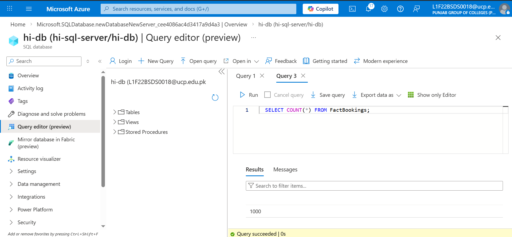

---

## Technical Handoff
Infrastructure is now stable. In **Phase 2**, we establish the hybrid-cloud bridges required to ingest data from firewalled on-premises environments.

**[ Back to Project Dashboard ](../README.md) | [ Next Phase: Hybrid Connectivity ](./phase2_ir_linkedservices.md)**
