# Phase 2: Hybrid-Cloud Connectivity & Security

**[ Back to Project Dashboard ](../README.md)**

*Securely bridging on-premises legacy environments with the Azure Cloud via Integration Runtimes.*

---

## Table of Contents
- [Project Foundation](#project-foundation)
- [Architecture Blueprint](#architecture-blueprint)
- [Operational Risk Mitigation](#operational-risk-mitigation)
- [Implementation Workflow](#implementation-workflow)
  - [Step 1: Provision the SHIR](#step-1-provision-the-self-hosted-integration-runtime-shir)
  - [Step 2: Install the Local Agent](#step-2-install-the-shir-agent-on-the-local-host)
  - [Step 3: On-Prem Connectivity](#step-3-linked-service-on-premises-file-system)
  - [Step 4: Cloud Storage Connectivity](#step-4-linked-service-azure-data-lake)
  - [Step 5: External API Connectivity](#step-5-linked-service-http-rest-api)
  - [Step 6: Relational SQL Connectivity](#step-6-linked-service-azure-sql-database)

---

## Project Foundation

The strategic success of a hybrid data ecosystem depends on secure, firewall-compliant connectivity. This phase focuses on the deployment of a **Self-Hosted Integration Runtime (SHIR)**, which acts as a bi-directional gateway between local file systems and the Azure Data Factory control plane.

**By the end of this phase, the ecosystem will possess:**
- A functional **SHIR Agent** authenticated to the cloud tenant.
- A suite of **Linked Services** (connection abstractions) for all target ecosystems.
- Validated **Hybrid Data Paths** with zero firewall-induced latency.

---

## Architecture Blueprint

The diagram below illustrates the secure communication channel established by the SHIR. Data is read locally and pushed securely to the Azure cloud, bypassing the need for incoming firewall exceptions.

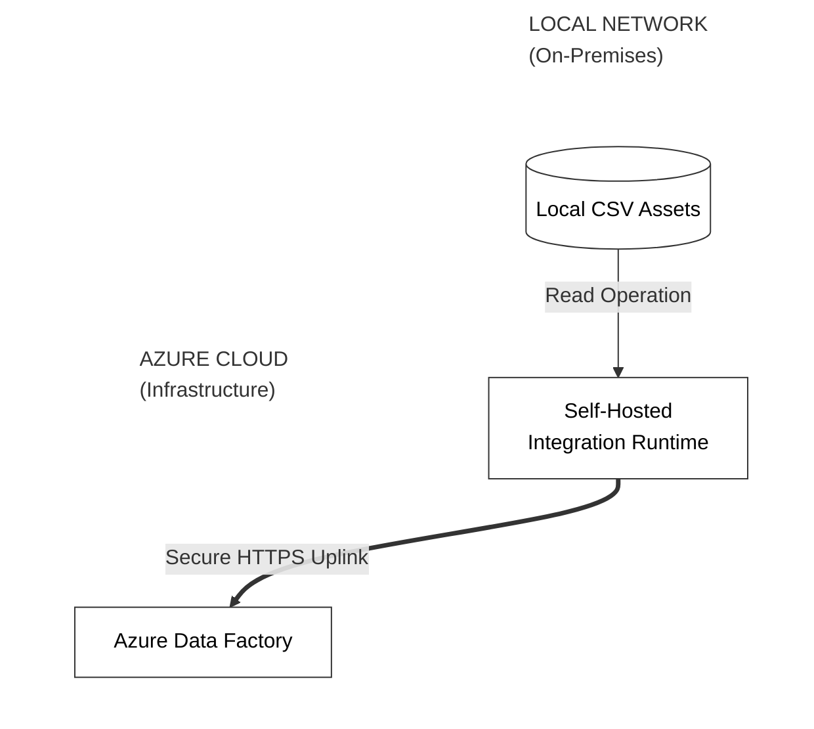

---

## Operational Risk Mitigation

Establishing hybrid bridges introduces security and connectivity risks. The following primary pitfall is addressed:

| Criticality | Implementation Risk | Strategic Mitigation |
|:---:|:---|:---|
| **CRITICAL** | **SHIR Heartbeat Loss** | Connection testing will fail if the local SHIR agent is dormant. We must verify the **Running** status in the Data Factory management plane before attempting Linked Service validation. |

---

## Implementation Workflow

### Step 1: Provision the Self-Hosted Integration Runtime (SHIR)

> **Concept Brief:** Think of the SHIR as a "Bridge". It allows Azure (Cloud) to safely reach into your personal computer (Local) without opening dangerous holes in your firewall.

1.  **Path:** `Azure Data Factory Studio > Manage (Toolbox Icon) > Integration runtimes > + New`.
2.  Select **Azure, Self-Hosted** -> **Continue**.
3.  **Type:** Select **Self-Hosted** -> **Continue**.
4.  **Name:** `hi-self-hosted`.
5.  Click **Create**.
6.  **Authorization Keys:** You will see two keys. Click the **Copy** icon for **Key 1** and save it in Notepad.
**Verification Checkpoint:** Verify the SHIR name `hi-self-hosted` and key generation on the 'Basics' tab.  
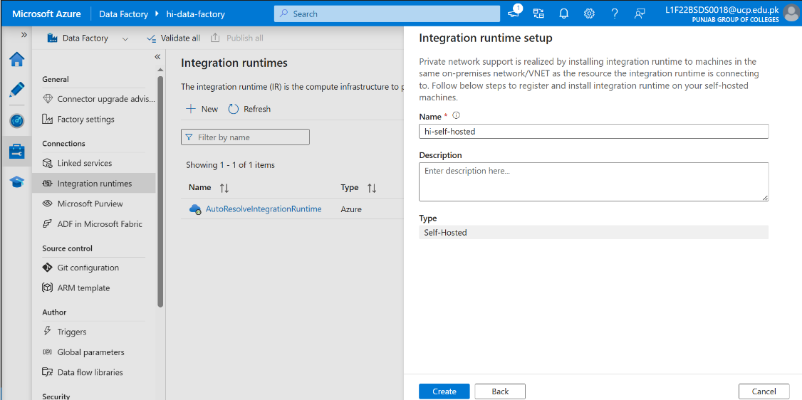  

**Verification Checkpoint:** Copy the 'Key 1' for the subsequent local registration step.  
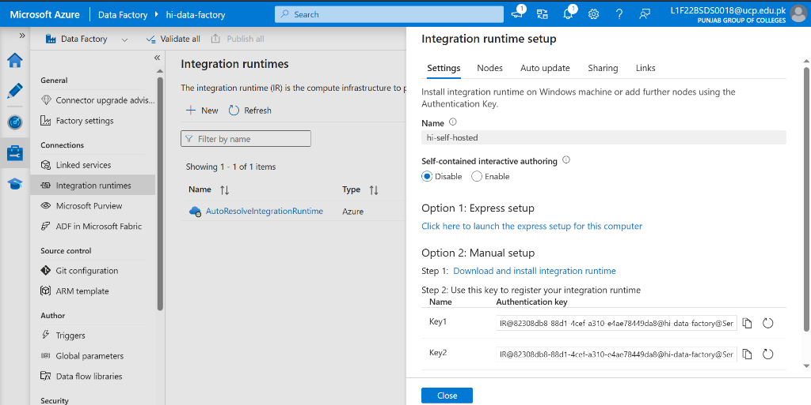  

---

### Step 2: Install the SHIR Agent on the Local Host

1.  **Download:** Go to the [Official Microsoft Download Center](https://www.microsoft.com/en-us/download/details.aspx?id=39717) and download the `.msi` (Integration Runtime).
2.  **Install:** Run the installer on your local Windows machine. 
3.  **Register:** When prompted, paste the **Key 1** you copied in the previous step.
4.  Click **Register**, then click **Finish**.
**Verification Checkpoint:** Confirm the 'Register' operation is successful on your local machine.  
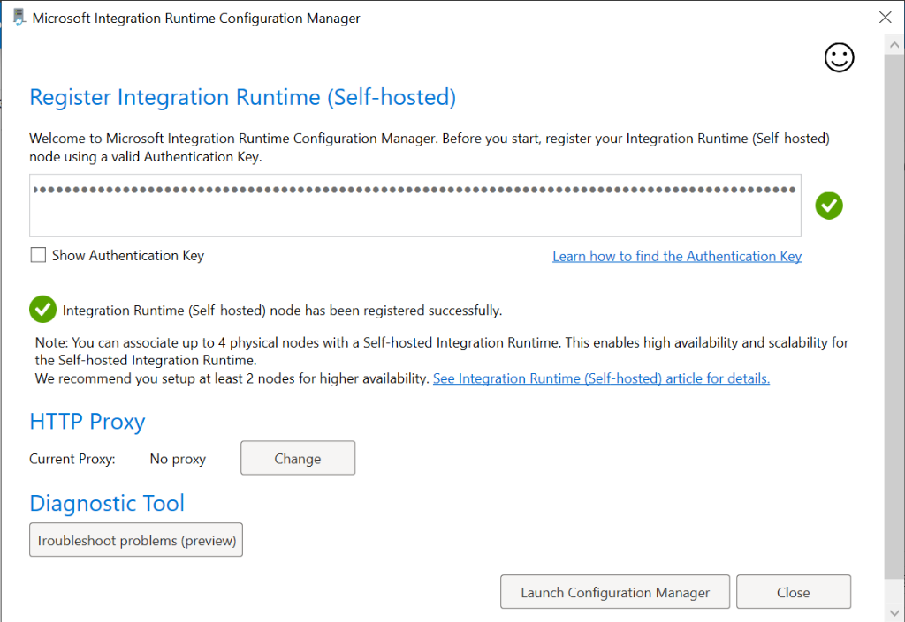  

**Verification Checkpoint:** Verify the SHIR status has transitioned to green 'Running' in the ADF portal.  
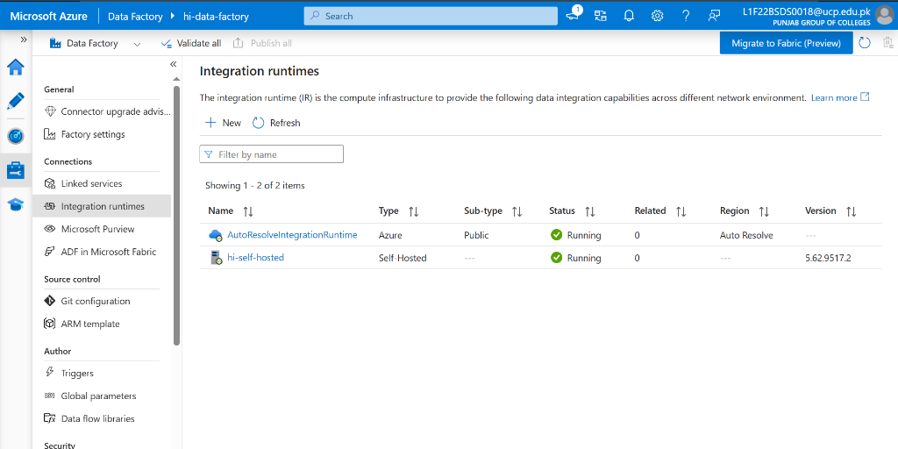  

---

### Step 3: Linked Service — On-Premises File System

> **Concept Brief:** A Linked Service is a "Connection String". It tells ADF *how* to connect to a specific source (like your hard drive).

1.  **Path:** `Manage > Linked services > + New`.
2.  Search for **File system** -> **Continue**.
3.  **Configure the following:**
    -   **Name:** `ls_onprem_file`.
    -   **Connect via integration runtime:** Select `hi-self-hosted`.
    -   **Host:** Enter your local data folder path (e.g., `C:\Users\YourName\Desktop\ADF_Submission\data\`).
    -   **User name:** Your Windows username.
    -   **Password:** Your Windows password.

4.  **Technical Tip:** If you see a permission error, navigate to the Integration Runtime folder on your PC (`C:\Program Files\Microsoft Integration Runtime\...\Shared`) and run the config tool as Administrator.
**Verification Checkpoint:** Verify the File System configuration parameters (Host Path and Credentials).  
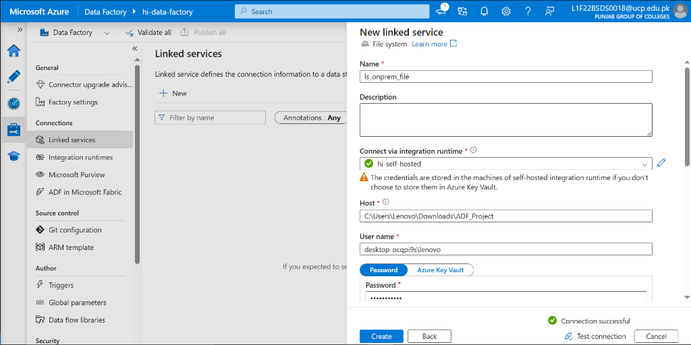  

**Verification Checkpoint:** Confirm the 'Test connection' result is 'Successful' for the On-Prem bridge.  
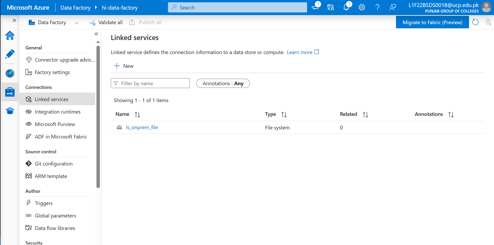  

---

### Step 4: Linked Service — Azure Data Lake (ADLS Gen2)

1.  **Path:** `Manage > Linked services > + New > Search: "Azure Data Lake Storage Gen2"`.
2.  **Name:** `ls_data_lake`.
3.  **Authentication method:** Account key.
4.  **Storage account name:** `hiadfstorage`.
5.  Click **Test connection**. Once successful, click **Create**.
**Verification Checkpoint:** Verify the ADLS Gen2 storage selection for `hiadfstorage`.  
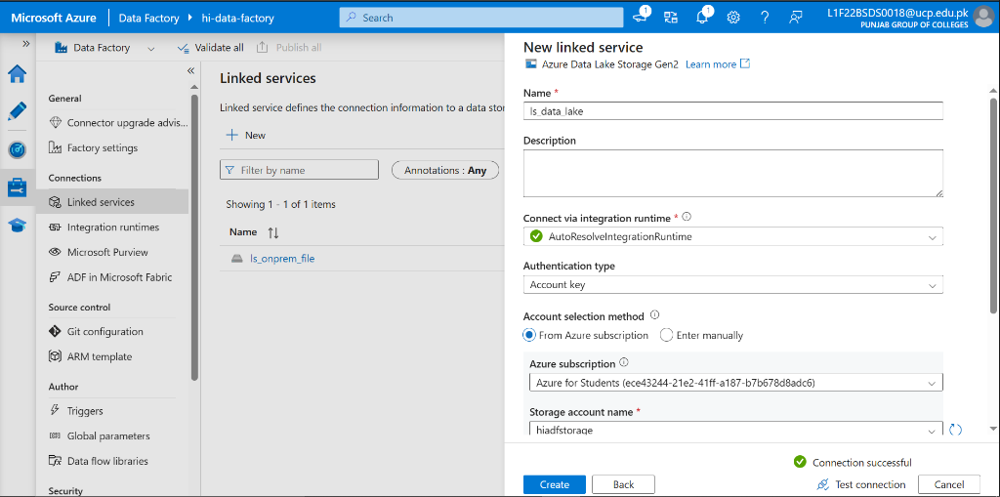  

**Verification Checkpoint:** Confirm 'Successful' connectivity to the cloud storage account.  
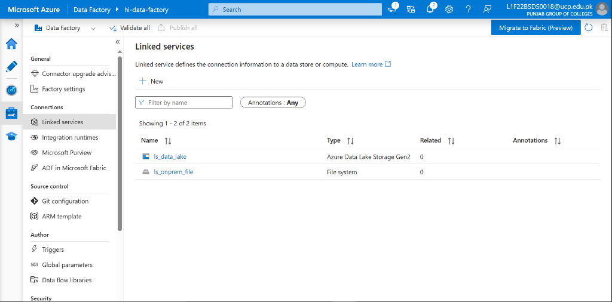  

---

### Step 5: Linked Service — HTTP/REST API (GitHub)

1.  **Path:** `Manage > Linked services > + New > Search: "HTTP"`.
2.  **Name:** `ls_github`.
3.  **Base URL:** `https://raw.githubusercontent.com/`.
4.  **Authentication type:** Anonymous.
**Verification Checkpoint:** Configure the GitHub HTTP Base URL as an Anonymous endpoint.  
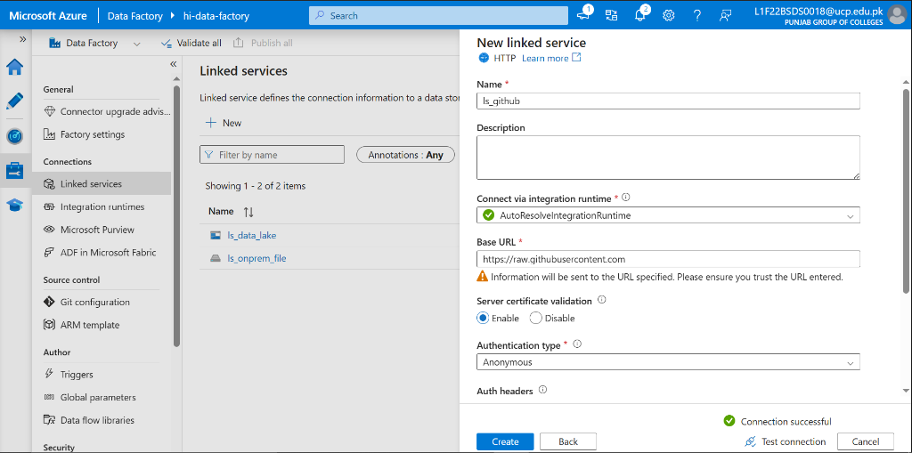  

**Verification Checkpoint:** Confirm the 'Test connection' to the public GitHub repository is successful.  
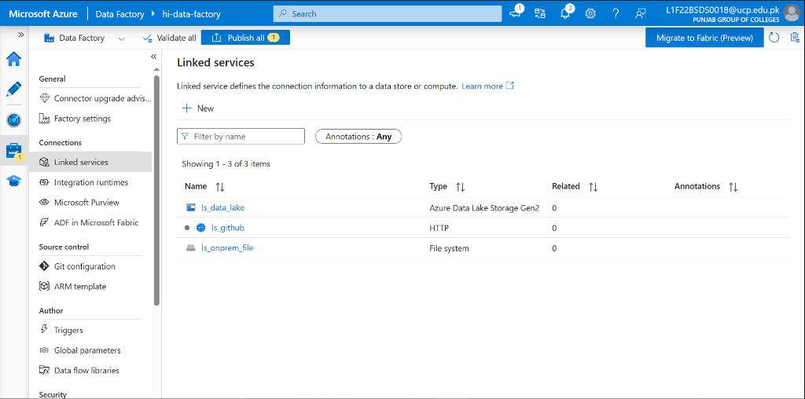  

---

### Step 6: Linked Service — Azure SQL Database

1.  **Path:** `Manage > Linked services > + New > Search: "Azure SQL Database"`.
2.  **Name:** `ls_sql`.
3.  **Azure subscription:** Select yours.
4.  **Server name:** `hi-sql-server`.
5.  **Database name:** `hi-db`.
6.  **Authentication type:** SQL Authentication.
7.  Enter your **User name** and **Password** from Phase 1.
8.  Click **Test connection** -> **Create**.
**Verification Checkpoint:** Configure Azure SQL parameters, ensuring 'SQL Authentication' is selected.  
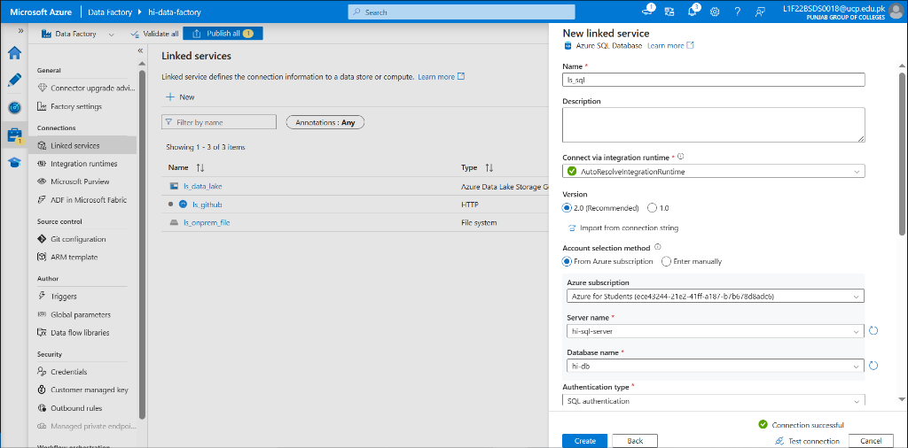  

**Verification Checkpoint:** Confirm successful connectivity to the `hi-db` relational hub.  
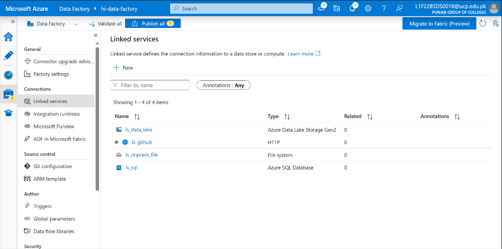  

**Verification Checkpoint:** Verify the final master inventory shows all four (4) Linked Services in a healthy state.  
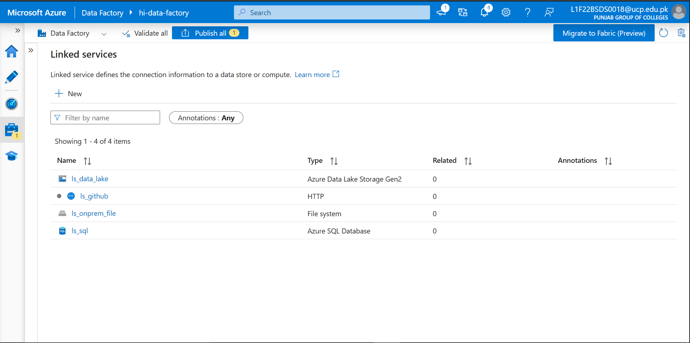  

---

## Technical Handoff
Hybrid connectivity is now operational. In **Phase 3**, we leverage the SHIR and `ls_onprem_file` to execute massive metadata-driven file ingestion.

**[ Back to Project Dashboard ](../README.md) | [ Previous Phase: Infrastructure Setup ](./phase1_resources.md) | [ Next Phase: On-Prem Ingestion ](./phase3_onprem_pipeline.md)**
