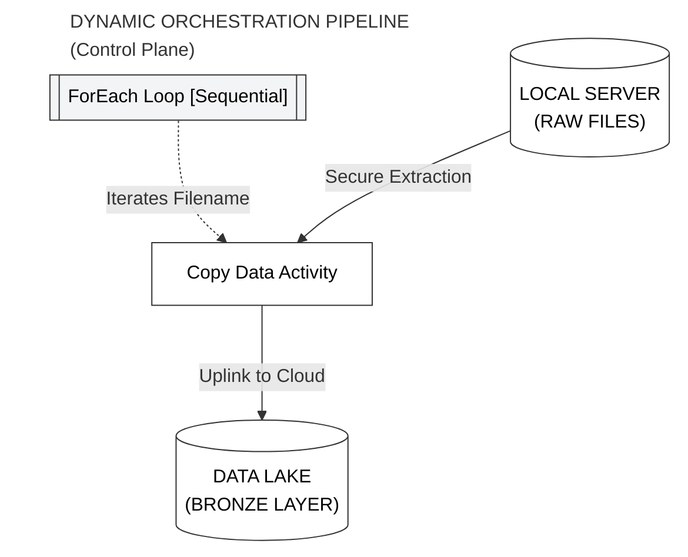
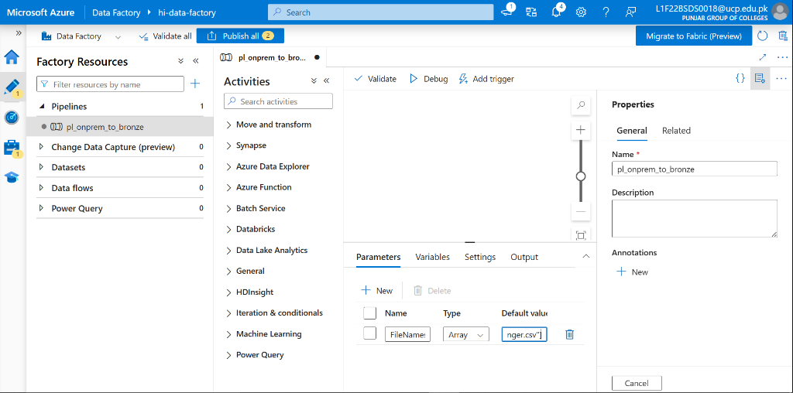
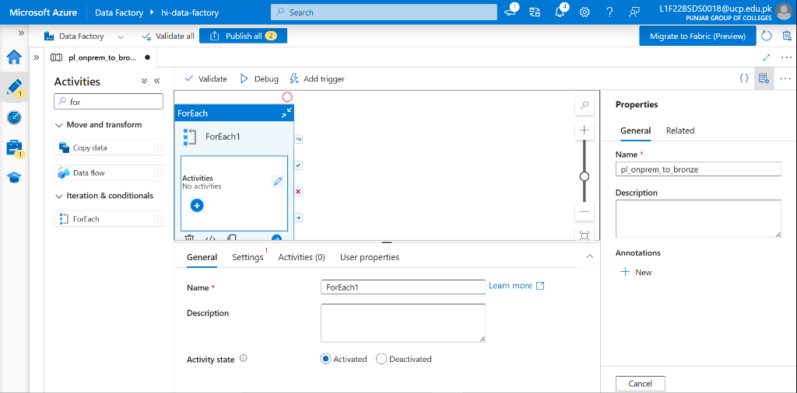
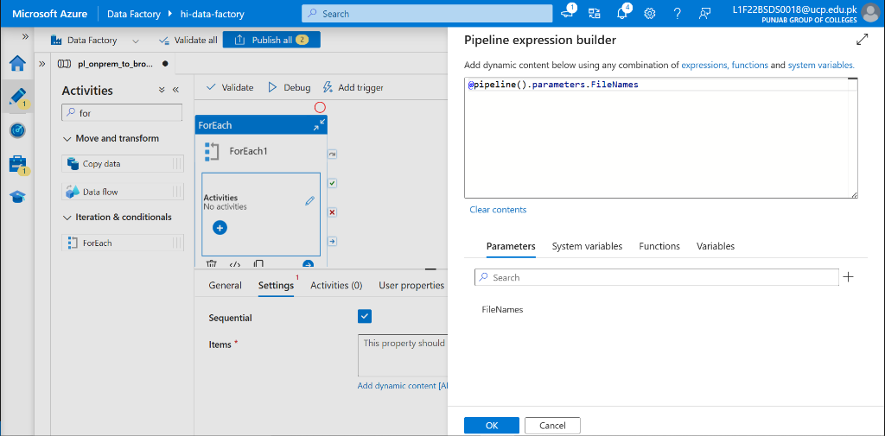
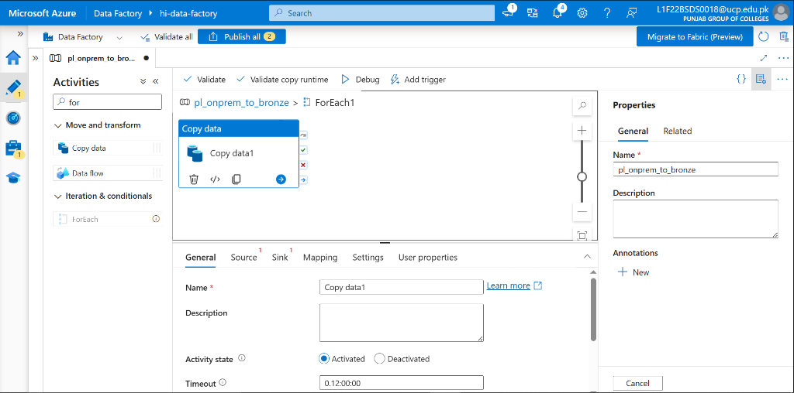
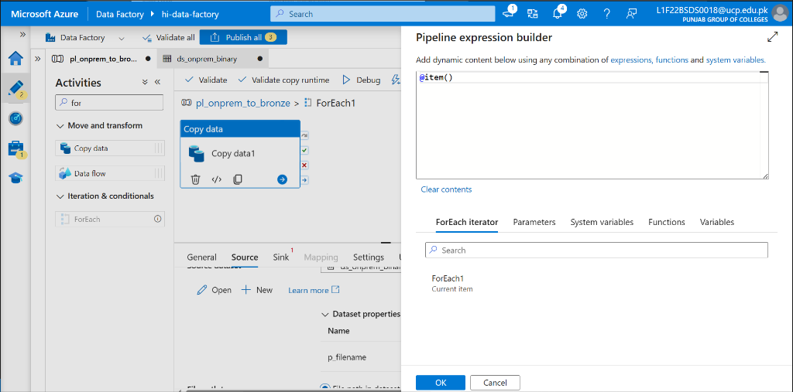
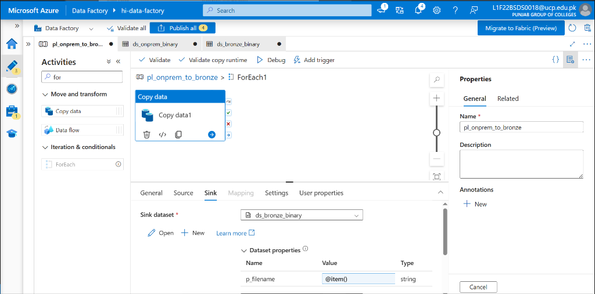
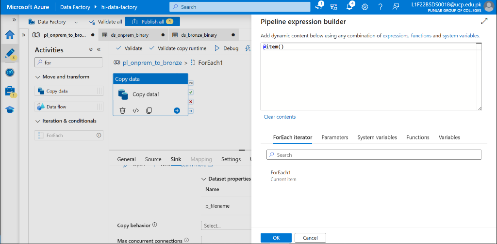
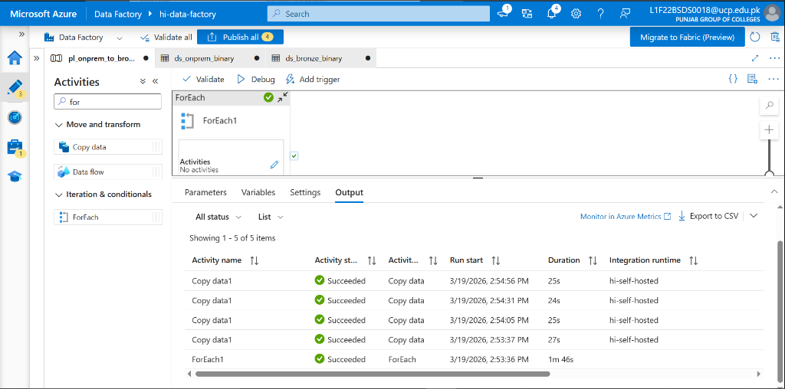
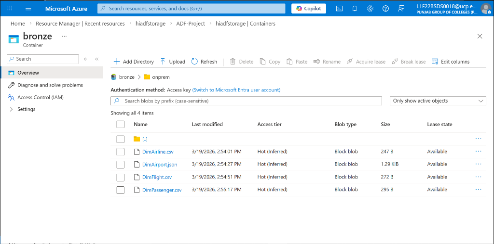

# Phase 3: Metadata-Driven On-Premises Ingestion

**[ Back to Project Dashboard ](../README.md)**

*Building dynamic, parameterized pipelines to orchestrate massive file ingestion into the Bronze Data Lake.*

---

## Table of Contents
- [Project Foundation](#project-foundation)
- [Architecture Blueprint](#architecture-blueprint)
- [Operational Risk Mitigation](#operational-risk-mitigation)
- [Implementation Workflow](#implementation-workflow)
  - [Step 1: Parameterized Dataset Templates](#step-1-parameterized-dataset-templates-source--sink)
  - [Step 2: Dynamic Workflow Creation](#step-2-dynamic-workflow-creation-and-parameters)
  - [Step 3: The ForEach Iterator](#step-3-the-foreach-iterator-logic)
  - [Step 4: Atomic Copy Activity](#step-4-atomic-copy-activity-configuration)

---

## Project Foundation

Static pipelines are inefficient at scale. This phase implements a **Metadata-Driven Ingestion Pattern**, utilizing a single dynamic workflow to iterate through a master array of filenames. This architectural choice enables infinite horizontal scaling without requiring additional pipeline development for new files.

**By the end of this phase, the ecosystem will possess:**
- **Reusable Dataset Templates** supporting runtime parameters.
- A **Dynamic Ingestion Workflow** capable of multi-file extraction.
- Validated **Bronze-layer Persistence** for all on-premises CSV assets.

---

## Architecture Blueprint

The following diagram illustrates the iterative loop. The pipeline reads the master array and executes an atomic Copy Data operation for each item, systematically lifting files from the local server into the cloud Data Lake.



---

## Operational Risk Mitigation

Dynamic iteration introduces risks related to resource contention and syntax errors. The following mitigations are applied:

| Criticality | Implementation Risk | Strategic Mitigation |
|:---:|:---|:---|
| **HIGH** | **SHIR Memory Exhaustion** | Parallel execution can crash local integration runtimes. We must check the **Sequential** box within the ForEach activity to ensure one-by-one execution, protecting host memory. |
| **MODERATE** | **Namespace Collision** | File naming must be precise. We use the `@item()` syntax to ensure that each file lands in the Data Lake with its original, unique filename preserve. |

---

## Implementation Workflow

### Step 1: Parameterized Dataset Templates (Source & Sink)

> **Concept Brief:** Parameters are like "Variables". Instead of creating 4 datasets for 4 files, we create **one** dataset with a parameter (`p_filename`) that changes its name depending on which file we are currently copying.

1. **Source Dataset (ds_onprem_binary):**
   - **Path:** `Author (Pencil Icon) > Datasets > ... > New dataset > File system > Binary`.
   - **Linked Service:** `ls_onprem_file`.
   - **Parameters Tab:** Click **+ New**. Name: `p_filename`. Type: `String`.
   - **Connection Tab:** Click the **File path** box for the File name. Select **Add dynamic content**. Paste: `@dataset().p_filename`.

2. **Sink Dataset (ds_bronze_binary):**
   - **Path:** `New dataset > Azure Data Lake Storage Gen2 > Binary`.
   - **Linked Service:** `ls_data_lake`.
   - **Parameters Tab:** Click **+ New**. Name: `p_filename`. Type: `String`.
   - **Connection Tab:** 
     - **File system:** `bronze`.
     - **Directory:** `onprem`.
     - **File name:** Click **Add dynamic content**. Paste: `@dataset().p_filename`.

---

### Step 2: Dynamic Workflow Creation and Parameters

1.  **Path:** `Author > Pipelines > + Pipeline`. Name: **`pl_onprem_to_bronze`**.
2.  **Parameters Tab (of the pipeline, not activity):** Click **+ New**.
    -   **Name:** `FileNames`.
    -   **Type:** `Array`.
    -   **Default Value:** Copy and paste the list below exactly:
        ```json
        ["DimAirline.csv", "DimAirport.json", "DimFlight.csv", "DimPassenger.csv"]
        ```

**Verification Checkpoint:** Under the 'Parameters' tab, confirm the `FileNames` array matches the image below.


---

### Step 3: The ForEach Iterator Logic

1.  Drag a **ForEach** activity from the **Iteration & conditionals** section onto the canvas.
2.  **Settings Tab:**
    -   **Sequential:** Check this box (Ensures your local computer isn't overwhelmed).
    -   **Items:** Click **Add dynamic content**. Paste: `@pipeline().parameters.FileNames`.

**Verification Checkpoint:** Your canvas should show a ForEach loop with a Copy Data activity nested inside.


**Verification Checkpoint:** Confirm the ForEach 'Settings' tab has 'Sequential' checked and 'Items' is set to `@pipeline().parameters.FileNames`.


---

### Step 4: Atomic Copy Activity Configuration

1.  Click the **Edit (Pencil)** icon inside the ForEach activity (or double-click the activity).
2.  Drag a **Copy Data** activity into the inner canvas.
3.  **Source Tab:**
    -   **Source dataset:** `ds_onprem_binary`.
    -   **Dataset properties:** You will see `p_filename`. Click the box, select **Add dynamic content**, and paste: `@item()`.
4.  **Sink Tab:**
    -   **Sink dataset:** `ds_bronze_binary`.
    -   **Dataset properties:** Set `p_filename` to `@item()`.

**Verification Checkpoint:** Detailed view of the inner ForEach configuration, showing the Copy Data activity.


**Verification Checkpoint:** Verify the 'Source' tab of the Copy Data activity, ensuring `p_filename` is set to `@item()`.


**Verification Checkpoint:** Verify the 'Sink' tab of the Copy Data activity, ensuring `p_filename` is set to `@item()`.


**Verification Checkpoint:** Confirm the mapping expression is correctly configured (if applicable).


**Verification Checkpoint:** A successful debug run of the pipeline.


**Verification Checkpoint:** The files successfully landed in the Bronze layer of the Data Lake.


---

## Technical Handoff
On-premises ingestion is now fully automated. In **Phase 4**, we extend the architecture to harvest reference data from external **REST APIs** using similar parameterized logic.

**[ Back to Project Dashboard ](../README.md) | [ Previous Phase: Hybrid Connectivity ](./phase2_ir_linkedservices.md) | [ Next Phase: API Ingestion ](./phase4_api_pipeline.md)**
