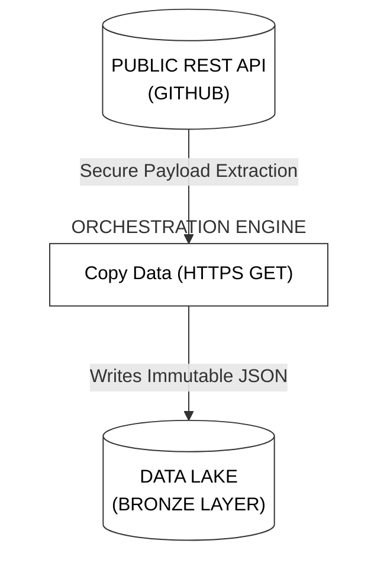
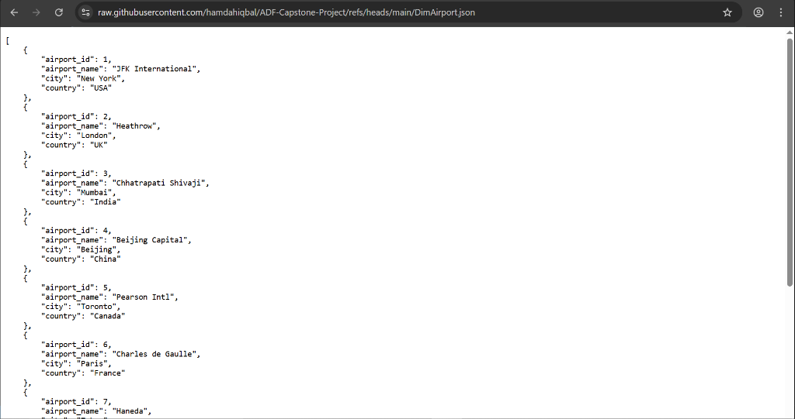
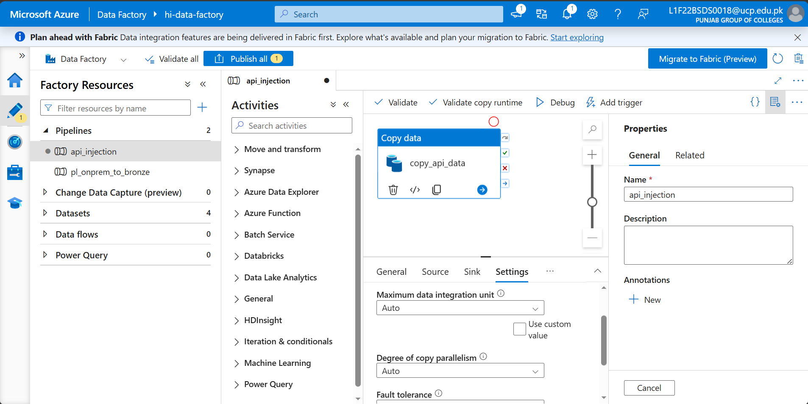
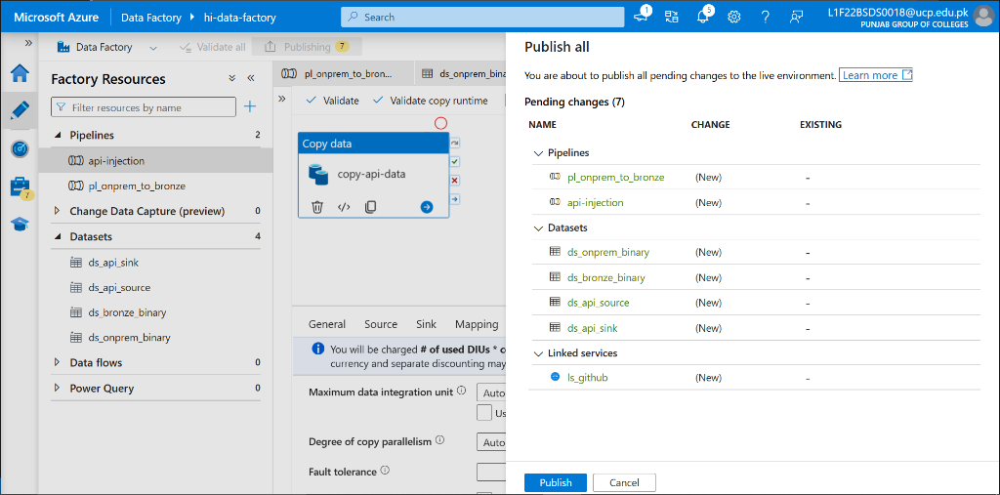
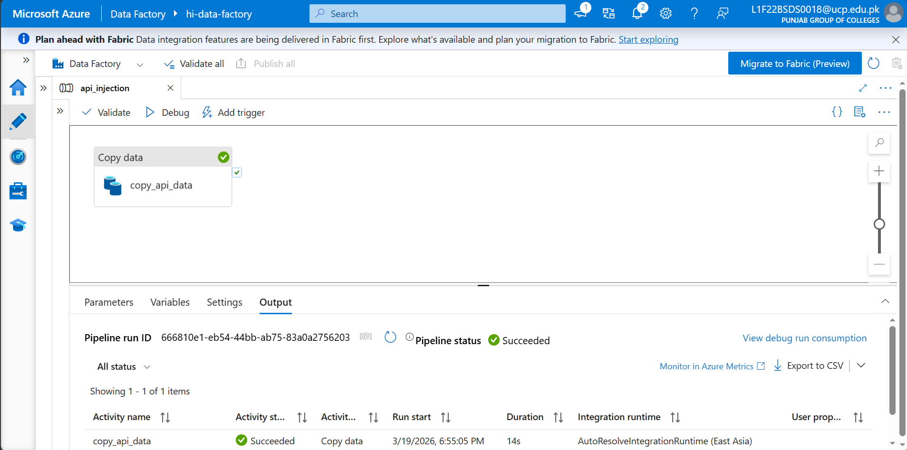
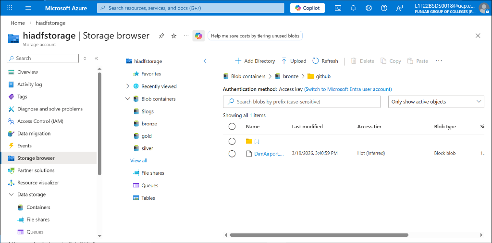

# Phase 4: REST API Payload Ingestion
**[ Back to Project Dashboard ](../README.md)**

*Architecting secure, automated ingestion of reference data from public REST-based web endpoints.*

---

## Table of Contents
- [Project Foundation](#project-foundation)
- [Architecture Blueprint](#architecture-blueprint)
- [Operational Risk Mitigation](#operational-risk-mitigation)
- [Implementation Workflow](#implementation-workflow)
  - [Step 1: Raw Endpoint Identification](#step-1-raw-endpoint-identification)
  - [Step 2: HTTP Source Dataset Template](#step-2-http-source-dataset-template)
  - [Step 3: JSON Sink Dataset Template](#step-3-json-sink-dataset-template)
  - [Step 4: API Ingestion Pipeline](#step-4-api-ingestion-pipeline-configuration)

---

## Project Foundation

Modern data ecosystems rely on external telemetry and reference metadata. This phase implements the **Automated API Harvesting Pattern**, fetching JSON payloads from public RESTful endpoints directly into the immutable Bronze layer. This strategy eliminates manual data entry and ensures the ingestion of 'live' external reference sets.

**By the end of this phase, the ecosystem will possess:**
- A validated **HTTP Linked Service** configured for public GitHub access.
- A **Payload-Specific Dataset** parsing raw JSON streams.
- **RESTful Ingestion Logic** integrated into the automated orchestration suite.

---

## Architecture Blueprint

The following diagram illustrates the secure outbound GET request. Data Factory initiates an HTTPS handshake with the GitHub server and streams the raw JSON payload into the `github` isolation sub-folder on ADLS Gen2.

---

## Operational Risk Mitigation

Interfacing with public web assets introduces risks related to URL formatting and network timeouts.

| Criticality | Implementation Risk | Strategic Mitigation |
|:---:|:---|:---|
| **CRITICAL** | **HTML Structuring Drift** | Providing a standard GitHub web link will cause ADF to download the website's HTML source (DOM) instead of the data. We must rigidly target the **Raw** URL endpoint to isolate the JSON payload. |
| **MODERATE** | **Endpoint Access Latency** | Web-based ingestion depends on exterior server-side health. We utilize the **Anonymous** authentication protocol within the Linked Service to ensure frictionless public data access. |

---

## Implementation Workflow

### Step 1: Raw Endpoint Identification

1.  **Path:** Open the [DimAirport.json](https://github.com/hamdahiqbal/ADF-Capstone-Project/blob/main/DimAirport.json) file in your GitHub repository.
2.  Click the **Raw** button on the top right.
3.  **Copy the URL** from your browser's address bar. It should look exactly like this:
    `https://raw.githubusercontent.com/hamdahiqbal/ADF-Capstone-Project/refs/heads/main/DimAirport.json`

**Verification Checkpoint:** Select the 'Raw' button on GitHub to extract the direct payload URI.  
  

---

### Step 2: HTTP Source Dataset Template

1.  **Path:** `Author > Datasets > New dataset > HTTP`.
2.  **Format:** Select **JSON** -> **Continue**.
3.  **Configure:**
    -   **Name:** `ds_api_source`.
    -   **Linked Service:** `ls_github`.
    -   **Relative URL:** `/hamdahiqbal/ADF-Capstone-Project/refs/heads/main/DimAirport.json`
4.  Click **OK**.

---

### Step 3: JSON Sink Dataset Template

1.  **Path:** `Author > Datasets > New dataset > Azure Data Lake Storage Gen2`.
2.  **Format:** Select **JSON** -> **Continue**.
3.  **Configure:**
    -   **Name:** `ds_api_sink`.
    -   **Linked Service:** `ls_data_lake`.
    -   **File system:** `bronze`.
    -   **Directory:** `github`.
    -   **File name:** `DimAirport.json`.
4.  Click **OK**.

---

### Step 4: API Ingestion Pipeline Configuration

1.  **Path:** `Author > Pipelines > + Pipeline`. Name: **`api_injection`**.
2.  Drag a **Copy Data** activity onto the canvas.
3.  **Source Tab:**
    -   **Source dataset:** `ds_api_source`.
    -   **Request method:** `GET`.
4.  **Sink Tab:**
    -   **Sink dataset:** `ds_api_sink`.
5.  **Execution:** Click **Publish all** first, then click **Debug**.

**Verification Checkpoint:** Confirm the Source and Sink tabs are correctly configured for the JSON payload.  
  

**Verification Checkpoint:** Execute a global 'Publish all' to register the new API pipeline.  
  

**Verification Checkpoint:** Confirm a successful 'Debug' execution with a green 'Succeeded' status.  
  

**Verification Checkpoint:** Verify the `DimAirport.json` file is present in the `bronze/github` container.  
  

---

## Technical Handoff
External reference ingestion is now stable. In **Phase 5**, we address the most complex ingestion challenge: implementing a **Modern Incremental Loading** mechanism for high-volume SQL datasets.

**[ Back to Project Dashboard ](../README.md) | [ Previous Phase: On-Prem Ingestion ](./phase3_onprem_pipeline.md) | [ Next Phase: Incremental Loading ](./phase5_incremental_sql.md)**
