# Phase 5: Modern Incremental Ingestion (Watermark Pattern)

**[ Back to Project Dashboard ](../README.md)**

*Architecting a dual-sensor lookup system to isolate and ingest only delta records from relational SQL sources.*

---

## Table of Contents
- [Project Foundation](#project-foundation)
- [Architecture Blueprint](#architecture-blueprint)
- [Operational Risk Mitigation](#operational-risk-mitigation)
- [Implementation Workflow](#implementation-workflow)
  - [Step 1: State Initialization & Datasets](#step-1-state-initialization--datasets)
  - [Step 2: Lookup 1 (Historic Watermark)](#step-2-lookup-1-historic-watermark-extraction)
  - [Step 3: Lookup 2 (Live Endpoint Sensor)](#step-3-lookup-2-live-endpoint-sensor)
  - [Step 4: The Delta Extraction Engine](#step-4-the-delta-extraction-engine)
  - [Step 5: Persistent State Overwrite](#step-5-persistent-state-overwrite)

---

## Project Foundation

Full data replication is technically inefficient and fiscally expensive in cloud environments. This phase implements a **High-Water Mark (HWM) Ingestion Pattern**, which utilizes dual-lookup sensors to isolate the 'delta'—extracting exclusively the records generated since the previous execution. This strategy minimizes network latency and optimizes cloud compute utilization.

**By the end of this phase, the ecosystem will possess:**
- A **Persistent State File** (`last-load.json`) on ADLS Gen2.
- A **Logical Sensor Chain** (Lookup-to-Lookup) for date-bracket calculation.
- An **Incremental Ingestion Pipeline** enforcing strict delta logic.

---

## Architecture Blueprint

The following diagram illustrates the sequential logic. Sensor 1 (Lookup) reads the historic date from storage; Sensor 2 (Lookup) probes SQL for the newest date. The Copy Data engine then injects these dates into a dynamic SQL query to extract only the records falling within the calculated bracket.

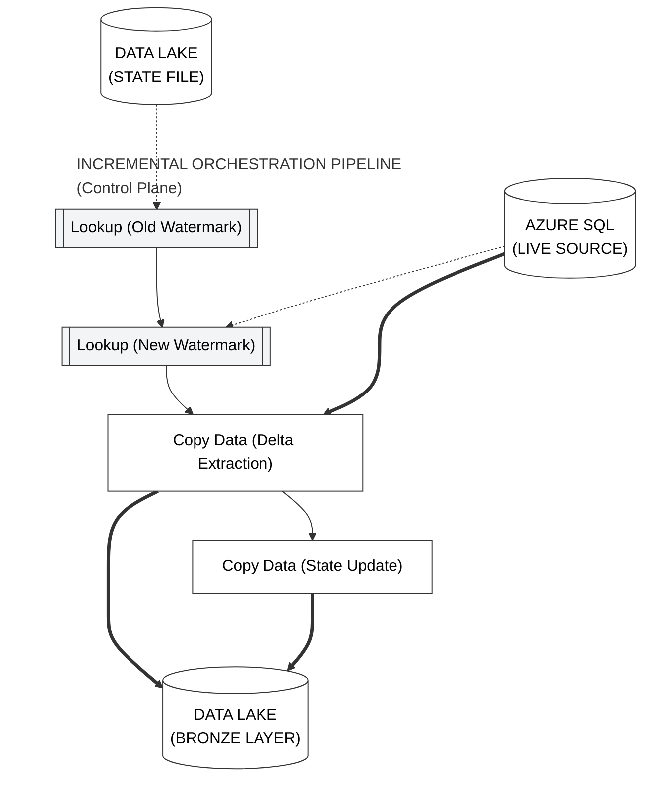

---

## Operational Risk Mitigation

HWM architectures are sensitive to data-type mismatches and off-by-one errors.

| Criticality | Implementation Risk | Strategic Mitigation |
|:---:|:---|:---|
| **CRITICAL** | **Array Parsing Failure** | By default, Lookup activities return complex JSON arrays. We must explicitly enable **First row only** to isolate a clean, injectable date string. |
| **FATAL** | **Incremental Record Leakage** | Utilizing `>=` in the extraction query will cause the pipeline to re-ingest the final record of the previous run. We rigidly use `>` to step precisely past the historic watermark. |

---

## Implementation Workflow

### Step 1: State Initialization & Datasets

> **Concept Brief:** Incremental loading means only copying *new* records. To do this, we need "memory". Our memory is the `last-load.json` file we created in Phase 1.

1.  **Path:** `Author > Pipelines > + Pipeline`. Name: **`sql_to_data_lake`**.
2.  **Datasets Required:**
    -   **`ds_monitor_lastload`**: (Already created in Phase 1).
    -   **`ds_sql_source`**: `Azure SQL Database`. Linked Service: `ls_sql`. Table: `dbo.FactBookings`.
    -   **`ds_sql_sink`**: `ADLS Gen2 > DelimitedText`. Linked Service: `ls_data_lake`. Path: `bronze / SQL /`.

**Verification Checkpoint:** Execute the SQL script to verify the source table structure.
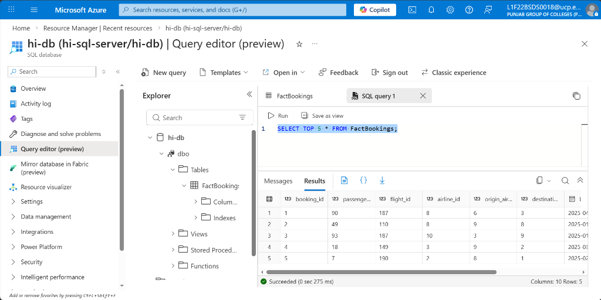

**Verification Checkpoint:** Verify the `monitor` folder structure exists in the Bronze container.
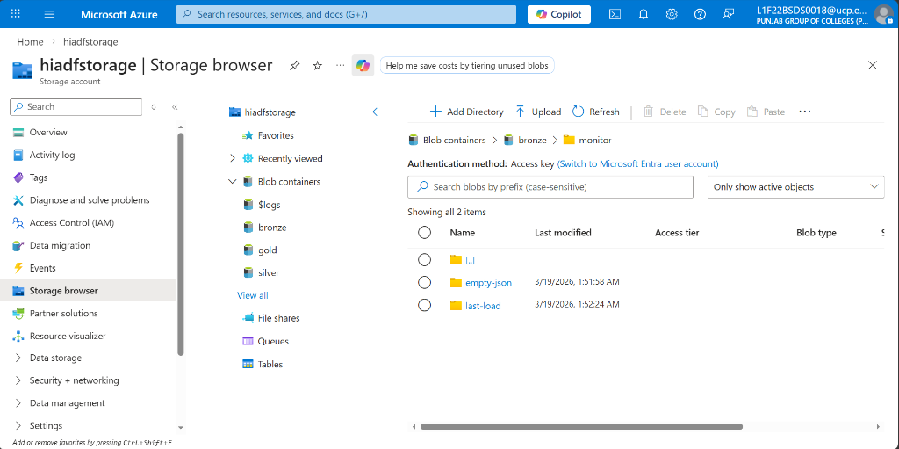

**Verification Checkpoint:** Confirm the initial `last-load.json` state is set to 1900-01-01.
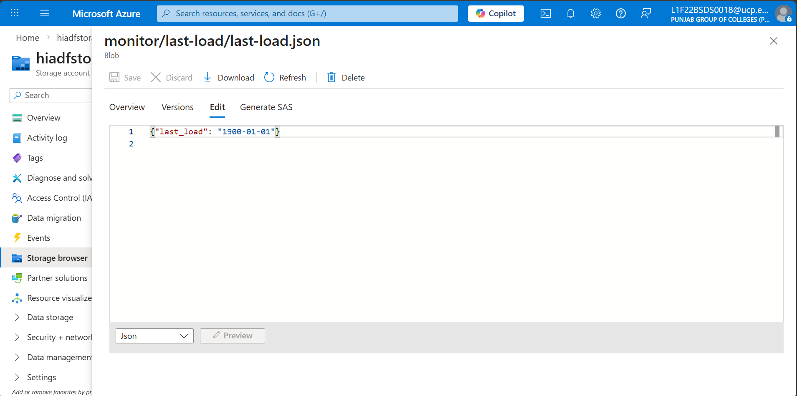

---

### Step 2: Lookup 1 (Historic Watermark Extraction)

1.  Drag a **Lookup** activity onto the canvas. Name: `last_load`.
2.  **Settings Tab:**
    -   **Source dataset:** `ds_monitor_lastload`.
    -   **First row only:** **Checked** (CRITICAL: This ensures we get a single date string instead of a list).

**Verification Checkpoint:** Configure the first Lookup (`last_load`) to read the state file.
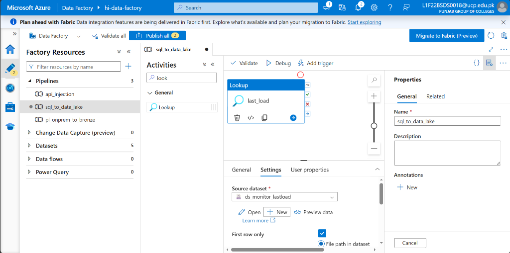

---

### Step 3: Lookup 2 (Live Endpoint Sensor)

1.  Drag a second **Lookup** activity. Name: `latest_load`.
2.  **Settings Tab:**
    -   **Source dataset:** `ds_sql_source`.
    -   **Use query:** Select this and paste:
        ```sql
        SELECT MAX(booking_date) as max_date FROM FactBookings;
        ```
    -   **First row only:** **Checked**.
3.  **Connect them:** Drag the green box from `last_load` to `latest_load`.

**Verification Checkpoint:** Configure the target SQL query for the `latest_load` sensor.
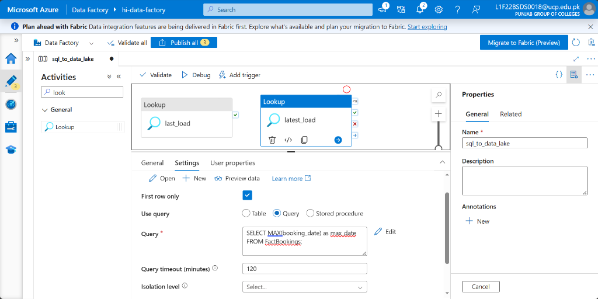

**Verification Checkpoint:** Confirm the success-dependency link between the two sensors.
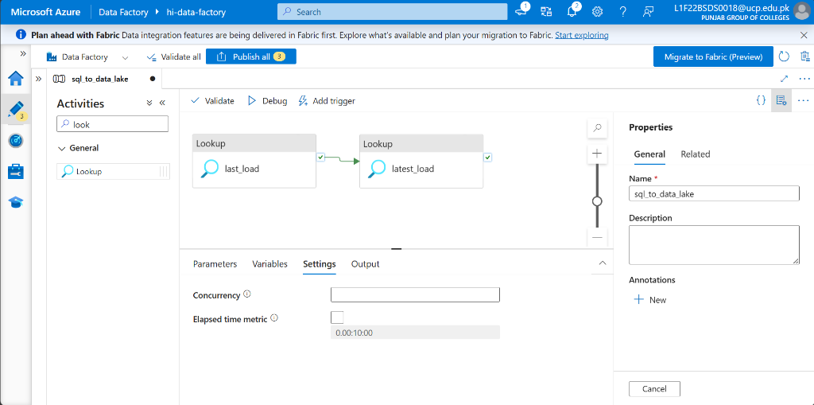

---

### Step 4: The Delta Extraction Engine

1.  Drag a **Copy Data** activity. Name: `Incremental_Copy`.
2.  **Source Tab:**
    -   **Source dataset:** `ds_sql_source`.
    -   **Use query:** Copy and paste this exact expression:
        ```sql
        SELECT * FROM FactBookings
        WHERE booking_date > '@{activity('last_load').output.firstRow.last_load}'
        AND booking_date <= '@{activity('latest_load').output.firstRow.max_date}';
        ```
3.  **Sink Tab:**
    -   **Sink dataset:** `ds_sql_sink`.
    -   **File extension:** `.csv`.

**Verification Checkpoint:** Verify the dynamic SQL query injection for delta extraction.
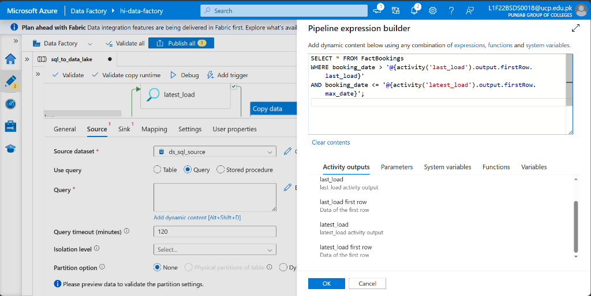

**Verification Checkpoint:** Confirm the CSV Sink settings for the Bronze destination.
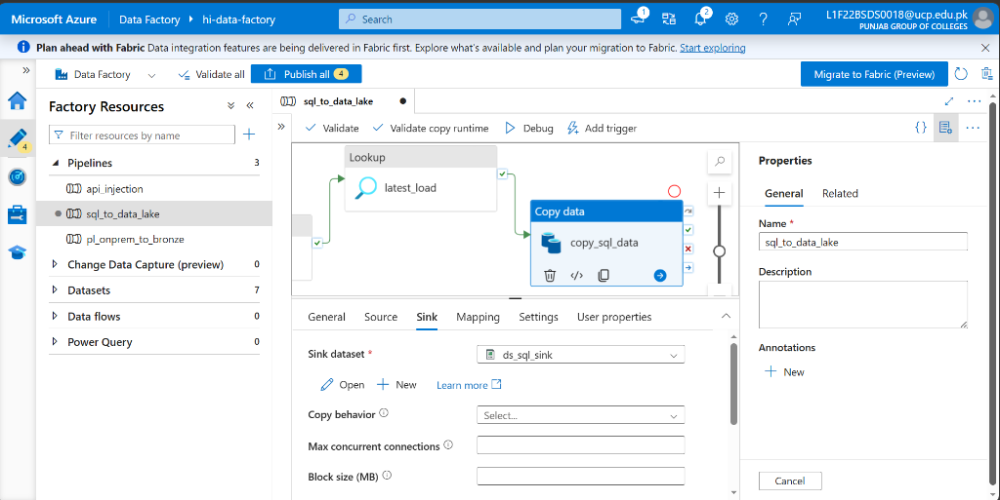

---

### Step 5: Persistent State Overwrite (The "Memory" Update)

1.  Drag a second **Copy Data** activity. Name: `Update_Watermark`.
2.  **Source Tab:** Select **Query** and paste:
    ```sql
    SELECT '@{activity('latest_load').output.firstRow.max_date}' as last_load;
    ```
3.  **Sink Tab:** `ds_monitor_lastload`.
4.  **Connect them:** `latest_load` -> `Incremental_Copy` -> `Update_Watermark`.

---

### Step 6: Multi-Run Validation Cycle

1.  **Publish All** and click **Debug**.
2.  **Run 1 (Baseline):** 1,000 rows should be copied (Watermark moves from 1900 to Current).
3.  **Run 2 (No Change):** 0 rows copied (Watermark stays same).
4.  **Run 3 (Incremental):** Add one row in SQL, run again. 1 row copied.

**Verification Checkpoint:** Verify the 'Update Watermark' copy activity configuration.
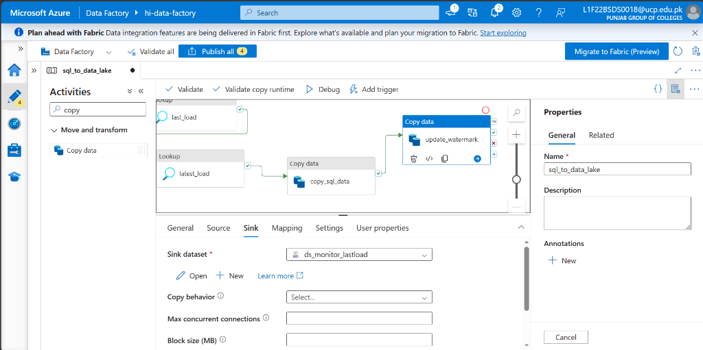

**Verification Checkpoint:** Final view of the complete incremental orchestration canvas.
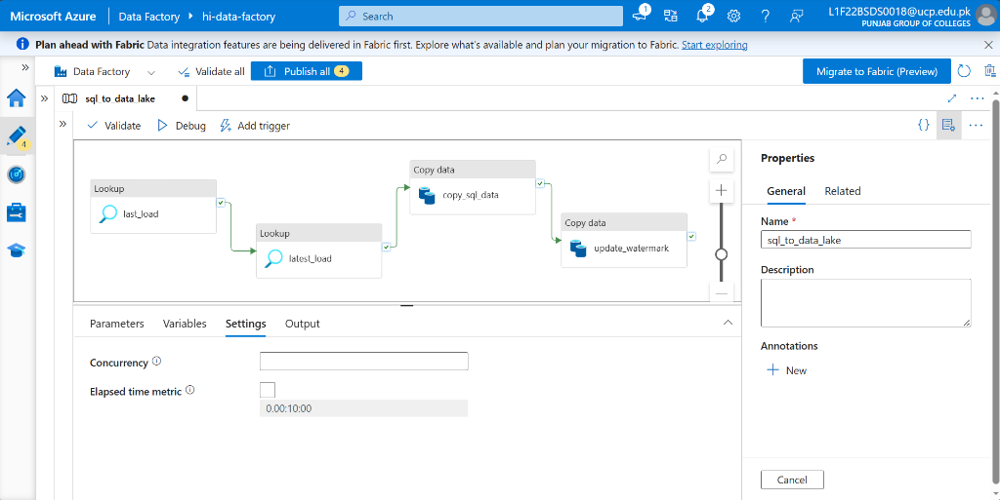

**Verification Checkpoint:** Publish all changes to register the HWM logic.
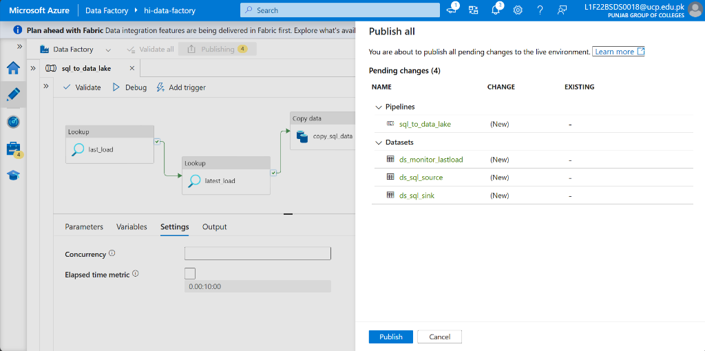

**Verification Checkpoint:** Confirm a successful Debug run across the entire chain.
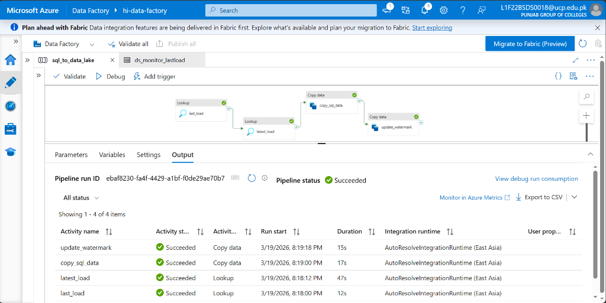

**Verification Checkpoint [Run 1]:** 1,000 rows extracted as a baseline.


**Verification Checkpoint:** Verify `last-load.json` has updated to the latest timestamp.
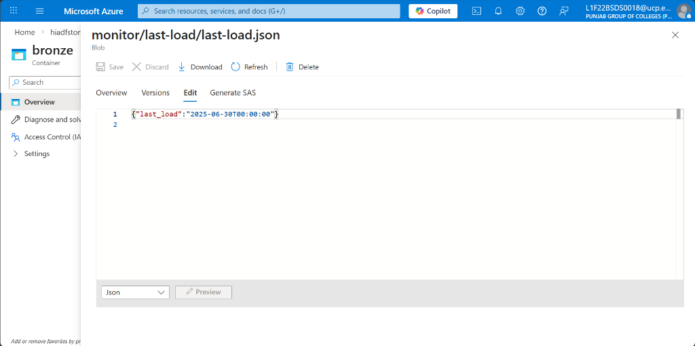

**Verification Checkpoint [Run 2]:** 0 rows extracted (No new data).
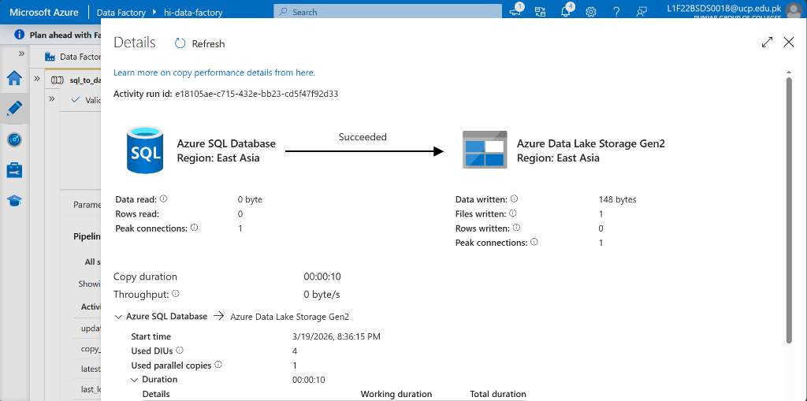

**Verification Checkpoint [Run 3]:** Incremental data extraction successful.


---

## Technical Handoff
Incremental extraction is now operationally stable. In **Phase 6**, we move from raw storage back into relational environments, building the **Analytical Data Mart** hub for end-user serving.

**[ Back to Project Dashboard ](../README.md) | [ Previous Phase: API Ingestion ](./phase4_api_pipeline.md) | [ Next Phase: SQL Mart Hub ](./phase6_load_to_sql.md)**
