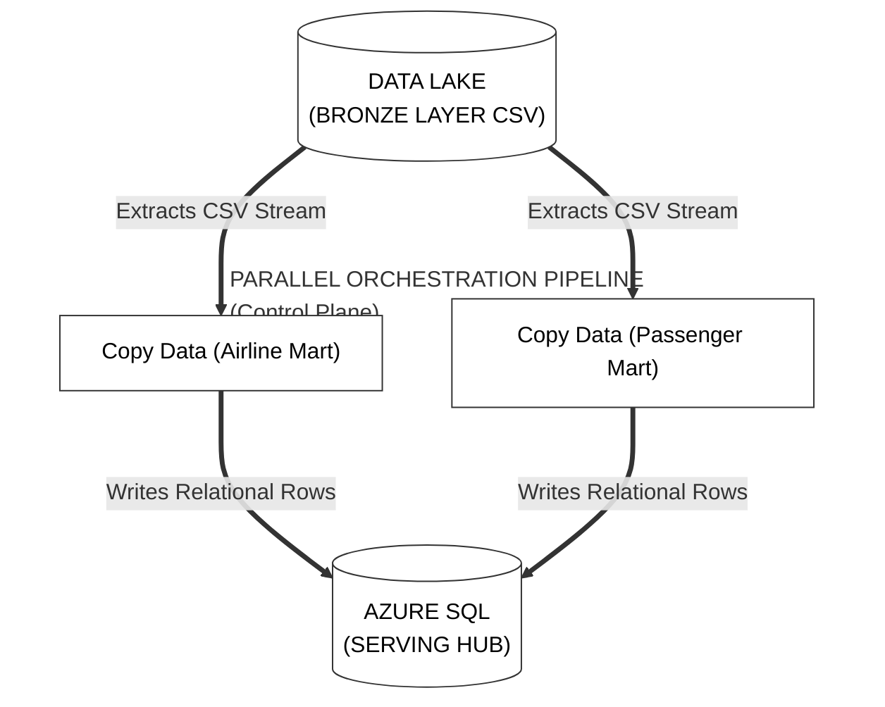
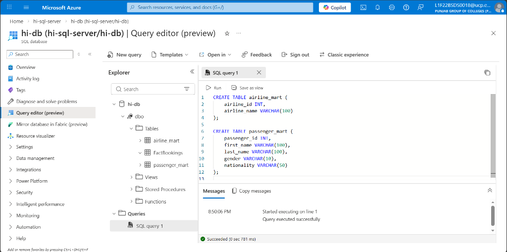
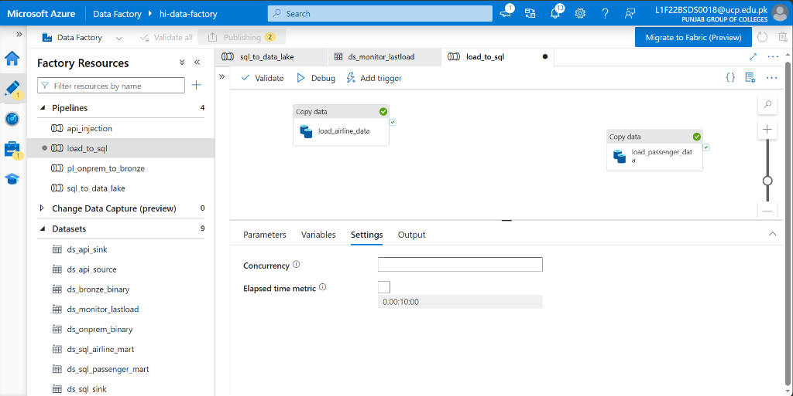
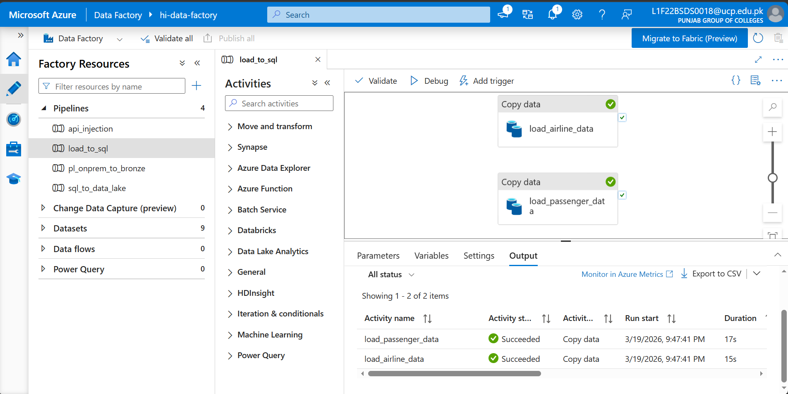
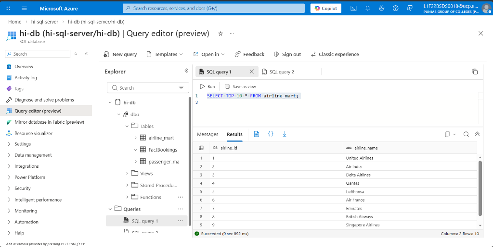
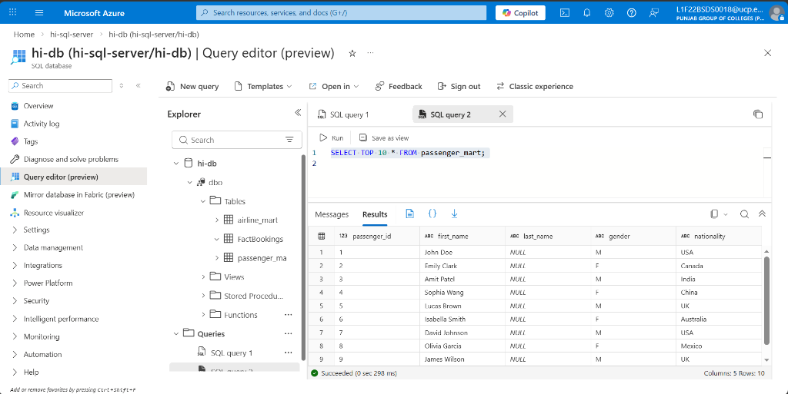

# Phase 6: Relational Mart Hub

**[ Back to Project Dashboard ](../README.md)**

*Transitioning Bronze Data Lake files into highly-structured Azure SQL 'Mart' tables for downstream business analytics.*

---

## Table of Contents
- [Project Foundation](#project-foundation)
- [Architecture Blueprint](#architecture-blueprint)
- [Operational Risk Mitigation](#operational-risk-mitigation)
- [Implementation Workflow](#implementation-workflow)
  - [Step 1: DDL Schema Enforcement](#step-1-ddl-schema-enforcement)
  - [Step 2: SQL Dataset Templates](#step-2-relational-dataset-templates)
  - [Step 3: Parallel Ingestion Pipeline](#step-3-parallel-ingestion-orchestration)
  - [Step 4: Explicit Column Mapping](#step-4-explicit-column-mapping-logic)

---

## Project Foundation

Data Lake storage is optimized for ingestion and volume, but business-ready serving requires the strict structure and schema enforcement of a relational database. This phase implements the **Serving Layer Pattern**, moving unstructured CSV assets from the Bronze layer into dedicated Azure SQL 'Mart' tables. This strategy provides the rigid schema-enforcement required by downstream BI platforms.

**By the end of this phase, the ecosystem will possess:**
- A **Structured Relational Schema** (DDL) within the Azure SQL hub.
- A **Parallel Ingestion Pipeline** multi-threading file-to-table transfers.
- **Explicit Type-Casting** logic to prevent structural data corruption.

---

## Architecture Blueprint

The following diagram illustrates the parallel execution path. The orchestrator multi-threads the copy operation, simultaneously extracting `DimAirline` and `DimPassenger` files and streaming them into their respective SQL destinations to minimize execution time.



---

## Operational Risk Mitigation

Transitioning from text-based storage (CSV) to typed relational engines (SQL) introduces the risk of schema drift and data-type collisions.

| Criticality | Implementation Risk | Strategic Mitigation |
|:---:|:---|:---|
| **CRITICAL** | **Semantic Type Mismatch** | CSV headers are natively strings. Azure SQL requires numeric types (Int, BigInt). We must utilize the **Explicit Mapping** tab to forcefully cast incoming text into relational-compliant types. |
| **MODERATE** | **Null Value Management** | Incomplete data records must be handled gracefully. We configure the mapping logic to allow SQL to default missing columns (e.g., `nationality`) to **NULL** instead of failing the activity. |

---

## Implementation Workflow

### Step 1: DDL Schema Enforcement

1. **Path:** `Azure SQL Database > Query editor`.
2. **Execute the following SQL** to create the target "Mart" tables:
   ```sql
   CREATE TABLE airline_mart (
       airline_id   INT,
       airline_name VARCHAR(100)
   );
   CREATE TABLE passenger_mart (
       passenger_id INT,
       first_name   VARCHAR(100),
       last_name    VARCHAR(100),
       gender       VARCHAR(10),
       nationality  VARCHAR(50)
   );
   ```

**Verification Checkpoint:** Execute the SQL script and confirm the `airline_data` and `passenger_data` tables are visible in the database.  
  

---

### Step 2: SQL Dataset Templates

1. **Path:** `Author > Datasets > New dataset > Azure SQL Database`.
2. Create two datasets:
   - **`ds_sql_airline_mart`**: Table Name: `dbo.airline_mart`.
   - **`ds_sql_passenger_mart`**: Table Name: `dbo.passenger_mart`.
3. Click **OK**.

---

### Step 3: Parallel Ingestion Orchestration

1. **Path:** `Author > Pipelines > + Pipeline`. Name: **`load_to_sql`**.
2. Drag **two** Copy Data activities onto the canvas. Do NOT connect them with arrows (This allows them to run at the same time).
3. **Activity 1 (Airlines):**
   - **Source:** `ds_bronze_binary`. Set `p_filename` to `DimAirline.csv`.
   - **Sink:** `ds_sql_airline_mart`.
4. **Activity 2 (Passengers):**
   - **Source:** `ds_bronze_binary`. Set `p_filename` to `DimPassenger.csv`.
   - **Sink:** `ds_sql_passenger_mart`.

**Verification Checkpoint:** Confirm the table matching logic in the Source and Sink settings for both activities.  
  

---

### Step 4: Explicit Column Mapping (CRITICAL)

> **Concept Brief:** Because CSV files are just text, we must tell SQL exactly which "Text" column belongs in which "Integer" or "Varchar" column.

1. In each activity, click the **Mapping** tab.
2. Click **Import schemas** (Ensure your source CSVs are already in the Bronze folder!).
3. **Verify Mappings:**
   - **Airlines:** `airline_id (String)` -> `airline_id (Int32)`.
   - **Passengers:** `passenger_id (String)` -> `passenger_id (Int32)`.
4. Click **Debug**.

**Verification Checkpoint:** Confirm the pipeline debug run was successful with green statuses.  
  

**Verification Checkpoint:** Confirm the `airline_mart` data landing by running a `SELECT` query.  
  

**Verification Checkpoint:** Confirm the `passenger_mart` data landing by running a `SELECT` query.  
  

---

## Technical Handoff
The Relational Data Mart is now populated. In **Phase 7**, we move beyond simple movement into **Complex Distributed Transformation**, utilizing Apache Spark to cleanse and consolidate the Medallion Data Lake.

**[ Back to Project Dashboard ](../README.md) | [ Previous Phase: Incremental Loading ](./phase5_incremental_sql.md) | [ Next Phase: Silver Layer Transformation ](./phase7_silver_transformation.md)**
