# Phase 7: Silver Layer Transformation (Spark Delta)
**[ Back to Project Dashboard ](../README.md)**

*Utilizing Mapping Data Flows and Apache Spark to cleanse, consolidate, and persist raw records in the high-performance Delta format.*

---

## Table of Contents
- [Project Foundation](#project-foundation)
- [Architecture Blueprint](#architecture-blueprint)
- [Operational Risk Mitigation](#operational-risk-mitigation)
- [Implementation Workflow](#implementation-workflow)
  - [Step 1: Source Definition](#step-1-source-dataset-instantiation)
  - [Step 2: Spark Cluster Initialization](#step-2-spark-cluster-initialization)
  - [Step 3: Schema Projections](#step-3-schema-projections-and-metadata-binding)
  - [Step 4: Relational Join Logic](#step-4-relational-inner-join-logic)
  - [Step 5: Semantic Cleansing](#step-5-semantic-cleansing-derived-column)
  - [Step 6: Atomic Upsert Policy](#step-6-atomic-upsert-policy-alter-row)
  - [Step 7: Delta Sink Persistence](#step-7-delta-sink-persistence-layer)

---

## Project Foundation

Raw data ingestion is only the first stage of the refinery. This phase implements the **Silver Tier Transformation Pattern**, utilizing **Mapping Data Flows** (visual Apache Spark) to execute complex data consolidation. By leveraging the **Delta Lake** storage format, the architecture achieves ACID compliance and high-performance Upsert (Update/Insert) capabilities directly on the Data Lake storage layer.

**By the end of this phase, the ecosystem will possess:**
- A **Spark-Optimized Data Flow** consolidating disparate Bronze streams.
- **Automated Data Cleansing** using functional expressions.
- A **Silver Delta Lake** supporting high-speed analytical lookups.

---

## Architecture Blueprint

The following diagram illustrates the distributed Spark pipeline. Multiple sources (Bookings and Passengers) are blended through an Inner Join, standardized through a Derived Column, and persisted into the Silver Delta layer using an Alter Row policy.

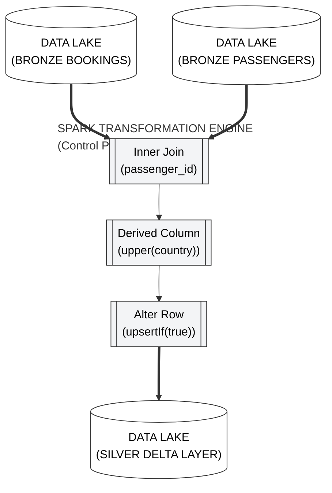

---

## Operational Risk Mitigation

Distributed Spark compute introduces risks related to cluster cold-starts and metadata binding.

| Criticality | Implementation Risk | Strategic Mitigation |
|:---:|:---|:---|
| **CRITICAL** | **Schema Blindness** | Failure to execute 'Import Projection' on sources prevents the Spark engine from recognizing column types. This will break the downstream Join logic. |
| **MODERATE** | **Cluster Warmup Latency** | Provisioning a Spark Debug cluster requires approximately 5-6 minutes. We must monitor the provisioning state until the **Ready** circle appears before initiating data previews. |

---

## Implementation Workflow

### Step 1: Source Dataset Instantiation

1. **Path:** `Author > Datasets > New dataset > Azure Data Lake Storage Gen2 > DelimitedText`.
2. Create two datasets:
   - **`ds_bronze_bookings`**: Path: `bronze / SQL /`.
   - **`ds_bronze_passengers`**: Path: `bronze / onprem / DimPassenger.csv`.

---

### Step 2: Spark Cluster Initialization

> **Concept Brief:** Data Flows run on a Spark Cluster (a group of powerful computers). These take time to "start up".

1. **Path:** `Author > Data flows > + Data flow`. Name: **`df_transform_silver`**`.
2. **Top Bar:** Toggle **Data flow debug** to **On**.
3. **Wait:** It will take **5-7 minutes** for the cluster to become ready. You will see a green circle when it's done.

**Verification Checkpoint:** Initiate the Spark cluster by toggling 'Data flow debug' to ON.  
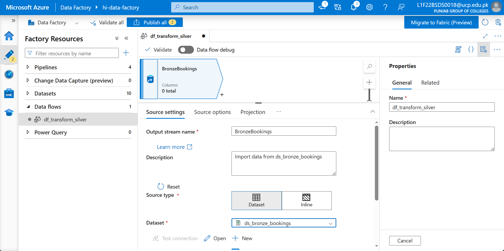  

**Verification Checkpoint:** Verify the debug session is activated and the cluster is warming up.  
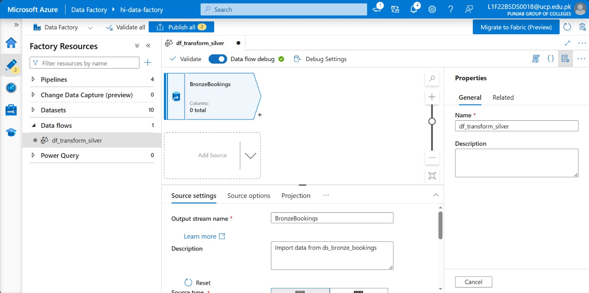  
  

---

### Step 3: Schema Projections (Technical Binding)

> **Concept Brief:** ADF needs to "see" inside your files. Importing a projection is like telling ADF: "Column 1 is an ID, Column 2 is a Name."

1. Add your two sources (`BronzeBookings` and `BronzePassengers`) by clicking **Add Source**.
2. In each source node, go to the **Projection** tab.
3. Click **Import projection**. **Stop:** If this fails, ensure your Spark Cluster (Step 2) is fully started.

**Verification Checkpoint:** Execute 'Import projection' for the Bookings source to bind the schema.  
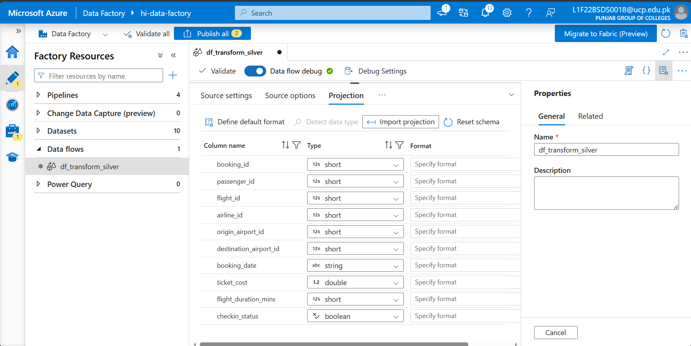  

**Verification Checkpoint:** Execute 'Import projection' for the Passengers source and verify column types.  
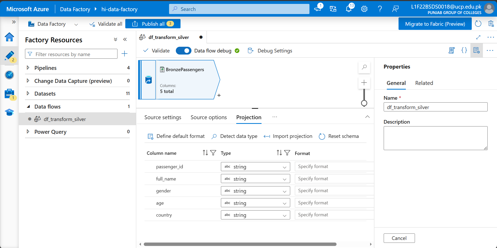  
  

---

### Step 4: Relational Inner Join Logic

1. Click the **+** icon next to `BronzeBookings` and select **Join**.
2. **Left stream:** `BronzeBookings`.
3. **Right stream:** `BronzePassengers`.
4. **Join type:** `Inner`.
5. **Join condition:** `passenger_id` == `passenger_id`.
6. **Data Preview:** Click the **Data Preview** tab -> **Refresh** to see the files combined.

**Verification Checkpoint:** Configure the 'Inner Join' using `passenger_id` as the relational key.  
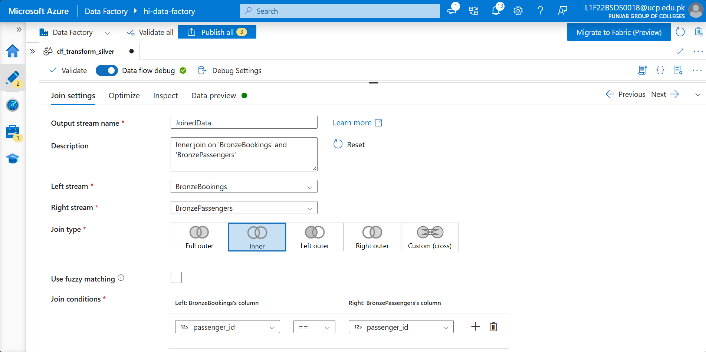  

**Verification Checkpoint:** Refresh the 'Data Preview' to confirm successful record consolidation.  
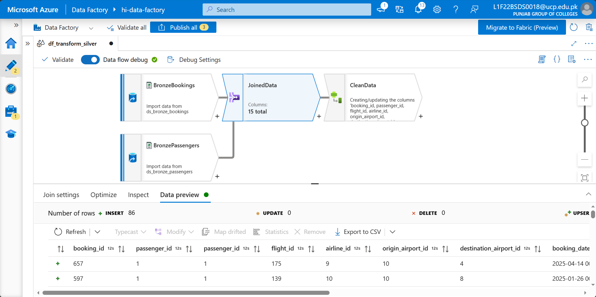  
  

---

### Step 5: Semantic Cleansing (Derived Column)

1. Click the **+** next to the Join and select **Derived Column**.
2. **Column name:** `country`.
3. **Expression:** Click the box and type `upper(country)`.

**Verification Checkpoint:** Define the `country` column transformation logic using the `upper()` function.  
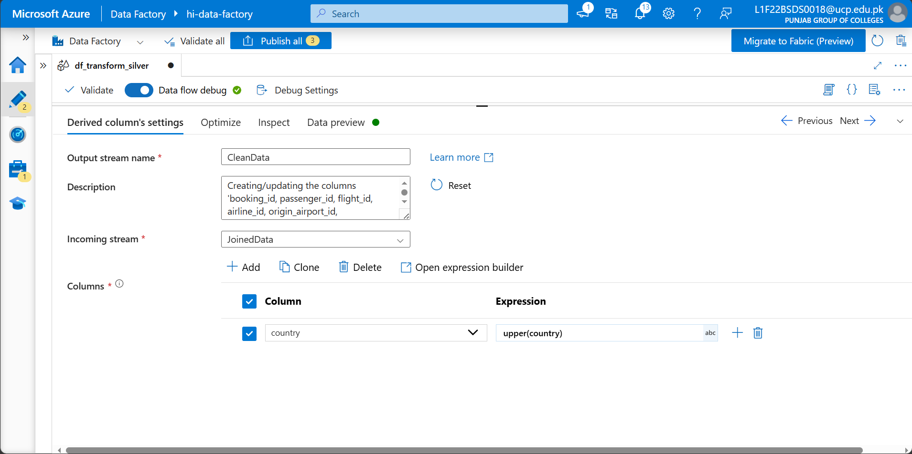  

**Verification Checkpoint:** Confirm the semantic transformation in the 'Data Preview' tab.  
  
  

---

### Step 6: Atomic Upsert Policy (Alter Row)

1. Click **+** and select **Alter Row**.
2. **Alter row conditions:** Select **Upsert if** and type the expression: `true()`.

**Verification Checkpoint:** Establish the Delta 'Upsert' policy using the `true()` expression.  
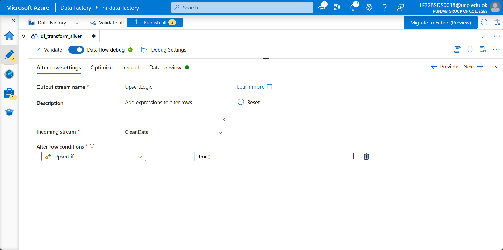  

**Verification Checkpoint:** Verify the Alter Row node presence in the transformation canvas.  
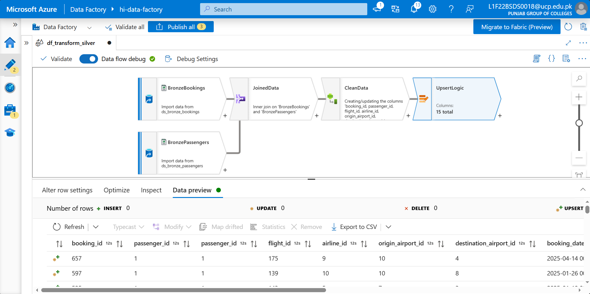  

---

### Step 7: Delta Sink Persistence Layer

1. Click **+** and select **Sink**.
2. **Sink type:** `Inline`.
3. **Inline dataset type:** `Delta`.
4. **Linked service:** `ls_data_lake`.
5. **Settings Tab:**
   - **File system:** `silver`.
   - **Path:** `bookings_delta`.
   - **Table action:** `None`.
   - **Key columns:** Select `booking_id` (This is required for the "Upsert" logic to work).

**Verification Checkpoint:** Finalize the Sink configuration using the 'Delta' inline format.  
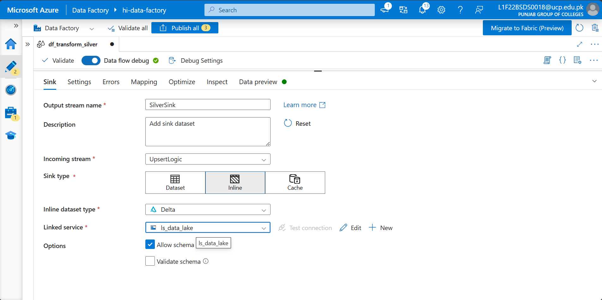  

**Verification Checkpoint:** Confirm the Sink node is correctly connected to the transformation chain.  
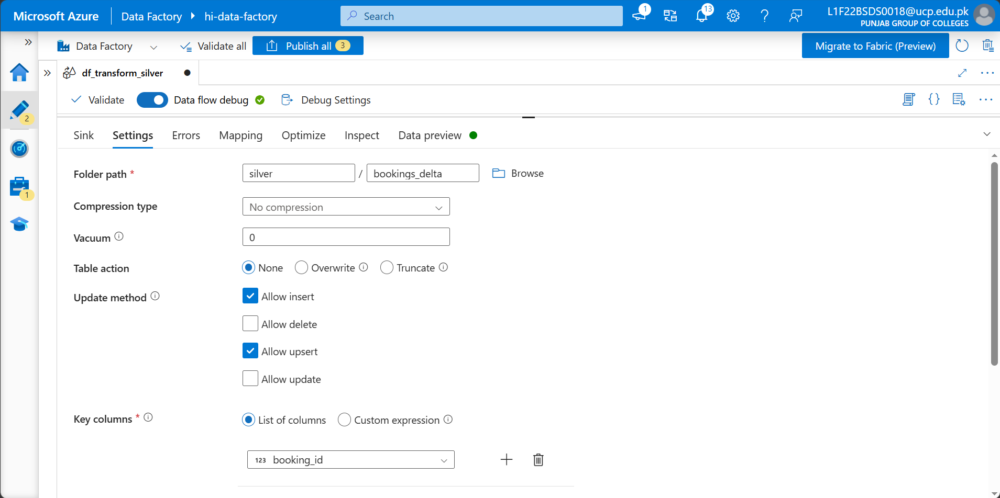  

**Verification Checkpoint:** Verify the creation of the Delta parquet files in the Silver container.  
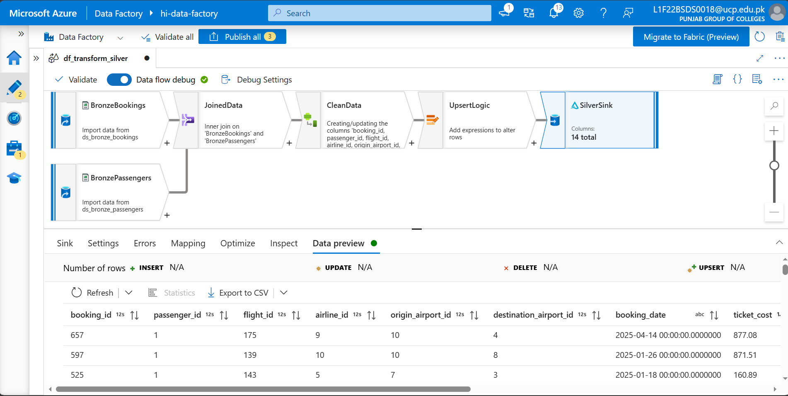  

**Verification Checkpoint:** View the complete, finalized Spark Data Flow orchestration.  
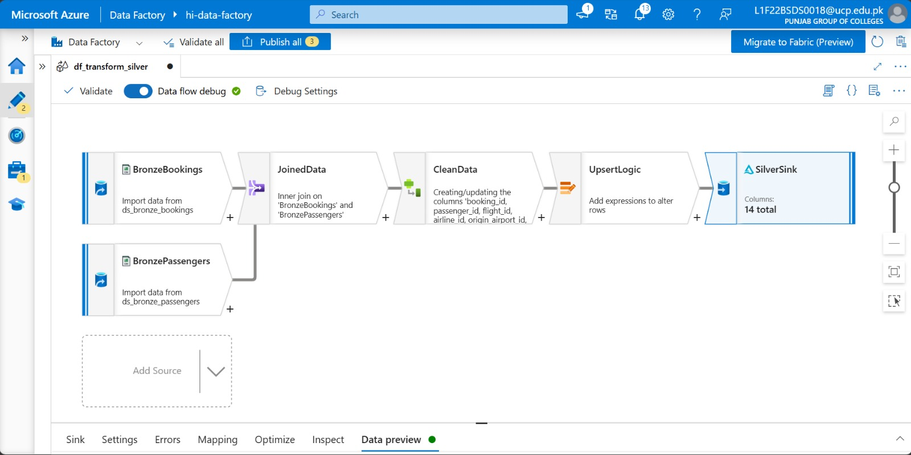  

**Verification Checkpoint:** Execute a final Sink 'Data Preview' to validate end-to-end logic.  
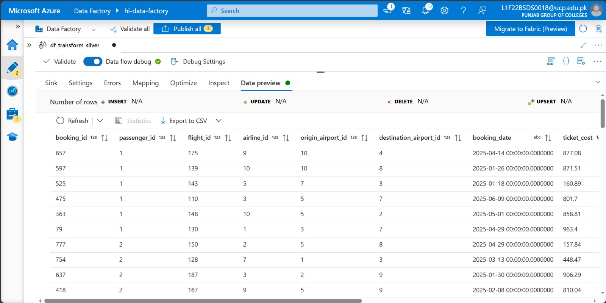  

**Verification Checkpoint:** Confirm a successful Pipeline Debug run for the Silver transformation.  
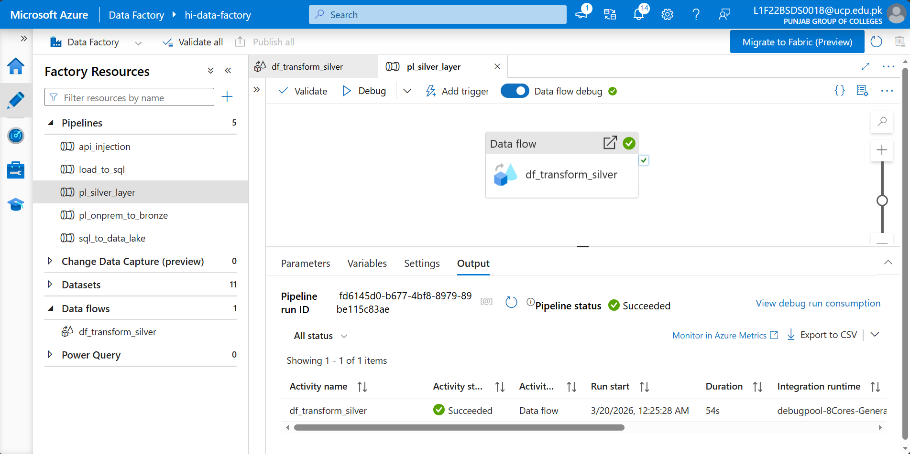  

---

## Technical Handoff
The Silver Tier is now operational. In **Phase 8**, we perform high-level analytical aggregations on the Delta Lake to derive strategic **Gold Tier** KPIs.

**[ Back to Project Dashboard ](../README.md) | [ Previous Phase: SQL Mart Hub ](./phase6_load_to_sql.md) | [ Next Phase: Gold Layer Analytics ](./phase8_gold_layer.md)**
