# Phase 8: Gold Layer Business Analytics

**[ Back to Project Dashboard ](../README.md)**

*Synthesizing millions of refined records into highly-aggregated, business-ready 'Gold' datasets to power executive-level strategic dashboards.*

---

## Table of Contents
- [Project Foundation](#project-foundation)
- [Architecture Blueprint](#architecture-blueprint)
- [Operational Risk Mitigation](#operational-risk-mitigation)
- [Implementation Workflow](#implementation-workflow)
  - [Step 1: Multi-Tier Inline Sources](#step-1-multi-tier-inline-source-initialization)
  - [Step 2: Relational Outer Join](#step-2-relational-left-outer-join)
  - [Step 3: Revenue Aggregation](#step-3-revenue-aggregation-logic)
  - [Step 4: Distributed Window Ranking](#step-4-distributed-window-ranking-denserank)
  - [Step 5: Analytical Filtering](#step-5-strategic-analytical-filtering)
  - [Step 6: Gold Tier Persistence](#step-6-gold-tier-delta-persistence)

---

## Project Foundation

The final tier of the Medallion Architecture resolves structural complexity into analytical simplicity. This phase implements the **Gold Tier Business Intelligence Pattern**, synthesizing Silver-layer records into high-level KPIs. By utilizing distributed **Spark Window Functions** (`denseRank`), the architecture identifies strategic performance metrics—such as the Top 5 Airlines by Revenue—systematically recalculated during every execution cycle.

**By the end of this phase, the ecosystem will possess:**
- A **Highly-Aggregated Data Flow** performing global analytical windowing.
- **Strategic Revenue KPIs** calculated across disparate datasets.
- A **Gold Delta Lake Hub** prepared for direct consumption by Power BI.

---

## Architecture Blueprint

The diagram illustrates the analytical synthesis. Data is drawn from Silver (Bookings) and Bronze (Airlines), blended through a Left Outer Join, mathematically aggregated into revenue totals, and windowed to determine global rankings before final persistence.

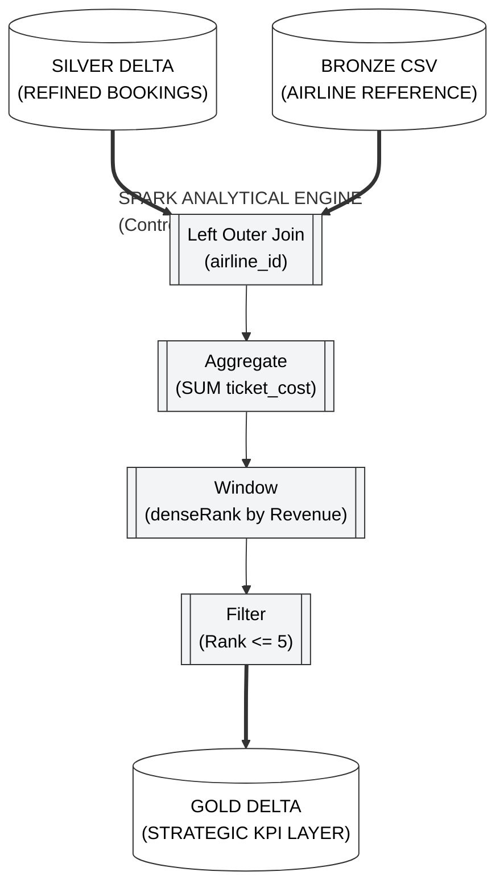

---

## Operational Risk Mitigation

Analytical synthesis requires absolute mathematical precision.

| Criticality | Implementation Risk | Strategic Mitigation |
|:---:|:---|:---|
| **CRITICAL** | **Aggregated Revenue Leakage** | Utilizing an Inner Join can accidentally delete records that refer to missing airline IDs. We rigidly use **Left Outer Join** to ensure 100% of financial revenue is preserved in the final calculation. |
| **MODERATE** | **Stale Data Collision** | Gold analytics must be pure. We configure the final sink to **Overwrite** the data set during every run, preventing yesterday's rankings from contaminating today's strategic view. |

---

## Implementation Workflow

### Step 1: Multi-Tier Inline Source Initialization

> **Strategic Justification:** Utilizing Inline dataset types for Delta and Parquet avoids the overhead of physical dataset abstractions and enables direct connectivity to the storage path.

1. **Path:** `Author > Data flows > + Data flow`. Name: **`df_analytics_gold`**.
2. **Add Source 1 (SilverBookings):**
   - **Source type:** `Inline`.
   - **Inline dataset type:** `Delta`.
   - **Linked service:** `ls_data_lake`.
   - **Settings:** Path: `silver / bookings_delta`.
3. **Add Source 2 (BronzeAirline):**
   - **Source type:** `Inline`.
   - **Inline dataset type:** `DelimitedText`.
   - **Linked service:** `ls_data_lake`.
   - **Settings:** Path: `bronze / onprem / DimAirline.csv`.
4. **Projection Tab:** Click **Import projection** on BOTH sources.

---

### Step 2: Relational Outer Join

> **Strategic Justification:** Establishing the relational link between transactions (Bookings) and metadata (Airlines) while preserving financial lineage.

1. Click **+** next to `SilverBookings` -> **Join**.
2. **Left stream:** `SilverBookings`.
3. **Right stream:** `BronzeAirline`.
4. **Join type:** `Left outer`.
5. **Join condition:** `airline_id` == `airline_id`.

**Verification Checkpoint:** Verify the Left Outer join configuration on the `airline_id` column.  
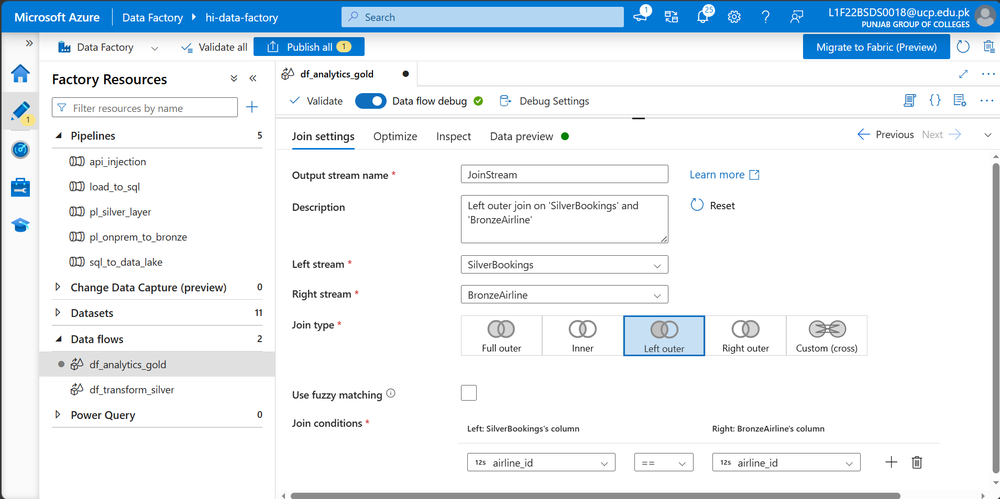  

---

### Step 3: Revenue Aggregation Logic

1. Click **+** -> **Aggregate**.
2. **Group by:** Select `airline_name`.
3. **Aggregates Tab:**
   - **Column:** `TotalRevenue`.
   - **Expression:** paste `sum(toShort(ticket_cost))`.
*(toShort() converts the text price into a number so we can add it up).*

**Verification Checkpoint:** Configure the 'Aggregate' node to calculate revenue per airline.  
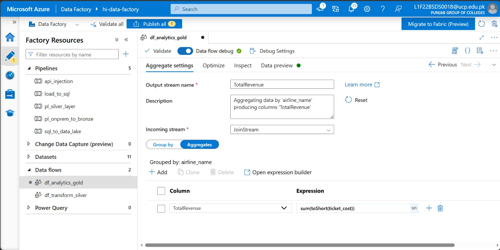  

**Verification Checkpoint:** Confirm the initial revenue calculations in the 'Data Preview'.  
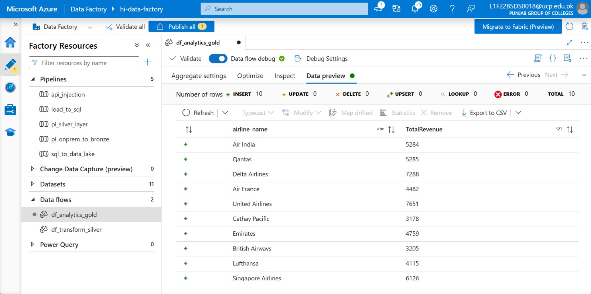  

---

### Step 4: Distributed Window Ranking (denseRank)

1. Click **+** -> **Window**.
2. **Over Tab:** Leave blank (We want a global rank).
3. **Sort Tab:** `TotalRevenue` -> `Descending`.
4. **Window Columns Tab:**
   - **Column:** `Rank`.
   - **Expression:** paste `denseRank()`.

**Verification Checkpoint:** Set the global sorting order to `Descending` based on revenue.  
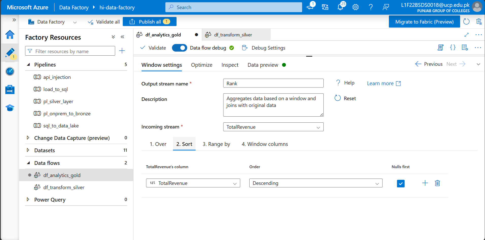  

**Verification Checkpoint:** Define the window ranking expression using `denseRank()`.  
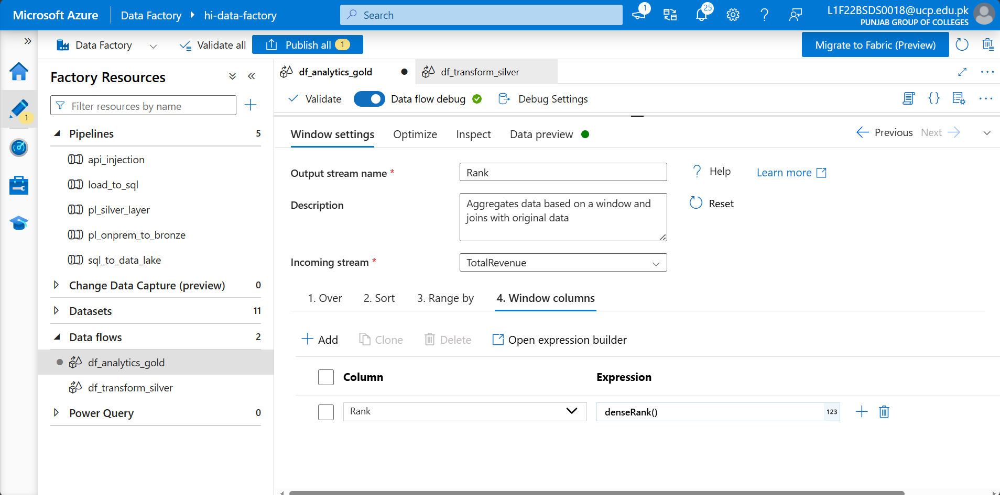  

**Verification Checkpoint:** Verify the ranking logic in the 'Data Preview' pane.  
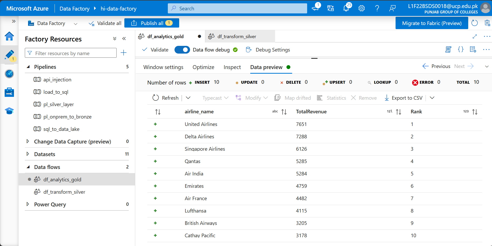  

---

### Step 5: Strategic Analytical Filtering (Top 5)

1. Click **+** -> **Filter**.
2. **Filter on:** paste `Rank <= 5`.

**Verification Checkpoint:** Confirm only the Top 5 rankings are retained in the final Gold dataset.  
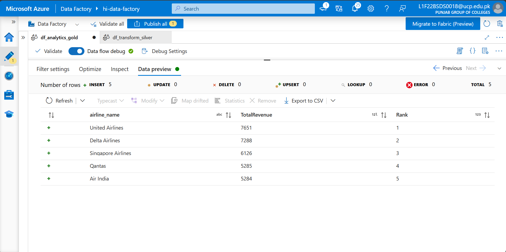  

---

### Step 6: Gold Tier Delta Persistence

1. Click **+** -> **Sink**.
2. **Sink type:** `Inline` -> `Delta`.
3. **Settings Tab:**
   - **Path:** `gold / business_view / top_airlines`.
   - **Table action:** Select **Overwrite**. (This ensures we always have the latest "Fresh" rankings).

**Verification Checkpoint:** View the complete Gold analytical Data Flow orchestration.  
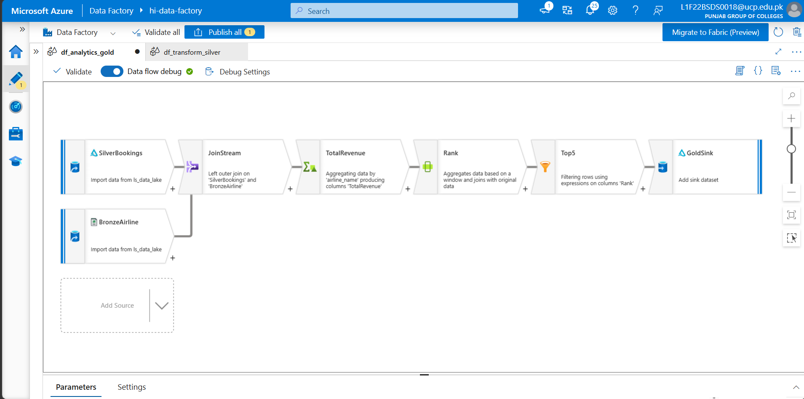  

**Verification Checkpoint:** Execute a final 'Data Preview' from the Gold Sink node.  
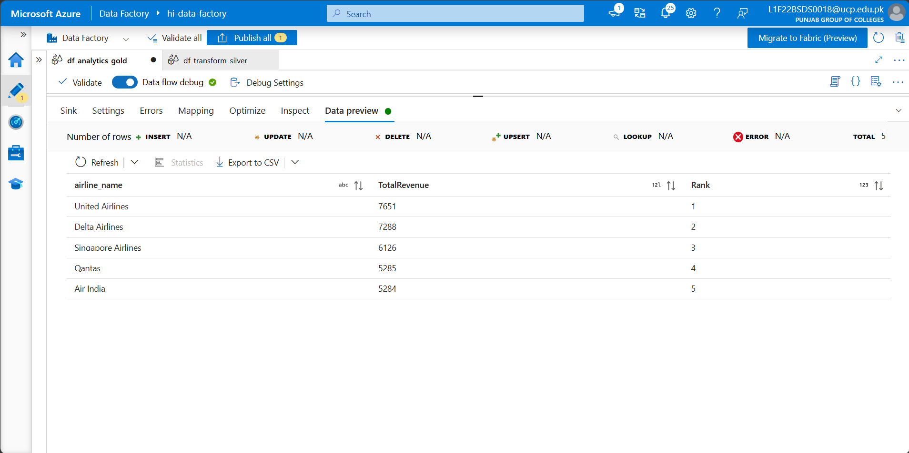  

**Verification Checkpoint:** Confirm a successful Pipeline Debug run for the Gold layer.  
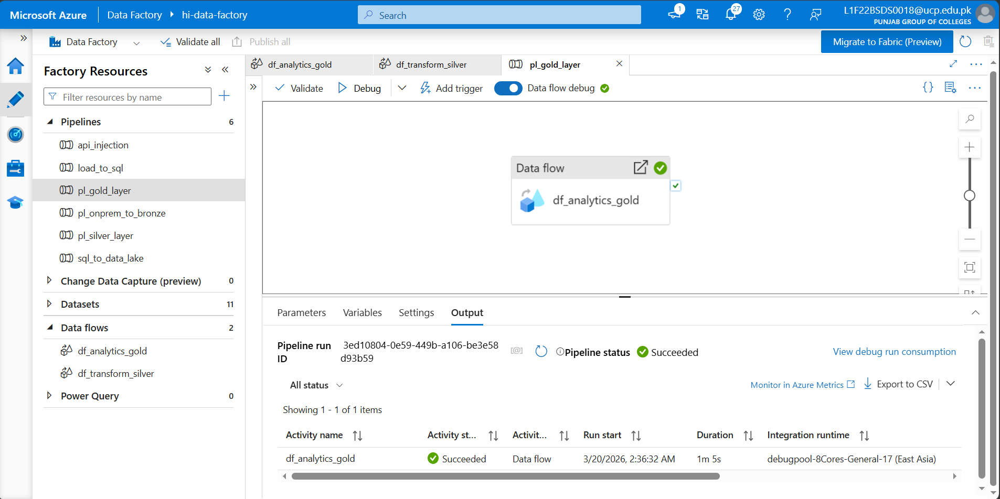  

---

## Technical Handoff
The analytical Gold Tier is now complete. In **Phase 9**, we transition from individual execution into **Master Orchestration**, building the master parent-child pipeline chain that enforces sequential integrity across the entire project.

**[ Back to Project Dashboard ](../README.md) | [ Previous Phase: Silver Transformation ](./phase7_silver_transformation.md) | [ Next Phase: Master Orchestration ](./phase9_parent_pipeline.md)**
