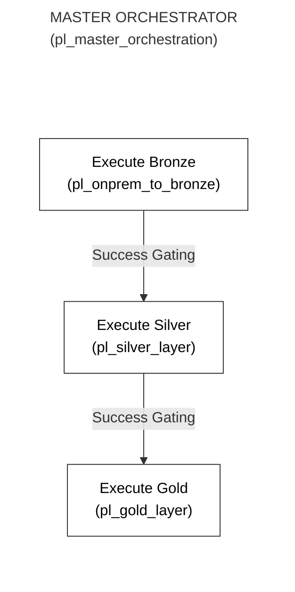
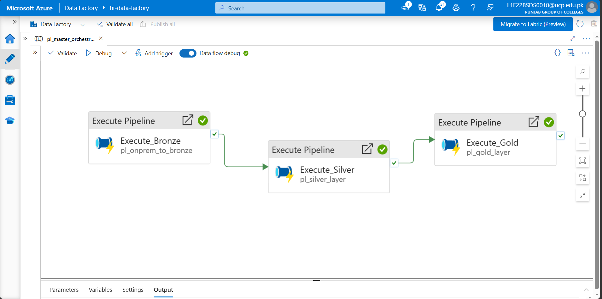
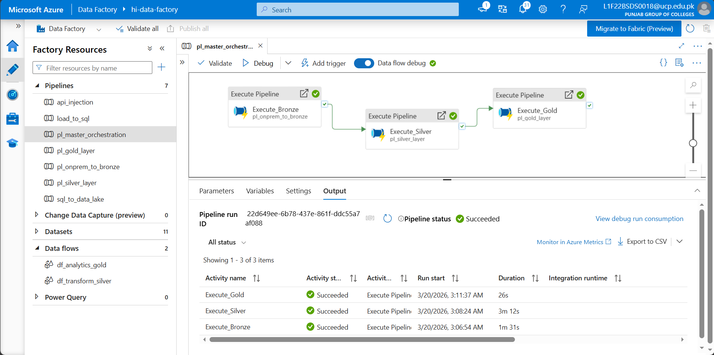

# Phase 9: End-to-End Parent Orchestration

**[ Back to Project Dashboard ](../README.md)**

*Architecting the master parent-child pipeline chain to enforce strict sequential integrity across all Medallion infrastructure tiers.*

---

## Table of Contents
- [Project Foundation](#project-foundation)
- [Architecture Blueprint](#architecture-blueprint)
- [Operational Risk Mitigation](#operational-risk-mitigation)
- [Implementation Workflow](#implementation-workflow)
  - [Step 1: Master Orchestration Root](#step-1-master-orchestration-root)
  - [Step 2: Sequential Dependency Gating](#step-2-sequential-dependency-gating)
  - [Step 3: End-to-End Execution & Finality](#step-3-end-to-end-execution-and-finality)

---

## Project Foundation

Independent pipeline execution is structurally insufficient for enterprise data ecosystems. This phase implements the **Master Orchestration Paradigm**, utilizing a central parent workflow to command the Bronze, Silver, and Gold subroutines. This architectural choice enforces absolute sequential integrity, ensuring that transformational logic never initiates before the preceding ingestion cycle is fully committed.

**By the end of this phase, the ecosystem will possess:**
- A **Master Parent Pipeline** (`pl_master_orchestration`) centralizing execution control.
- **Dependency Gated Transitions** (Success/Failure) across all Medallion stages.
- Validated **Synchronous Workflow Execution** with zero race conditions.

---

## Architecture Blueprint

The following diagram illustrates the sequential dependency chain. The parent pipeline invokes each child subroutine in order, only proceeding to the next tier upon the successful terminal state of the previous activity.

---

## Operational Risk Mitigation

Chaining asynchronous processes introduces the risk of 'Ghost Completions' and race conditions.

| Criticality | Implementation Risk | Strategic Mitigation |
|:---:|:---|:---|
| **CRITICAL** | **Ghost Completion Chain** | By default, an `Execute Pipeline` activity terminates immediately after firing the trigger. We must enforce **Wait on completion** to ensure the parent engine remains locked until the child subroutine marks a final success state. |
| **MODERATE** | **Race Condition Overlap** | High-volume pipelines can overlap if dependency lines are omitted. We utilize the **Green Success Dependency** line to rigidly gate the execution path, preventing simultaneous Bronze and Silver operations. |

---

## Implementation Workflow

### Step 1: Master Orchestration Root

1. **Path:** `Author > Pipelines > + Pipeline`. Name: **`pl_master_orchestration`**.
2. Drag three **Execute Pipeline** activities (from the **General** section) onto the canvas. 

---

### Step 2: Sequential Dependency Gating

> **Concept Brief:** A "Success Dependency" (Green Line) tells ADF: "Only start Phase B if Phase A finishes successfully."

1. **Configure the 3 Nodes:**
   - **Node 1 (Execute_Bronze):** Invoke `pl_onprem_to_bronze`. **Check the box: Wait on completion**.
   - **Node 2 (Execute_Silver):** Invoke `pl_silver_layer`. **Check the box: Wait on completion**.
   - **Node 3 (Execute_Gold):** Invoke `pl_gold_layer`. **Check the box: Wait on completion**.

**Verification Checkpoint:** Your master canvas should show three green 'Success' arrows connecting the layers.  
  

---

### Step 3: End-to-End Execution and Finality

**Verification Checkpoint:** Confirm all three activities are 'Succeeded' in the Monitoring tab.  
  

---

## Technical Handoff
Orchestration is now established and validated. In **Phase 10**, we layer on the **Operational Telemetry Hub**, building serverless alerting to detect and report pipeline terminations in real-time.

**[ Back to Project Dashboard ](../README.md) | [ Previous Phase: Gold Analytics ](./phase8_gold_layer.md) | [ Next Phase: Logic App Monitoring ](./phase10_logic_app.md)**
